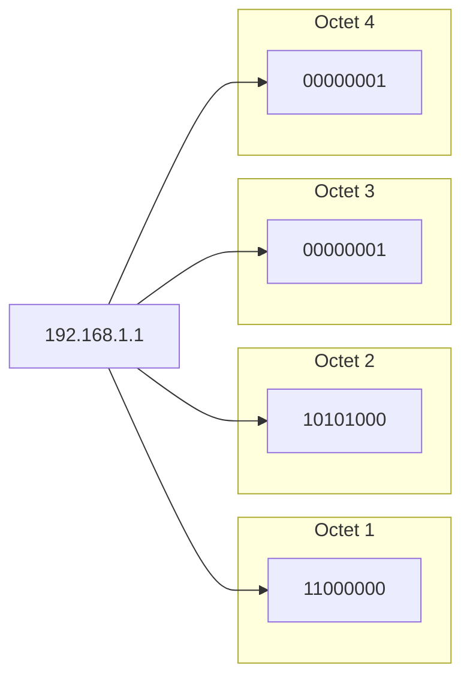
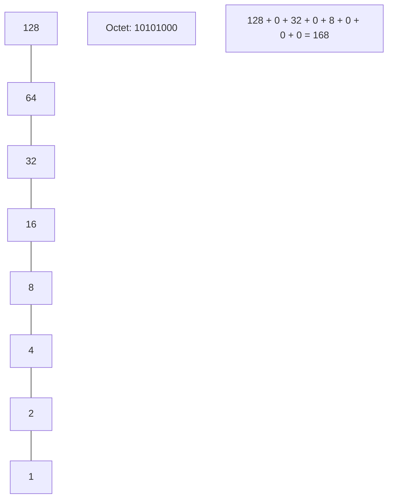

# 01. Binary and IP Fundamentals

To understand how cloud networks function, we must first understand how computers see IP addresses. An IPv4 address is not just a string of four numbers; it is a **32-bit binary integer**.

## The Anatomy of an IP Address

An IPv4 address consists of 32 bits, divided into four **octets** (8 bits each).

### Classful vs. Classless History

In the early days of the internet, IP addresses were divided into "Classes" (A, B, C, D, E). This was extremely wasteful.

| Class | Range Start | Default Mask | Hosts per Network |
| :--- | :--- | :--- | :--- |
| **A** | 1.0.0.0 | 255.0.0.0 (/8) | 16,777,214 |
| **B** | 128.0.0.0| 255.255.0.0 (/16)| 65,534 |
| **C** | 192.0.0.0| 255.255.255.0 (/24)| 254 |

**CIDR (Classless Inter-Domain Routing)** replaced this in 1993, allowing us to split networks exactly where we want, using a variable length subnet mask (VLSM).

---

## The Binary-to-Decimal Conversion

Each bit in an octet represents a power of 2:
`128 | 64 | 32 | 16 | 8 | 4 | 2 | 1`

---

## Real-Life Scenarios

### Scenario 1: "The Legacy Ghost"
**Problem**: A junior engineer was troubleshooting a routing issue and assumed that because an IP started with `192`, it *must* be a Class C network with a `/24` mask. 
**Consequence**: They misconfigured the router, blocking traffic to the rest of the `/20` supernet.
**Solution**: Education on CIDR notation.
*   Result: The team stopped using "Class A/B/C" terminology and switched exclusively to CIDR notation.

### Scenario 2: "The Overlapping Disaster"
**Problem**: Two companies merged, and their internal networks both used the `10.0.0.0/8` range (Class A).
**Impact**: Thousands of servers could not talk to each other across the VPN tunnels because their IP ranges overlapped perfectly.
**Solution**: Re-subnetting into smaller, distinct CIDR blocks like `10.10.0.0/16` and `10.20.0.0/16`.

### Scenario 3: "Broadcast Storm"
**Problem**: A legacy on-premise network was built as a single massive "Class A" flat network.
**Consequence**: A single malfunctioning device sent a broadcast packet that hit 16 million possible host addresses, crashing the switches.
**Solution**: Breaking the network into smaller subnets using binary boundaries.

---

## ❓ Interview Questions

1. **How many bits are in an IPv4 address?**
    - 32 bits.
2. **What is an octet?**
    - A group of 8 bits representing a number from 0 to 255.
3. **What is the significance of the number 255 in subnetting?**
    - It is the maximum value of an 8-bit octet (`11111111`).
4. **Why was Classful addressing replaced by CIDR?**
    - To prevent IP address exhaustion and allow for more flexible network sizes.
5. **How do you convert the decimal 10 to binary?**
    - `00001010` (8 + 2).
6. **What is a "loopback" address?**
    - `127.0.0.1`, used by a computer to talk to itself.
7. **What is the binary representation of 255.255.255.0?**
    - `11111111.11111111.11111111.00000000`.
8. **What does the 'slash' in /24 represent?**
    - It means the first 24 bits of the address are the network portion.
9. **Can an IPv4 address contain the number 256?**
    - No, the maximum value for an 8-bit octet is 255.
10. **What is the difference between Public and Private IPs?**
    - Public IPs are routable on the global internet; Private IPs are reserved for internal use (RFC 1918).

---

## 🧠 Quiz

1. **How many bits in an octet?**
    - [x] 8
    - [ ] 16
2. **Binary `11000000` equals:**
    - [x] 192
    - [ ] 128
3. **CIDR stands for:**
    - [x] Classless Inter-Domain Routing
    - [ ] Computer Internet Data Routing
4. **Maximum value of an octet:**
    - [x] 255
    - [ ] 256
5. **Class A default mask is:**
    - [x] /8
    - [ ] /16
6. **IPv4 bits total:**
    - [x] 32
    - [ ] 128
7. **Private IP range starting with 10...**
    - [x] 10.0.0.0/8
    - [ ] 10.0.0.0/24
8. **Smallest number in an octet:**
    - [x] 0
    - [ ] 1
9. **`128 + 64` equals:**
    - [x] 192
    - [ ] 224
10. **`11111111` in decimal:**
    - [x] 255
    - [ ] 128
11. **Number of octets in IPv4:**
    - [x] 4
    - [ ] 8
12. **Is 172.16.0.1 a private IP?**
    - [x] Yes
    - [ ] No
13. **Subnet mask for /16:**
    - [x] 255.255.0.0
    - [ ] 255.0.0.0
14. **Computers process IPs as:**
    - [x] Binary
    - [ ] Decimal
15. **RFC for private addressing:**
    - [x] 1918
    - [ ] 2024
16. **Broadcast address decimal:**
    - [x] 255
    - [ ] 1
17. **Network address decimal:**
    - [x] 0
    - [ ] 254
18. **Powers of 2: 2^3 equals:**
    - [x] 8
    - [ ] 6
19. **CIDR was introduced in:**
    - [x] 1993
    - [ ] 2005
20. **Can 1.1.1.1 be a private IP?**
    - [x] No
    - [ ] Yes