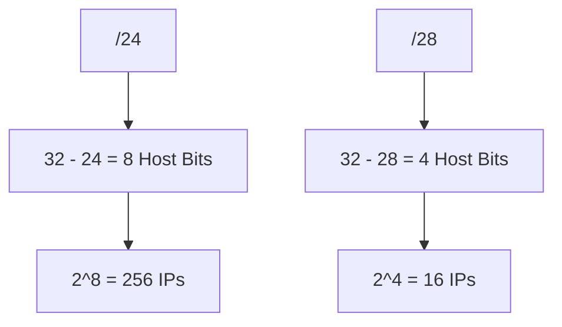
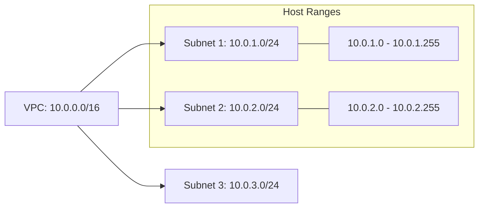

# 02. CIDR Math and Calculation

Calculating the size of a network and the range of its IP addresses is a fundamental skill for cloud architects. CIDR (Classless Inter-Domain Routing) provides the mathematical framework for this.

## The Formula for Host Counts

The number of IP addresses in a CIDR block is determined by the number of bits remaining for hosts (32 minus the CIDR prefix).

**Formula: `Total IPs = 2^(32 - Prefix)`**

## CIDR Table Reference

| Hash | Total IP Addresses | Subnet Mask |
| :--- | :--- | :--- |
| **/32** | 1 | 255.255.255.255 |
| **/30** | 4 | 255.255.255.252 |
| **/28** | 16 | 255.255.255.240 |
| **/24** | 256 | 255.255.255.0 |
| **/20** | 4,096 | 255.255.240.0 |
| **/16** | 65,536 | 255.255.0.0 |

---

## Visualizing Subnet Boundaries

When you split a `/16` (VPC) into `/24` (Subnets), you are effectively "borrowing" bits from the host portion to create network segments.

---

## Real-Life Scenarios

### Scenario 1: "The Cramped Subnet"
**Problem**: An administrator created a `/28` subnet for a Kubernetes node group. A `/28` only has 16 IPs, and AWS reserves 5 of them. 
**Impact**: Only 11 nodes/pods could be launched. The cluster failed to scale during a traffic spike.
**Solution**: Re-created the subnet as a `/24`.

### Scenario 2: "The Overlapping Peering Request"
**Problem**: Two departments wanted to peer their VPCs. Department A used `10.0.0.0/16`. Department B used `10.0.128.0/17`.
**Impact**: Because `10.0.128.0/17` is a subset of `10.0.0.0/16`, AWS blocked the peering connection due to overlapping CIDRs.
**Solution**: Department B had to migrate to `10.1.0.0/16`.

### Scenario 3: "Wasted Space"
**Problem**: A startup used a `/16` for their main database subnet because "we want to be ready for growth."
**Consequence**: They had 65,000 IPs reserved for 4 database servers. When they needed to create a new region with a different range, they realized they had used up most of the `10.x.x.x` private space.
**Solution**: Resizing best practices (standardizing on `/24` or `/20`).

---

## ❓ Interview Questions

1. **How many IPs are in a /26?**
    - 64 (2 ^ (32-26) = 2^6).
2. **If you have a /16 VPC, how many /24 subnets can you create?**
    - 256 (256 * 256 = 65,536 total IPs).
3. **What is the CIDR for a single specific IP address?**
    - `/32`.
4. **How do you find the first IP in a range?**
    - It is the network address (all host bits are 0).
5. **How do you find the last IP in a range?**
    - It is the broadcast address (all host bits are 1).
6. **If a subnet is 10.0.1.0/24, what is the next contiguous subnet?**
    - 10.0.2.0/24.
7. **What is the mask for a /20?**
    - 255.255.240.0.
8. **Does a /25 have more or fewer IPs than a /24?**
    - Fewer (128 vs 256).
9. **Can you create a /31 subnet in AWS?**
    - No, the smallest allowed is /28.
10. **Why are powers of 2 important in CIDR?**
    - Because IP counts must always be a power of 2 (2, 4, 8, 16, etc.) due to binary math.

---

## 🧠 Quiz

1. **Total IPs in a /24:**
    - [x] 256
    - [ ] 512
2. **Hosts in a /30:**
    - [x] 4
    - [ ] 2
3. **CIDR for 4096 addresses:**
    - [x] /20
    - [ ] /16
4. **Mask for /16:**
    - [x] 255.255.0.0
    - [ ] 255.255.255.0
5. **Next subnet after 10.0.0.0/24:**
    - [x] 10.0.1.0/24
    - [ ] 10.0.0.1/24
6. **Formula for total IPs:**
    - [x] 2^(32-prefix)
    - [ ] 2^prefix
7. **`/28` total IPs:**
    - [x] 16
    - [ ] 32
8. **`/32` represents:**
    - [x] 1 IP
    - [ ] 32 IPs
9. **Is /23 larger than /24?**
    - [x] Yes
    - [ ] No
10. **How many /28s in a /24?**
    - [x] 16
    - [ ] 8
11. **Number of bits in IPv4 mask:**
    - [x] 32
    - [ ] 24
12. **Binary `11110000` is decimal:**
    - [x] 240
    - [ ] 224
13. **VPC max size in AWS:**
    - [x] /16
    - [ ] /8
14. **Smallest Subnet in AWS:**
    - [x] /28
    - [ ] /30
15. **Broadcast address host bits are all:**
    - [x] 1
    - [ ] 0
16. **Network address host bits are all:**
    - [x] 0
    - [ ] 1
17. **Total IPs in /17:**
    - [x] 32,768
    - [ ] 65,536
18. **Total IPs in /21:**
    - [x] 2,048
    - [ ] 1,024
19. **If prefix is /24, how many bits for network?**
    - [x] 24
    - [ ] 8
20. **If prefix is /24, how many bits for hosts?**
    - [x] 8
    - [ ] 24