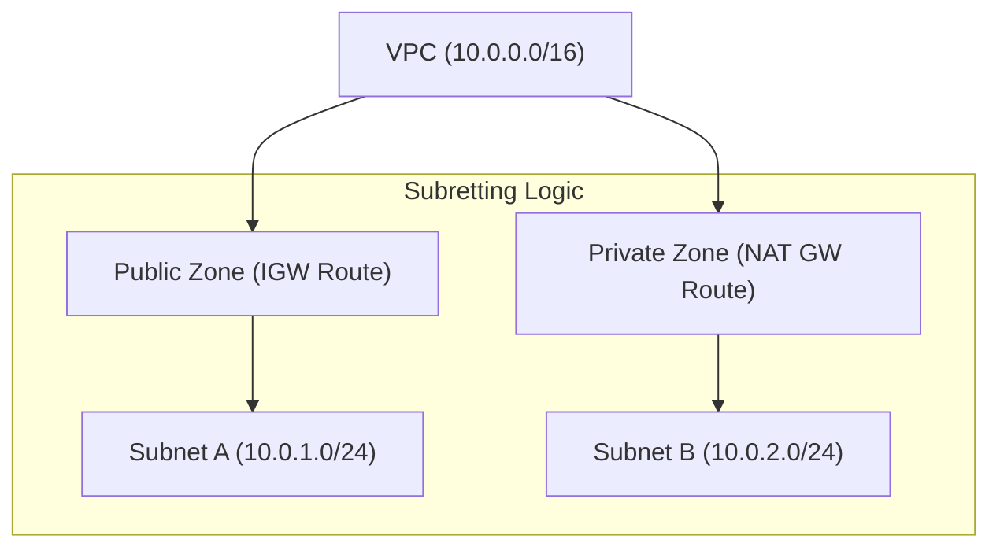

# Subnetting and CIDR

Subnetting is the practice of dividing a VPC's IP address range into smaller, manageable segments. Understanding CIDR (Classless Inter-Domain Routing) notation and binary math is crucial for defining these ranges efficiently and securely.

## 📚 Learning Path

| # | Topic | Description | Key Concepts |
| :--- | :--- | :--- | :--- |
| **01** | [**Binary Fundamentals**](./01-Binary-and-IP-Fundamentals/README.md) | How Computers see IPs | Octets, Bits, Bits-to-Decimal |
| **02** | [**CIDR Math**](./02-CIDR-Math-and-Calculation/README.md) | Calculating Network Sizes | Host formulas, Masks, Boundaries |
| **03** | [**Zoning Patterns**](./03-Public-and-Private-Zoning/README.md) | Architectural Isolation | Public vs Private, 3-Tier Design |
| **04** | [**AWS Limits**](./04-AWS-Reserved-IPs-and-Limits/README.md) | Cloud-Specific Constraints | The 5 Reserved IPs, /16 to /28 |

---

## 🏗️ Architecture Visualization

---

## 🏗️ Real-Life Scenarios

### Scenario 1: The "Legacy CIDR" Overlap
**Problem**: An organization acquired a smaller company. Both companies had designed their VPCs using the exact same `10.0.0.0/16` CIDR block.
**Crisis**: When the engineering teams tried to connect the two VPCs via VPC Peering to share an internal API, the connection failed because the routers couldn't distinguish between local and remote traffic for the same IP range.
**Outcome**: One company had to rebuild their entire infrastructure in a new VPC with `10.1.0.0/16`, costing 3 months of migration work.
**Solution**: Always check the "Corporate IP Registry" before picking a CIDR. Use unique ranges for every VPC even if they aren't connected *today*.
**Result**: The organization now mandates non-overlapping IP blocks across all global regions and accounts.

### Scenario 2: The "Small Subnet" Trap
**Problem**: A cloud architect decided to save IPs by sizing subnets at `/28` (16 IPs) for every microservice.
**Crisis**: During a marketing campaign, one service needed to scale to 50 instances. The Auto-Scaling Group failed to launch more than 11 instances because the subnet was full (16 total - 5 reserved = 11 usable).
**Outcome**: The site crashed under load because it couldn't scale horizontally.
**Solution**: Size subnets for growth. Standardize on `/24` (251 usable IPs) for most services, and `/20` or `/18` for extremely large clusters like Kubernetes nodes.
**Result**: Subnet sizing is now a part of the "Architectural Review" process, favoring larger blocks for critical services.

### Scenario 3: The "Reserved IP" Calculation Error
**Problem**: A network engineer calculated they needed exactly 254 IPs for a legacy appliance and created a `/24` subnet.
**Crisis**: The appliance failed to join the network because AWS reserves 5 IPs in every subnet, leaving only 251 available.
**Outcome**: The project was delayed by a week as the subnet had to be deleted and recreated with a larger range.
**Solution**: Always factor in cloud-specific reserved IPs (+5 for AWS) when doing subnet math.
**Result**: The team's CIDR cheat sheet now includes a "Usable IPs" column that automatically subtracts the cloud overhead.

---

## ❓ Interview Questions

1.  **What is CIDR notation and how does '/24' differ from '/16'?**
    - *Answer*: CIDR (Classless Inter-Domain Routing) notation defines the "Prefix length" or the number of bits in the network mask. A `/24` has 24 network bits and 8 bits for hosts (256 IPs), while a `/16` has 16 network bits and 16 bits for hosts (65,536 IPs). The smaller the number after the slash, the larger the network.
2.  **Which 5 IP addresses are reserved by AWS in a subnet?**
    - *Answer*: 1. `.0` (Network address). 2. `.1` (VPC Router). 3. `.2` (DNS Server). 4. `.3` (Future use). 5. `.255` (Broadcast address - though broadcast isn't supported in VPC, it's still reserved).
3.  **How do you calculate the number of usable hosts in a /26 subnet?**
    - *Answer*: 2^(32 - 26) = 2^6 = 64 total IPs. Subtract the 5 reserved IPs: 64 - 5 = **59 usable IPs**.
4.  **Explain the 'Binary Math' relationship between a subnet mask and an IP range.**
    - *Answer*: An IP address is 32 bits. The subnet mask uses bits to "mask" the network portion. In binary, a `/24` mask is 24 ones followed by 8 zeros. The zeros represent the host portion of the address that can change.
5.  **Why can you not resize a subnet after it is created?**
    - *Answer*: In most cloud platforms, subnets are immutable segments of the VPC. To change the size, you must delete any resources inside the subnet, delete the subnet itself, and recreate it with the new CIDR block.
6.  **What is a 'Public' vs. 'Private' subnet zoning strategy?**
    - *Answer*: It's a security pattern. **Public subnets** have a route to an Internet Gateway and are used for Load Balancers. **Private subnets** have no direct internet route (or a route via a NAT Gateway) and are used for databases and backend servers to keep them hidden from the web.

---

## 🧠 Comprehensive Quiz (25 Questions)

<b>1. How many bits are in an IPv4 address?</b>

Show Answer

Answer: B

<b>2. A /24 subnet contains how many TOTAL IP addresses?</b>

Show Answer

Answer: B

<b>3. How many IPs are reserved by AWS in every subnet?</b>

Show Answer

Answer: C

<b>4. Which IP is typically the VPC DNS server in a subnet?</b>

Show Answer

Answer: C

<b>5. True/False: A /28 subnet is LARGER than a /24 subnet.</b>

Show Answer

Answer: B

<b>6. What is the largest CIDR block allowed for a VPC?</b>

Show Answer

Answer: B

<b>7. Usable IPs in a /27 subnet (32 IPs):</b>

Show Answer

Answer: C (32 - 5 = 27)

<b>8. RFC 1918 range for 10.x.x.x starts at:</b>

Show Answer

Answer: A

<b>9. 'Zoning' refers to partitioning a network based on:</b>

Show Answer

Answer: B

<b>10. CIDR stands for:</b>

Show Answer

Answer: B

<b>11. True/False: You can have two subnets with overlapping IPs in the same VPC.</b>

Show Answer

Answer: A

<b>12. Host bits in a /22 subnet:</b>

Show Answer

Answer: B

<b>13. A /16 VPC can be divided into how many /24 subnets?</b>

Show Answer

Answer: B

<b>14. The last IP in an AWS subnet block (e.g., .255 in a /24) is reserved for:</b>

Show Answer

Answer: B

<b>15. 'Subnet Mask' for a /24 in decimal is:</b>

Show Answer

Answer: B

<b>16. True/False: You can move a subnet from zone A to zone B.</b>

Show Answer

Answer: A

<b>17. What is the impact of choosing a /28 for a database subnet?</b>

Show Answer

Answer: B

<b>18. Binary: 2^8 equals:</b>

Show Answer

Answer: B

<b>19. Which subnet type is used for 'Bastion Hosts'?</b>

Show Answer

Answer: B

<b>20. True/False: You can add multiple IPv4 CIDR blocks to a single VPC.</b>

Show Answer

Answer: A

<b>21. A CIDR block of '0.0.0.0/0' represents:</b>

Show Answer

Answer: B

<b>22. How many host IPs are in a /30 subnet?</b>

Show Answer

Answer: B (4 total, but AWS requirement is minimum /28 for subnets)

<b>23. 'Subnet Fragmentation' occurs when:</b>

Show Answer

Answer: B

<b>24. Which is the most common CIDR for an enterprise VPC?</b>

Show Answer

Answer: B

<b>25. Subnetting is to a VPC what _____ is to an office building.</b>

Show Answer

Answer: B

