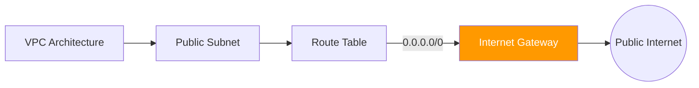

# 01. Internet Gateway Fundamentals

An **Internet Gateway (IGW)** is a logical, horizontally scaled, and highly available VPC component that serves as the edge between your private network and the global internet.

## Core Concepts

The IGW provides two main functions:
1.  **Target for Routes**: It serves as a target in your VPC route tables for internet-bound traffic (`0.0.0.0/0`).
2.  **Network Address Translation (NAT)**: It performs static 1-to-1 NAT for instances that have been assigned a public IPv4 address.

### Attachment Logic
You create an IGW as a standalone resource and then **attach** it to a specific VPC. 
*   **Limit**: You can only attach **one** IGW to a VPC at a time.
*   **Availability**: It is managed by AWS and is inherently redundant across all Availability Zones in a region. It does not have a bandwidth limit; it scales to meet demand.

---

## The 1-to-1 NAT Process

When an instance in a public subnet sends a packet to the internet:
1.  The instance uses its **Private IP** as the source.
2.  The packet reaches the IGW.
3.  The IGW replaces the Private IP with the instance's **Public IP** (or Elastic IP).
4.  The packet goes to the internet.
5.  Inbound responses are translated back from Public IP to Private IP by the IGW.

---

## Real-Life Scenarios

### Scenario 1: "The Forgotten Route"
**Problem**: An engineer created a VPC, attached an Internet Gateway, and gave their EC2 instance a Public IP. However, they couldn't even ping `google.com`.
**Discovery**: The "Subnet Route Table" was missing an entry for the IGW.
**Solution**: Added a route: `Destination: 0.0.0.0/0, Target: igw-xxxxxxxx`.
*   Result: Connectivity was restored instantly.

### Scenario 2: "The Detachment Dilemma"
**Problem**: A security audit required a company to "disconnect" a VPC from the internet immediately.
**Procedure**: The admin tried to detach the IGW but received an error.
**Discovery**: You cannot detach an IGW if any resource in the VPC has an active public IP or if there are still routes pointing to the IGW.
**Solution**: Cleaned up the route tables first, then detached the IGW.

### Scenario 3: "Scaling without Limits"
**Problem**: A media company expected a 100x spike in traffic for a live event. They were worried the IGW would become a bottleneck.
**Solution**: AWS Documentation check.
*   Result: The team proceeded with confidence knowing that IGWs are horizontally scaled by AWS and do not require manual scaling or pre-provisioning for bandwidth.

---

## ❓ Interview Questions

1. **How many Internet Gateways can you attach to a single VPC?**
    - Only one.
2. **Does an IGW scale automatically?**
    - Yes, it is horizontally scaled and redundant. There is no manual "size" to choose.
3. **What is the difference between an IGW and a NAT Gateway?**
    - IGW allows bidirectional traffic (inbound and outbound) for instances with Public IPs. A NAT Gateway is for outbound-only traffic for instances with only Private IPs.
4. **Where do you define the connection to an IGW?**
    - In the Subnet's Route Table.
5. **If a VPC has an IGW but no route in the route table, is it 'connected' to the internet?**
    - No. The gateway is attached to the VPC, but traffic doesn't know how to reach it.
6. **Is there a cost for an Internet Gateway itself?**
    - No, the IGW itself is free. You only pay for the data transfer (standard AWS Data Transfer rates).
7. **Can an IGW perform 1-to-many NAT?**
    - No, it only performs 1-to-1 static NAT for public IPs.
8. **What happens if you delete an IGW?**
    - All resources relying on it for internet access lose connectivity immediately.
9. **Can an IGW be used for IPv6?**
    - Yes, it supports both IPv4 and IPv6 traffic.
10. **Is an IGW a physical device?**
    - No, it is a logical, software-defined network component.

---

## 🧠 Quiz

1. **Max IGWs per VPC:**
    - [x] 1
    - [ ] Unlimited
2. **IGW performs mapping for:**
    - [x] Public IPs to Private IPs
    - [ ] Private IPs to NAT IPs
3. **Bandwidth limit of an IGW:**
    - [x] No limit (Scales automatically)
    - [ ] 10 Gbps
4. **Route for all internet traffic:**
    - [x] 0.0.0.0/0
    - [ ] 255.255.255.255
5. **IGW is used by subnets categorized as:**
    - [x] Public
    - [ ] Private
6. **True or False: An IGW must be attached to a VPC.**
    - [x] True
    - [ ] False
7. **Is an IGW required for a NAT Gateway to work?**
    - [x] Yes (The NAT GW itself needs a route to the IGW)
    - [ ] No
8. **Which layer of the OSI model does IGW belong to (conceptually)?**
    - [x] Layer 3 (Network)
    - [ ] Layer 2 (Data Link)
9. **Does deleting a VPC delete the attached IGW?**
    - [x] No (It must be detached first)
    - [ ] Yes
10. **Cost of the IGW resource:**
    - [x] $0
    - [ ] $0.045 per hour
11. **Can you use an IGW with a peering connection?**
    - [x] No
    - [ ] Yes
12. **For IPv6 outbound-only access, use:**
    - [x] Egress-Only IGW
    - [ ] Standard IGW
13. **IGW is redundant within:**
    - [x] The entire Region
    - [ ] A single AZ
14. **To make a subnet public, you point 0.0.0.0/0 to:**
    - [x] igw-id
    - [ ] nat-id
15. **Standard AWS prefix for IGW ID:**
    - [x] igw-
    - [ ] vpc-
16. **Can IGW block specific ports?**
    - [x] No (Use Security Groups or NACLs)
    - [ ] Yes
17. **If instance has NO public IP, can it use an IGW?**
    - [x] No (It needs a NAT Gateway)
    - [ ] Yes
18. **Does IGW support ICMP (Ping)?**
    - [x] Yes
    - [ ] No
19. **Can you modify the internal IP mapping of an IGW?**
    - [x] No
    - [ ] Yes
20. **Is IGW highly available?**
    - [x] Yes
    - [ ] No