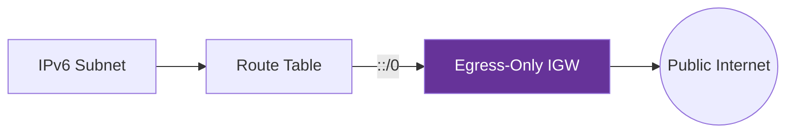

# 03. IPv6 and Egress-Only Gateways

In the world of IPv4, we use NAT to hide private instances from the web. In IPv6, there is no NAT. Every instance gets a **Globally Unique Address (GUA)** that is potentially reachable from the internet. To maintain the "Outbound Only" security of a private subnet in an IPv6 environment, AWS provides the **Egress-Only Internet Gateway**.

## Why No NAT for IPv6?

IPv6 has such a massive address space (2^128) that we no longer need to "save" addresses by hiding them behind a single IP. Instead, security is handled via routing and firewalls.

### Key Differences:
*   **Bidirectional**: A standard IGW allows traffic both In and Out for IPv6.
*   **Unidirectional**: An Egress-Only IGW allows instances to reach the internet, but **drops all incoming traffic initiated from the internet**.

---

## Comparison Table

| Feature | Internet Gateway (IGW) | Egress-Only IGW |
| :--- | :--- | :--- |
| **IPv4 Support** | Yes | No |
| **IPv6 Support** | Yes | Yes (Only) |
| **Inbound Access** | Allowed (if permitted by SG) | Blocked (Always) |
| **Outbound Access** | Allowed | Allowed |
| **Typical Use** | Public Subnets | Private Subnets (IPv6) |

---

## Real-Life Scenarios

### Scenario 1: "The IPv6 Security Gap"
**Problem**: A company moved their application servers to IPv6. They were surprised to see that their servers were receiving direct pings from the public internet.
**Discovery**: They were using a standard Internet Gateway for the IPv6 route (`::/0`), which permitted inbound traffic.
**Solution**: Replaced the standard IGW route with an **Egress-Only IGW**.
*   Result: The servers could still download updates, but were no longer "visible" to external scanners.

### Scenario 2: "The Outbound Only Requirement"
**Problem**: An auditor required proof that private instances could not receive unsolicited traffic, even though they had global IPv6 addresses.
**Solution**: Demonstrated the presence of the `eigw-xxxx` in the route table and the absence of a standard `igw-xxxx` for the `::/0` destination.
*   Result: Compliance reached; the Egress-Only IGW proved a hardware-enforced "one-way door".

---

## ❓ Interview Questions

1. **Does IPv6 use NAT in a VPC?**
    - No. All IPv6 addresses are globally unique and routable.
2. **What is an Egress-Only Internet Gateway?**
    - A VPC component that allows outbound IPv6 traffic while blocking all inbound traffic initiated from the internet.
3. **Can an Egress-Only IGW handle IPv4 traffic?**
    - No, it is exclusively for IPv6.
4. **Where do you point the `::/0` route in a private IPv6 subnet?**
    - To the Egress-Only Internet Gateway (`eigw-xxxx`).
5. **How does an Egress-Only IGW differ from a NAT Gateway?**
    - A NAT Gateway translates Private IPs to a Public EIP for IPv4. An Egress-Only IGW performs **no translation**; it just filters the traffic based on direction for IPv6.
6. **Is there a cost for an Egress-Only IGW?**
    - No, the resource itself is free.
7. **Is it horizontally scaled?**
    - Yes, like the standard IGW, it is managed by AWS and scales automatically.
8. **Can you attach multiple Egress-Only IGWs to a VPC?**
    - Yes, unlike the IGW, you can have multiple of these, though one is usually sufficient.
9. **How do you find the Egress-Only IGW ID?**
    - It starts with the prefix `eigw-`.
10. **Does it support stateful traffic?**
    - Yes, it allows response traffic back in for a connection initiated from the instance.

---

## 🧠 Quiz

1. **Protocol handled by Egress-Only IGW:**
    - [x] IPv6
    - [ ] IPv4
2. **True or False: IPv6 uses NAT in AWS.**
    - [x] False
    - [ ] True
3. **Egress-Only IGW allows:**
    - [x] Outbound Initiated Traffic
    - [ ] Inbound Initiated Traffic
4. **Standard IPv6 default route is:**
    - [x] ::/0
    - [ ] 0.0.0.0/0
5. **Egress-Only IGW prefix:**
    - [x] eigw-
    - [ ] vpc-
6. **Does it perform IP translation?**
    - [x] No
    - [ ] Yes
7. **Can you use it in a public subnet?**
    - [x] You can, but a standard IGW is more common for bidirectional needs.
    - [ ] No
8. **Is it managed by AWS?**
    - [x] Yes
    - [ ] No
9. **Bandwidth limit:**
    - [x] Scales automatically
    - [ ] 1 Gbps
10. **Stateful or Stateless?**
    - [x] Stateful
    - [ ] Stateless
11. **Required for IPv6 in private subnets?**
    - [x] Yes (to reach the web)
    - [ ] No
12. **IGW vs EIGW for inbound traffic:**
    - [x] EIGW blocks it
    - [ ] IGW blocks it
13. **IPv6 length in bits:**
    - [x] 128
    - [ ] 32
14. **GUA stands for:**
    - [x] Globally Unique Address
    - [ ] General Utility Address
15. **EIGW is a regional resource?**
    - [x] Yes
    - [ ] No
16. **Is it part of VPC?**
    - [x] Yes
    - [ ] No
17. **Can it replace a NAT Gateway for IPv4?**
    - [x] No
    - [ ] Yes
18. **Does it require an Elastic IP?**
    - [x] No
    - [ ] Yes
19. **Can you associate a SG with an EIGW?**
    - [x] No
    - [ ] Yes
20. **Main benefit of IPv6 over IPv4:**
    - [x] Address Space Size
    - [ ] Faster speed