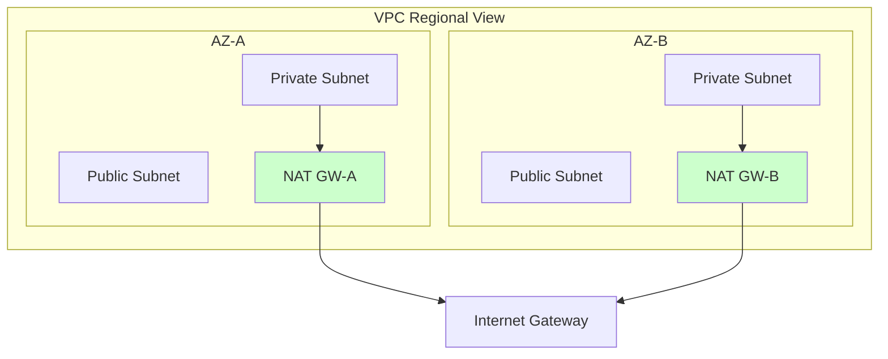

# 04. High Availability and Optimization

Designing gateways is not just about connectivity; it is about ensuring that a failure in one Availability Zone (AZ) doesn't bring down your entire architecture.

## The NAT Gateway Single-Zone Fallacy

Many developers deploy a single NAT Gateway in "Subnet A" and point all routes from all AZs to it.

### Why this is BAD:
1.  **Single Point of Failure**: If Availability Zone 1 goes down, the NAT Gateway in Subnet A dies. Even if your App Servers in Zone 2 are healthy, they lose internet connectivity and crash.
2.  **Latency & Cost**: Traffic crossing from Zone 2 to Zone 1 incurs **Cross-AZ Data Transfer** charges and minor latency.

## Best Practice: One NAT per AZ
To achieve **High Availability (HA)**:
1.  Deploy a NAT Gateway in **every** public subnet (one per AZ).
2.  Update the private route table of each AZ to point to its **local** NAT Gateway.

---

## Cost Optimization

NAT Gateways have two costs:
*   **Hourly Rate**: ~$32/month per NAT Gateway.
*   **Data Processing**: ~$0.045 per GB.

### Strategies to Save:
*   **VPC Endpoints**: Use Interface or Gateway Endpoints for services like S3 or DynamoDB. This traffic stays internal and avoids NAT processing charges.
*   **Combine Small Regions**: If a region only has dev workloads, maybe use a NAT Instance (t3.micro) instead of a Managed NAT Gateway.

---

## Real-Life Scenarios

### Scenario 1: "The Regional Outage"
**Problem**: A major cloud provider had an outage in a single Availability Zone. A fintech company lost their entire platform even though their servers were multi-AZ.
**Discovery**: They had only one NAT Gateway. It was in the failing AZ. All servers in the healthy AZ lost connection to the payment processing API.
**Solution**: Migrated to a **Multiple NAT Gateway** architecture.

### Scenario 2: "The S3 Bill Spike"
**Problem**: A data-science team was processing petabytes of data from S3 using private EC2 instances. Their NAT Gateway bill was $15,000 per month.
**Discovery**: S3 traffic was being routed through the NAT Gateway.
**Solution**: Deployed an **S3 Gateway Endpoint**.
*   Result: NAT costs dropped to $50/month. The S3 Gateway Endpoint is free and the traffic no longer transited the NAT.

### Scenario 3: "Ghost Traffic"
**Problem**: An administrator saw a massive amount of data being processed by a NAT Gateway, but couldn't identify which instance was responsible.
**Solution**: Enabled **VPC Flow Logs**.
*   Result: Identified a rogue background script on a staging server that was uploading logs to an external site every 5 seconds.

---

## ❓ Interview Questions

1. **How do you make a NAT Gateway highly available across a region?**
    - You don't. A managed NAT Gateway is only HA within a single AZ. You must deploy one per AZ for regional HA.
2. **What is the most common way to reduce NAT Gateway costs?**
    - Using VPC Endpoints (for S3, DynamoDB, etc.) to keep traffic inside the AWS network.
3. **What is cross-AZ data transfer?**
    - A fee charged when data moves between different Availability Zones in the same region.
4. **How do you monitor NAT Gateway bandwidth?**
    - Using the `BytesOutPerSecond` and `BytesInPerSecond` metrics in Amazon CloudWatch.
5. **If a NAT Gateway in AZ-1 fails, does a NAT in AZ-2 automatically take over?**
    - No. Route Tables are static. You would need to manually update the route or use automation (like Lambda) to failover. This is why "one per AZ" is preferred.
6. **Can a NAT Gateway be shared across multiple VPCs?**
    - Not directly. You would need Transit Gateway or VPC Peering to route traffic to the VPC where the NAT lives.
7. **Is there a data transfer limit for NAT Gateways?**
    - No, but you are billed for every GB processed.
8. **What is the default retry limit for NAT Gateway port allocation?**
    - NAT Gateways can handle 55,000 concurrent connections to a single destination.
9. **How do you identify which instance is causing high NAT usage?**
    - Analyze VPC Flow Logs.
10. **Does a NAT Gateway support port forwarding?**
    - No. It is for outbound traffic only.

---

## 🧠 Quiz

1. **Best HA strategy for NAT Gateway:**
    - [x] One per AZ
    - [ ] One per VPC
2. **S3 traffic should use:**
    - [x] Gateway Endpoint
    - [ ] NAT Gateway
3. **Price model for NAT GW:**
    - [x] Hourly + Usage
    - [ ] Fixed Monthly
4. **NAT Gateway is highly available within:**
    - [x] Its own AZ
    - [ ] The whole Region
5. **Cross-AZ transfer is:**
    - [x] A billable charge
    - [ ] Free
6. **VPC Flow Logs help to:**
    - [x] Identify traffic sources
    - [ ] encrypt traffic
7. **NAT Gateway limits concurrent connections to one target at:**
    - [x] ~55,000
    - [ ] 1,000,000
8. **To save money in Dev environments, use:**
    - [x] NAT Instance
    - [ ] NAT Gateway
9. **Interface Endpoints use:**
    - [x] PrivateLink
    - [ ] Internet Gateway
10. **A single NAT Gateway in a VPC is:**
    - [x] A single point of failure
    - [ ] High Availability standard
11. **CloudWatch metric for NAT traffic:**
    - [x] BytesOutPerSecond
    - [ ] PacketsDropped
12. **Can NAT Gateway perform port translation?**
    - [x] Yes
    - [ ] No
13. **Benefit of Gateway Endpoints:**
    - [x] Free and stays internal
    - [ ] Faster internet speed
14. **Routing 10 instances through 1 NAT GW:**
    - [x] Consolidates egress
    - [ ] Is impossible
15. **If you have 3 AZs, how many NAT GWs do you need for full HA?**
    - [x] 3
    - [ ] 1
16. **Is NAT Gateway a 'shared' service in a region?**
    - [x] No (It belongs to your VPC)
    - [ ] Yes
17. **NAT Gateway throughput starts at:**
    - [x] 5 Gbps
    - [ ] 1 Gbps
18. **Can you put a NAT Gateway in a private subnet?**
    - [x] No (Public only)
    - [ ] Yes
19. **Elastic IP is required for NAT GW?**
    - [x] Yes
    - [ ] No
20. **Is NAT Gateway cost a flat fee?**
    - [x] No (Consumption based)
    - [ ] Yes