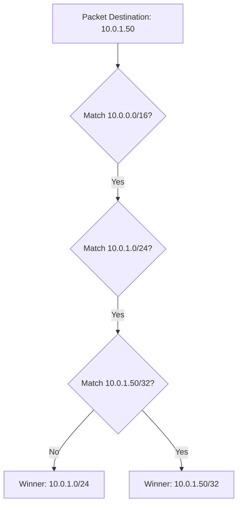

# 02. Priority Logic: Longest Prefix Match (LPM)

When a packet needs to be routed, and there are multiple matching rules in a route table, how does AWS decide which one to follow? The answer is **Longest Prefix Match (LPM)**.

## Core Principle: Specificity Wins

LPM means that the router will choose the route with the most specific destination (the one with the largest CIDR prefix/number after the slash).

### The Decision Flow

### Priority Example Table

| Destination | CIDR Number | Specificity | Priority |
| :--- | :--- | :--- | :--- |
| **0.0.0.0/0** | 0 | Least Specific | Lowest |
| **10.0.0.0/16** | 16 | Medium | Medium |
| **10.0.1.0/24** | 24 | High | High |
| **10.0.1.50/32**| 32 | Most Specific | Highest |

---

## Static vs. Propagated Routes

Sometimes you have two routes with the exact same destination prefix (e.g., both are `/24`). In this case, AWS uses the following tie-breaking order:

1.  **Static Routes**: Routes you manually entered.
2.  **Propagated Routes**: Routes learned automatically from a Virtual Private Gateway (VPN/Direct Connect).

> [!IMPORTANT]
> Within the same prefix length, **Static routes always win over Propagated routes**.

---

## Real-Life Scenarios

### Scenario 1: "The Peering Conflict"
**Problem**: A company had a general route to the internet (`0.0.0.0/0 -> igw`). They peered with a partner company using VPC Peering and added a route for the partner's network (`172.16.0.0/12 -> pcx`). 
**Question**: If a server tries to talk to `172.16.5.1`, which way does it go?
**Result**: It follows the peering connection because `/12` is more specific than `/0`. Even if the internet route existed first, LPM ensures traffic goes to the partner.

### Scenario 2: "The Emergency Bypass"
**Problem**: A critical software update was failing because the internal mirror (`10.0.5.0/24`) was corrupted. The team needed to temporarily force all traffic for that specific range to go to the public internet instead.
**Solution**: Added a temporary static route to the route table: `10.0.5.0/24 -> igw-xxx`.
*   Result: Because the VPC local route was `10.0.0.0/16`, the new `/24` route was more specific. Traffic for that specific range bypassed the broken internal mirror and went to the web.

### Scenario 3: "VPN vs. Direct Connect"
**Problem**: An office has both a VPN (Propagated) and a Direct Connect (Propagated) to AWS for redundancy. They both advertise the same `192.168.1.0/24` range.
**Result**: AWS uses **BGP path attributes** (like AS Path length) to decide between two propagated routes of the same length.

---

## ❓ Interview Questions

1. **What is Longest Prefix Match (LPM)?**
    - The rule that the most specific route (the one with the longest mask) is used when multiple routes match a destination.
2. **If I have a route for 0.0.0.0/0 and 10.0.0.0/16, which one handles traffic to 10.0.5.5?**
    - 10.0.0.0/16 (Prefix 16 > Prefix 0).
3. **What is a prefix?**
    - The number after the slash in CIDR notation, representing how many bits are fixed for the network portion.
4. **Who wins between a static route and a propagated route of the same length?**
    - The static route.
5. **If two routes have the exact same destination and target, can they both exist in one table?**
    - No. You cannot have duplicate destinations in a single route table.
6. **How does AWS handle ties in LPM?**
    - It uses the origin (Static > Propagated).
7. **What is a /32 route used for?**
    - Targeting a single specific IP address (e.g., a specific database or host).
8. **What is a 'default route'?**
    - `0.0.0.0/0`, which matches everything not caught by a more specific rule.
9. **Can a peering connection route be more specific than the local route?**
    - No. You cannot create a route more specific than the VPC CIDR that points away from `local`.
10. **Does LPM happen at the instance level?**
    - No, it happens at the VPC Routing layer before traffic hits the network interface.

---

## 🧠 Quiz

1. **Which prefix is most specific?**
    - [x] /32
    - [ ] /16
2. **Shortest prefix matches are:**
    - [x] Least specific
    - [ ] Most specific
3. **If 10.0.0.0/8 and 10.1.1.0/24 match, the winner is:**
    - [x] 10.1.1.0/24
    - [ ] 10.0.0.0/8
4. **Static routes are preferred over:**
    - [x] Propagated routes
    - [ ] All other routes
5. **The default internet route is:**
    - [x] 0.0.0.0/0
    - [ ] 255.255.255.255
6. **LPM stands for:**
    - [x] Longest Prefix Match
    - [ ] Logical Priority Model
7. **A /0 route is the:**
    - [x] Default route
    - [ ] Most specific route
8. **Can you have two /24 routes for the same destination?**
    - [x] No
    - [ ] Yes
9. **Priority is determined by the size of the:**
    - [x] Mask (Prefix)
    - [ ] Target name
10. **Propagated routes come from:**
    - [x] VPN or Direct Connect
    - [ ] Manual input
11. **Does 'local' route have high or low priority?**
    - [x] High (usually /16 or /20)
    - [ ] Low
12. **In a tie of prefix length, winner is:**
    - [x] Static
    - [ ] Propagated
13. **LPM ensures traffic goes to the:**
    - [x] Most specific target
    - [ ] Fastest target
14. **Is /31 allowed in a route table?**
    - [x] Yes (unlike subnets)
    - [ ] No
15. **Target for a peering connection:**
    - [x] pcx-xxxx
    - [ ] igw-xxxx
16. **Most specific possible host route:**
    - [x] /32
    - [ ] /0
17. **LPM is used to resolve:**
    - [x] Route conflicts
    - [ ] IP overlap
18. **If no routes match, traffic is:**
    - [x] Dropped
    - [ ] Sent to Main RT
19. **BGP is used for which routes?**
    - [x] Propagated
    - [ ] Local
20. **Is 10.0.0.0/16 more specific than 0.0.0.0/0?**
    - [x] Yes
    - [ ] No