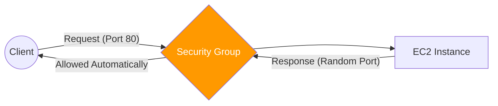

# 01. Security Groups: Stateful Defense

A **Security Group (SG)** acts as a virtual firewall for your instances (EC2, RDS, Lambda, etc.) to control inbound and outbound traffic. It is the most common and powerful security tool in a VPC.

## Core Characteristics

The defining feature of a Security Group is that it is **Stateful**.

### 1. Stateful Behavior
*   **Automatic Response**: If you allow traffic *in* through a specific port, the Security Group automatically allows the *response* to leave the instance, regardless of your outbound rules.
*   **Connection Tracking**: The SG "remembers" the connection. It maps the request to the response and ensures seamless communication.

### 2. Allow-Only Model
*   **Whitelisting**: You can only add "Allow" rules.
*   **Implicit Deny**: By default, all inbound traffic is denied. You must explicitly permit the traffic you want.
*   **No Deny Rules**: You cannot explicitly block a specific IP address in a Security Group (use a NACL for that).

### 3. ID Referencing (Abstraction)
Instead of using IP addresses, you can allow traffic from **other Security Groups** by referencing their ID (e.g., `sg-12345`).
*   **Scalability**: This allows you to say "Allow all Web Servers to talk to the Database", no matter how many web servers you have or what their IPs are.

---

## The Default Security Group

Every VPC has a default security group. If you don't specify a security group when you launch an instance, it is associated with this one.
*   **Behavior**: It allows all inbound traffic from other instances that are associated with the **same security group**.
*   **Warning**: It is usually better to create custom security groups for specific tiers.

---

## Real-Life Scenarios

### Scenario 1: "The Vanishing IPs"
**Problem**: A DevOps team was manually whitelisting the IPs of 20 web servers inside their Database SG. Every time the Auto Scaling Group rotated a server, the database became unreachable.
**Solution**: Changed the Database SG rule to: `Allow Port 3306 from Web-SG-ID`.
*   Result: Automated scaling worked perfectly without any manual IP updates.

### Scenario 2: "The Half-Open Port"
**Problem**: An administrator allowed inbound traffic on port 443 but forgot to add any outbound rules to the Security Group.
**Discovery**: The application continued to serve HTTPS traffic without issue.
**Reason**: Because SGs are stateful, the outbound response was automatically permitted by the state tracking mechanism.

### Scenario 3: "The RDS Lockdown"
**Problem**: A security audit found that the database was accepting connections from the internal dev jumpbox when it shouldn't.
**Solution**: Restricted the DB Security Group to only accept traffic from the **App Server SG ID**.
*   Result: Only the application code could reach the database; even humans on the network were blocked.

---

## ❓ Interview Questions

1. **What does 'stateful' mean in the context of Security Groups?**
    - It means that if inbound traffic is allowed, the outbound response is automatically allowed as well, without needing an explicit outbound rule.
2. **Can you create a 'Deny' rule in a Security Group?**
    - No. Security Groups only support "Allow" rules.
3. **Where are Security Groups applied?**
    - At the Instance level (specifically, at the Elastic Network Interface / ENI).
4. **How many Security Groups can be attached to an EC2 instance?**
    - Up to 5 by default (can be increased).
5. **If an instance has multiple SGs, how are the rules evaluated?**
    - They are **additive**. If *any* rule in *any* attached SG allows the traffic, it is permitted.
6. **Can you reference a Security Group from another VPC?**
    - Only if the VPCs are peered and you are in the same region (or using specific Transit Gateway configurations).
7. **Does an SG rule take effect immediately?**
    - Yes, changes are applied in real-time.
8. **What is the default outbound rule for a new custom Security Group?**
    - Allow All (`0.0.0.0/0`).
9. **What is the default inbound rule for a new custom Security Group?**
    - Deny All.
10. **Difference between SG and OS-level firewalls (like iptables)?**
    - SGs are managed by the AWS infrastructure before the traffic even reaches the instance's CPU/OS.

---

## 🧠 Quiz

1. **Security Groups are:**
    - [x] Stateful
    - [ ] Stateless
2. **Rules in an SG can only be:**
    - [x] Allow
    - [ ] Deny
3. **SGs operate at the:**
    - [x] Instance Layer (ENI)
    - [ ] Subnet Layer
4. **Reference to another SG uses:**
    - [x] Group ID (sg-xxxx)
    - [ ] Admin Name
5. **Default Inbound rule for custom SG:**
    - [x] Deny All
    - [ ] Allow All
6. **Max SGs per instance (default):**
    - [x] 5
    - [ ] 1
7. **Security Groups are additive?**
    - [x] Yes
    - [ ] No
8. **Evaluation order in SG:**
    - [x] All rules evaluated
    - [ ] Numbered order
9. **SG rules apply to:**
    - [x] Inbound and Outbound independently
    - [ ] Only Inbound
10. **Stateful return traffic is:**
    - [x] Handled automatically
    - [ ] Requires outbound rule
11. **Do SGs use rule numbers?**
    - [x] No
    - [ ] Yes
12. **Can you block one specific IP in an SG?**
    - [x] No (Use NACL)
    - [ ] Yes
13. **Benefit of SG-to-SG rules:**
    - [x] Abstraction and scalability
    - [ ] Faster connection
14. **OSI Layer for SGs:**
    - [x] Layer 3/4
    - [ ] Layer 7
15. **Initial outbound rule for custom SG:**
    - [x] Allow All
    - [ ] Deny All
16. **Is state tracking managed by AWS?**
    - [x] Yes
    - [ ] No
17. **Can SGs wrap around an RDS instance?**
    - [x] Yes
    - [ ] No
18. **If two rules conflict (one more specific), what happens?**
    - [x] Both are allowed (Additive)
    - [ ] Most specific wins
19. **Can SGs block internal VPC traffic?**
    - [x] Yes (If not explicitly allowed)
    - [ ] No
20. **Security Groups are a:**
    - [x] Mandatory component for instances
    - [ ] Optional component