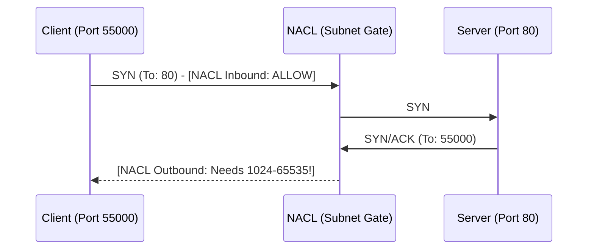

# 04. Advanced Troubleshooting

Debugging network connectivity in AWS requires a systematic approach. Most "broken" connections are caused by a misunderstanding of stateful vs. stateless behavior or the "Ephemeral Port Trap".

## The Ephemeral Port Trap

When a client connects to a server, it uses a well-known port (like 80 or 443) on the server. However, the client itself opens a temporary **Ephemeral Port** (usually between 1024-65535) to receive the response.

### Why this breaks NACLs:
Because NACLs are stateless, they don't know that an outbound packet is a response to an allowed inbound request.
*   **Inbound**: You allow Port 80.
*   **Outbound**: Your server tries to send the response to the client's port (e.g., 49152).
*   **Failure**: If your Outbound NACL only has `Allow Port 80`, the response is **Blocked**.

---

## The Troubleshooting Checklist

| Symptom | Probable Cause | Diagnostic Tool |
| :--- | :--- | :--- |
| **Connection Timeout** | Inbound security rule missing or Route Table issue | `Reachability Analyzer` |
| **Connection Refused** | Security is fine, but service isn't running | `telnet` or `nc -zv` |
| **Ping works, SSH fails** | ICMP is allowed, but TCP 22 is not | `Security Group rules` |
| **Can connect IN, but can't ping OUT** | NACL Outbound rules missing | `NACL rules` |

---

## Essential Diagnostic Tools

### 1. VPC Reachability Analyzer
A visual tool that checks the network path between two resources without sending any actual traffic. It will tell you exactly which SG or NACL is blocking the flow.

### 2. VPC Flow Logs
A feature that enables you to capture information about the IP traffic to and from network interfaces in your VPC.
*   **REJECT**: The traffic hit a firewall (SG or NACL) and was dropped.
*   **ACCEPT**: The firewall allowed the traffic. If it's still failing, the issue is inside the EC2 instance (OS-level firewall/service).

### 3. Netcat (nc)
The "Swiss Army Knife" of networking. Use it to check if a port is open.
*   `nc -zv <address> 80` (Check if port 80 is listening).

---

## Real-Life Scenarios

### Scenario 1: "The One-Way Web"
**Problem**: An EC2 instance can download updates from the internet, but users cannot browse the website hosted on it.
**Discovery**: The **Security Group** allowed outbound traffic (updates) but the inbound port 80 was missing.
**Fix**: Added Inbound Rule for Port 80.

### Scenario 2: "The Ephemeral Blackhole"
**Problem**: A new custom NACL was applied. Public web servers could still see traffic reaching them (via logs), but users always got "Timed Out".
**Discovery**: VPC Flow Logs showed `ACCEPT` on Inbound but `REJECT` on Outbound port 32768.
**Fix**: Added Outbound NACL rule for `1024-65535`.

### Scenario 3: "The Internal Wall"
**Problem**: Two instances in the same subnet could not ping each other.
**Discovery**: The **Default Security Group** had been modified and no longer allowed "All traffic from self".
**Fix**: Added a rule to allow all traffic from the Security Group's own ID.

---

## ❓ Interview Questions

1. **What is the range of ephemeral ports for a NAT Gateway?**
    - 1024–65535.
2. **How does Reachability Analyzer help in debugging?**
    - it provides a step-by-step path analysis and highlights exactly where traffic is dropped (e.g., "Blocked by Security Group sg-123").
3. **Difference between a 'Connection Timeout' and 'Connection Refused'?**
    - Timeout usually means a firewall (SG/NACL) dropped the packet. Refused usually means the packet reached the server, but no application was listening on that port.
4. **What does a REJECT in VPC Flow Logs mean?**
    - It means the traffic was blocked by either a Security Group or a Network ACL.
5. **How do you find out if a NACL is preventing a connection?**
    - Look at the Outbound rules for the subnet and check if the necessary return ports (ephemeral ports) are open.
6. **Can a Security Group block traffic from another instance in the same subnet?**
    - Yes, if there is no "Allow" rule for that traffic. SGs are enforced at the ENI level.
7. **Does 'ping' (ICMP) use the same rules as Web (TCP 80)?**
    - No. ICMP is a different protocol and must be explicitly allowed in the SG/NACL.
8. **What is 'ingress' and 'egress'?**
    - Ingress is incoming traffic; Egress is outgoing traffic.
9. **Can a NACL log traffic?**
    - No, you must use VPC Flow Logs to see which traffic was accepted or rejected by a NACL.
10. **Why would a server be able to talk to its database but not the internet?**
    - Likely because the database is internal (local route) and the internet route (0.0.0.0/0) or NAT Gateway is missing or blocked by a firewall.

---

## 🧠 Quiz

1. **Ephemeral ports are used for:**
    - [x] Return traffic
    - [ ] Initial connection
2. **Range of ephemeral ports usually starts at:**
    - [x] 1024
    - [ ] 1
3. **'REJECT' in Flow Logs indicates:**
    - [x] Firewall block
    - [ ] App crash
4. **Tool for path visualization:**
    - [x] Reachability Analyzer
    - [ ] CloudFront
5. **Connecting TO port 80 requires return ports:**
    - [x] 1024-65535
    - [ ] 80 only
6. **Stateful firewalls handle responses:**
    - [x] Automatically
    - [ ] Manually
7. **Stateless firewalls handle responses:**
    - [x] By explicit rule
    - [ ] Automatically
8. **VPC Flow Logs are enabled at:**
    - [x] VPC, Subnet, or ENI level
    - [ ] Account level only
9. **Metric for SG denial:**
    - [x] None (Use Flow Logs)
    - [ ] CloudWatch SG_Reject
10. **OS-level firewall is:**
    - [x] Inside the instance
    - [ ] In the AWS VPC dashboard
11. **Timeout usually means:**
    - [x] Traffic dropped (Firewall)
    - [ ] App error
12. **Refused usually means:**
    - [x] No listener (App)
    - [ ] Traffic dropped
13. **Protocol for ping:**
    - [x] ICMP
    - [ ] TCP
14. **Protocol for Web:**
    - [x] TCP
    - [ ] UDP
15. **Standard HTTP port:**
    - [x] 80
    - [ ] 443
16. **Standard HTTPS port:**
    - [x] 443
    - [ ] 80
17. **Standard SSH port:**
    - [x] 22
    - [ ] 3389
18. **Can you see the payload in Flow Logs?**
    - [x] No
    - [ ] Yes
19. **REJECT in Flow Logs can be from:**
    - [x] SG or NACL
    - [ ] IAM
20. **Troubleshooting 'half-open' connection means:**
    - [x] Inbound allowed, Outbound blocked
    - [ ] Connection is too slow