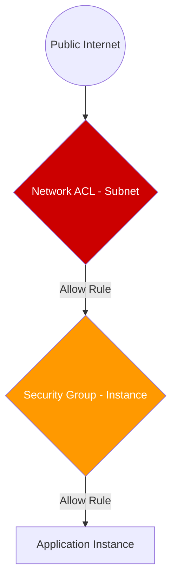

# Network Security: NACLs and Security Groups

AWS provides two layers of firewall protection for your VPC: **Security Groups** (Instance level) and **Network ACLs** (Subnet level). Understanding the layered interaction between these two is critical for architecting secure cloud environments.

## 📚 Learning Path

| # | Topic | Description | Key Concepts |
| :--- | :--- | :--- | :--- |
| **01** | [**SGs: Stateful**](./01-Security-Groups-Stateful/README.md) | The Instance-Level Firewall | State Tracking, Allow Rules, SG-IDs |
| **02** | [**NACLs: Stateless**](./02-Network-ACLs-Stateless/README.md) | The Subnet-Level Gatekeeper | Rule Numbering, Deny Rules, Ephemeral Ports |
| **03** | [**Layered Defense**](./03-Layered-Defense-Strategies/README.md) | Professional Security Design | Evaluation Order, 3-Tier Security |
| **04** | [**Troubleshooting**](./04-Advanced-Troubleshooting/README.md) | Finding the "Block" | Reachability Analyzer, Flow Logs |

---

## 🛡️ The Layered Defense Diagram

---

## 🏗️ Real-Life Scenarios

### Scenario 1: The "Invisible Block" Mystery
**Problem**: An application server in a private subnet couldn't download software updates from the internet via a NAT Gateway. The Security Group allowed all outbound traffic, and there was a valid route to the NAT Gateway.
**Crisis**: Developers were stuck for 12 hours unable to deploy critical security patches.
**Outcome**: The issue was a custom **Network ACL (NACL)**. The NACL allowed outbound traffic on ports 80/443, but it **didn't** allow inbound traffic on **ephemeral ports** (1024-65535). Because NACLs are stateless, they don't remember that the request started inside; they need an explicit return rule.
**Solution**: Add an Inbound NACL rule to allow traffic from `0.0.0.0/0` on port range `1024-65535`.
**Result**: Updates started working instantly. The team documented "Statelessness" as a key troubleshooting step.

### Scenario 2: The "Over-Permissive" Security Group
**Problem**: A junior admin attached the same Security Group to 50 different instances (web servers, app servers, and databases) to "keep it simple."
**Crisis**: A single web server was compromised via a zero-day exploit. Because it shared an SG with the database, the attacker was able to move laterally and access sensitive customer data on port 3306.
**Outcome**: A major data breach occurred that could have been prevented by network isolation.
**Solution**: Implement **Micro-segmentation**. Use different Security Groups for each tier. Web SGs only allow port 443 from LB. DB SGs only allow port 3306 from the App SGs.
**Result**: The blast radius of any future compromise is now restricted to a single tier or even a single instance.

### Scenario 3: The "Deny Rule" Requirement
**Problem**: A company detected a specific botnet IP address (`203.0.113.10`) attempting to brute-force their web servers.
**Crisis**: Security Groups only support "Allow" rules. They couldn't specifically block just that one malicious IP without blocking everyone else.
**Outcome**: The botnet continued to pound the CPU of the web servers, causing high latency for legitimate users.
**Solution**: Use a **Network ACL** to add a "Deny" rule with a low rule number (e.g., Rule 50) for that specific IP.
**Result**: The malicious traffic was dropped at the subnet boundary before even reaching the instances, immediately stabilizing the platform.

---

## ❓ Interview Questions

1.  **Explain the difference between 'Stateful' and 'Stateless' firewalls.**
    - *Answer*: A **Stateful** firewall (Security Groups) remembers the state of a connection. If you allow inbound traffic on port 80, the return traffic is automatically allowed outbound. A **Stateless** firewall (NACLs) does not remember state; you must explicitly define both inbound and outbound rules for every communication path.
2.  **In what order are NACL rules evaluated?**
    - *Answer*: From the **lowest rule number to the highest**. As soon as a packet matches a rule (Allow or Deny), evaluation stops, and that rule is applied. This is why "Deny" rules for specific IPs should have lower numbers than "Allow" rules for broader ranges.
3.  **Why do NACLs require rules for 'Ephemeral Ports'?**
    - *Answer*: Because NACLs are stateless. When an instance sends a request to a website (Outbound), the website responds with traffic on a random high port (Ephemeral port). Since the NACL doesn't "remember" the outbound request, you must have an inbound rule to allow that response traffic back in.
4.  **Can you reference a Security Group by its ID in another Security Group's rules?**
    - *Answer*: Yes, and this is a best practice. Instead of whitelisting an IP range, you can say "Allow port 3306 from `sg-123456` (the App Tier SG)". This ensures that only instances with that specific SG can access the database, regardless of what their IP address is.
5.  **What is the default behavior of a custom NACL when it is first created?**
    - *Answer*: By default, a **custom** NACL denies all inbound and outbound traffic until you add rules. (Note: The **default** NACL that comes with the VPC allows all traffic to facilitate ease of use).
6.  **Which layer should you use to block a specific malicious IP address?**
    - *Answer*: You should use a **Network ACL**. Security Groups only support "Allow" rules, so you cannot specifically target an IP for blocking. NACLs support "Deny" rules, making them the correct tool for blocking malicious actors.

---

## 🧠 Comprehensive Quiz (25 Questions)

<b>1. Security Groups are enforced at which level?</b>

Show Answer

Answer: B

<b>2. True/False: Network ACLs (NACLs) are stateful.</b>

Show Answer

Answer: B

<b>3. Which component supports 'Deny' rules?</b>

Show Answer

Answer: B

<b>4. What is the evaluation order for NACL rules?</b>

Show Answer

Answer: B

<b>5. True/False: If an SG allows inbound traffic on port 80, outbound traffic on the same connection is automatically allowed.</b>

Show Answer

Answer: A

<b>6. 'Ephemeral Ports' typically fall into which range?</b>

Show Answer

Answer: B

<b>7. How many Security Groups can be attached to a single network interface (ENI)?</b>

Show Answer

Answer: B (Standard limit)

<b>8. When multiple SGs are attached to an instance, the effective policy is:</b>

Show Answer

Answer: B

<b>9. True/False: A NACL can be associated with multiple subnets.</b>

Show Answer

Answer: A

<b>10. What happens if a packet doesn't match any rule in a NACL?</b>

Show Answer

Answer: B

<b>11. Which is a best practice for Database security?</b>

Show Answer

Answer: B

<b>12. 'Stateless' means the firewall does NOT:</b>

Show Answer

Answer: B

<b>13. In a 3-Tier architecture, which tier should be in a public subnet?</b>

Show Answer

Answer: B

<b>14. True/False: You can change the 'Default NACL' to deny all traffic.</b>

Show Answer

Answer: A

<b>15. What rule number is evaluated first in a NACL?</b>

Show Answer

Answer: B

<b>16. 'Source' in a Security Group rule can be:</b>

Show Answer

Answer: D

<b>17. If a NACL denies traffic on port 80, but the SG allows it, what happens?</b>

Show Answer

Answer: B

<b>18. Security Group rules are only:</b>

Show Answer

Answer: B

<b>19. True/False: You can add tags to Security Groups.</b>

Show Answer

Answer: A

<b>20. 'Ingress' rules control:</b>

Show Answer

Answer: B

<b>21. NACLs are primarily used for:</b>

Show Answer

Answer: B

<b>22. Which port range do servers use to respond to clients?</b>

Show Answer

Answer: B

<b>23. Total number of rules allowed in a NACL (default)?</b>

Show Answer

Answer: A (AWS Default, increaseable via quota)

<b>24. A Security Group acts at Layer _____ of the OSI Model.</b>

Show Answer

Answer: B

<b>25. Without a layered defense, a single bug can lead to a _____.</b>

Show Answer

Answer: B

