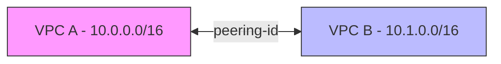
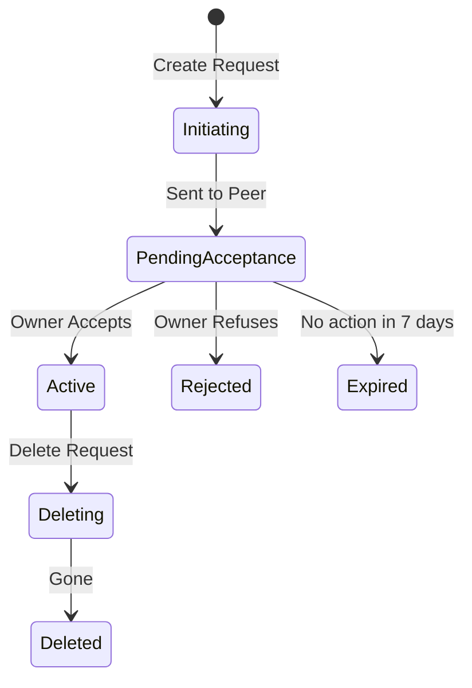

# 01. VPC Peering Basics

**VPC Peering** is a networking connection between two VPCs that enables you to route traffic between them using private IPv4 or IPv6 addresses. It is fundamentally a "point-to-point" connection, acting like a private virtual cable between two networks.

## Core Concepts

### 1. Point-to-Point Connectivity
A peering connection connects exactly two VPCs. It is not a broad network entry point; it is a dedicated bridge for specific traffic.

### 2. Peering Lifecycle
The process of establishing a peer follows a strict "Request -> Accept" state machine to ensure both VPC owners agree to the connection.

### 3. Critical Constraints
*   **No Overlapping CIDRs**: You cannot peer VPCs that have overlapping or identical IP ranges (e.g., both use `10.0.0.0/16`).
*   **Regional Limit**: By default, you can have up to 50 active peering connections per VPC (can be increased).
*   **Inter-Region Support**: You can peer VPCs across different AWS Regions (Inter-Region Peering) and different AWS Accounts.

---

## Real-Life Scenarios

### Scenario 1: "The IP Collision"
**Problem**: Two companies merged (Company A and Company B). Both had their primary VPCs set up with the default `10.0.0.0/16` CIDR.
**Outcome**: When they tried to create a VPC peering connection to share database resources, AWS blocked the request immediately.
**Solution**: Company B had to create a new VPC with a different CIDR (`172.16.0.0/16`) and migrate its resources before they could peer.

### Scenario 2: "The Cross-Account Handshake"
**Problem**: An external security vendor needed private access to a client's "Logs VPC" in a separate AWS account.
**Discovery**: The vendor initiated the request, but the connection sat in `Pending Acceptance` for 3 days.
**Solution**: The client had to log into their own AWS console, locate the "Peering Connections" section, and manually click "Accept Request".
*   Result: Once accepted, the state moved to `Active`, and traffic could flow (after route table updates).

### Scenario 3: "Global Latency Check"
**Problem**: A gaming startup wanted to peer their US-East-1 VPC with their Tokyo (AP-Northeast-1) VPC to synchronize leaderboards.
**Question**: Does traffic traverse the public internet?
**Result**: No. Inter-Region peering traffic stays on the AWS global backbone, ensuring lower latency and higher security compared to a VPN over the internet.

---

## ❓ Interview Questions

1. **What is the most important requirement before starting a VPC peering request?**
    - Ensuring that the CIDR blocks of the two VPCs do not overlap.
2. **Does VPC Peering traffic go over the public internet?**
    - No. All traffic stays within the private AWS network backbone.
3. **What is the ID prefix for a VPC Peering connection?**
    - `pcx-xxxx`.
4. **Who pays for the data transfer in a VPC peering connection?**
    - Standard inter-AZ/inter-Region data transfer rates apply to both sides. There is no hourly fee for the peering connection itself.
5. **Can you peer two VPCs in different AWS Accounts?**
    - Yes, as long as you have the Account ID and VPC ID of the peer.
6. **What happens if a peering request is not accepted within 7 days?**
    - It expires and its status changes to `Expired`.
7. **Is there a bandwidth limit for VPC peering?**
    - No. The bandwidth is limited only by the instance types and the network performance of the VPCs themselves. There is no "bottleneck" gateway in between.
8. **Can you modify the CIDR of a VPC after it has been peered?**
    - No, you cannot add or remove CIDR blocks from a VPC that has an active peering connection (though some recent AWS updates have relaxed this for secondary CIDRs).
9. **How many VPCs can be involved in a single peering connection?**
    - Exactly two.
10. **Is VPC Peering an 'all-or-nothing' connection?**
    - No. While the peering bridge is built, the actual traffic flow is controlled by individual Route Tables and Security Groups.

---

## 🧠 Quiz

1. **Peering Prefix:**
    - [x] pcx-
    - [ ] tgw-
2. **Is Peering 1-to-1 or Many-to-Many?**
    - [x] 1-to-1
    - [ ] Many-to-Many
3. **Do overlapping CIDRs work?**
    - [x] No
    - [ ] Yes
4. **Time until a request expires:**
    - [x] 7 Days
    - [ ] 24 Hours
5. **Cost for active Peering Connection:**
    - [x] $0 (Only data transfer)
    - [ ] $0.05 per hour
6. **Peering across regions is called:**
    - [x] Inter-Region Peering
    - [ ] Global VPC
7. **Maximum default peering per VPC:**
    - [x] 50
    - [ ] 10
8. **Does traffic encrypt by default?**
    - [x] Yes (on the AWS backbone)
    - [ ] No
9. **Can you peer with a VPC in another account?**
    - [x] Yes
    - [ ] No
10. **State after request is sent but not accepted:**
    - [x] Pending Acceptance
    - [ ] Active
11. **Inter-Region traffic uses:**
    - [x] AWS Global Backbone
    - [ ] Public Internet
12. **Is there a gateway 'bottleneck' in peering?**
    - [x] No
    - [ ] Yes
13. **VPC Peering handles:**
    - [x] IPv4 and IPv6
    - [ ] Only IPv4
14. **To start peering, you need:**
    - [x] Account ID and VPC ID
    - [ ] IAM Admin password
15. **If A is peered with B, can B see A's internet?**
    - [x] No (Not without Transit Gateway)
    - [ ] Yes
16. **Is bandwidth limited by AWS?**
    - [x] No
    - [ ] Yes
17. **Status after a peer is deleted:**
    - [x] Deleted
    - [ ] Inactive
18. **Can you reject a peering request?**
    - [x] Yes
    - [ ] No
19. **Primary purpose of peering:**
    - [x] Private resource sharing
    - [ ] Public web hosting
20. **Is peering transitive?**
    - [x] No
    - [ ] Yes