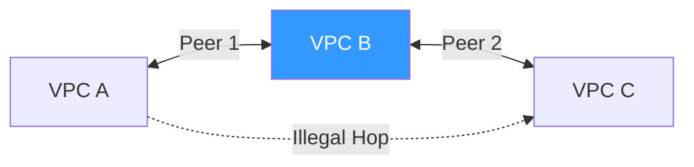

# 02. Routing and Security in Peering

Simply "Connecting" two VPCs via peering does not allow data to flow. You must configure **Route Tables**, handle **DNS Resolution**, and update **Security Groups** to bridge the two networks.

## The Non-Transitive Rule

The most famous concept in VPC peering is that it is **Non-Transitive**. If VPC A is peered with VPC B, and VPC B is peered with VPC C, VPC A **cannot** talk to VPC C using VPC B as a bridge.

### Why?
The VPC router only looks one step ahead. It does not allow "multi-hop" routing for peering. To connect A to C, you must create a **Third Peering Connection** directly between A and C.

---

## DNS Support in Peering

By default, an instance in VPC A cannot resolve the private DNS name of an instance in VPC B. 
*   **The Issue**: If you try to reach `db.internal.vpc-b`, it will fail because the DNS servers are local to their own VPCs.
*   **The Solution**: You must enable **DNS Resolution Support** on the peering connection. This tells the AWS DNS server to allow cross-VPC private hostname resolution.

---

## Cross-VPC Security Groups

In the same region, you can reference a **Security Group ID** from a peered VPC in your rules. 
*   **Benefit**: "Allow Port 3306 from `sg-web-vpc-a`". 
*   **Why it's great**: You don't have to keep track of IP addresses. If a web server in VPC A changes its IP, the database in VPC B still recognizes its SG membership.

---

## Real-Life Scenarios

### Scenario 1: "The Peering Mesh Nightmare"
**Problem**: An organization had 10 VPCs that all needed to talk to each other. They started creating peering connections.
**Discovery**: For 10 VPCs to be fully meshed, they needed `(N*(N-1))/2` connections, which is **45 connections**. The management became a nightmare.
**Result**: They realized that peering doesn't scale for large meshes (this is why they later switched to Transit Gateway).

### Scenario 2: "The Broken Database Connection"
**Problem**: A developer could ping the internal IP of a RDS database in a peered VPC, but the application (trying to use the DNS name `db-01.xxxxxxxx.region.rds.amazonaws.com`) failed to connect.
**Discovery**: DNS Resolution Support was not enabled on the `pcx-xxxx` connection.
**Solution**: Modified the Peering Connection Options to "Allow DNS resolution from accepted VPC".

### Scenario 3: "Hidden Edge-to-Edge"
**Problem**: VPC A has a VPN connection to an On-Premise office. VPC A is peered with VPC B. Can the On-Premise office talk to VPC B via the peering connection?
**Answer**: **No**. This is "Edge-to-Edge" routing, which is forbidden in VPC peering.
**Solution**: Must use Transit Gateway or a separate VPN for VPC B.

---

## ❓ Interview Questions

1. **What does it mean that VPC peering is non-transitive?**
    - If A is peered with B and B is peered with C, traffic cannot flow from A to C through B.
2. **Can you reach an On-Premise network via a peer's VPN?**
    - No. VPC peering does not support edge-to-edge routing.
3. **How do you enable private DNS resolution across a peering connection?**
    - You must enable "DNS Resolution Support" in the peering connection options for both the Requester and the Accepter.
4. **Can you reference a Security Group ID in a peered VPC?**
    - Yes, but only for **Inter-Region Peering** if specific settings are met (usually same region is standard).
5. **How do you route traffic to a peered VPC?**
    - You must add a static route to your Route Table: `Destination: Peer-CIDR, Target: pcx-xxxx`.
6. **If two peered VPCs have overlapping CIDRs, what happens to the route table?**
    - You cannot create the peering connection in the first place, so the route table conflict is avoided by the API limits.
7. **What is 'Edge-to-Edge' routing?**
    - Attempting to use a VPC as a "middleman" to reach an IGW, VGW, or another Peer.
8. **Does a peering connection automatically update my route tables?**
    - No. You must manually add the routes on **both sides** of the peering connection.
9. **Which component enforces security in a peering connection?**
    - Both Security Groups (at the instance) and NACLs (at the subnet boundary).
10. **Can you use peering to connect a VPC to a public website?**
    - No. Peering is for private IP communication only.

---

## 🧠 Quiz

1. **Non-transitive means:**
    - [x] No multi-hop routing
    - [ ] No internet access
2. **To enable DNS across VPCs, modify:**
    - [x] Peering Connection Options
    - [ ] Routing Table
3. **Edge-to-Edge routing is:**
    - [x] Blocked in Peering
    - [ ] Allowed by default
4. **Target for Peering Route:**
    - [x] pcx-id
    - [ ] igw-id
5. **If N=4, a full mesh needs:**
    - [x] 6 connections
    - [ ] 4 connections
6. **Can you reference Peer SG IDs in same region?**
    - [x] Yes
    - [ ] No
7. **DNS resolution of private IPs requires:**
    - [x] Enable DNS Resolution Support
    - [ ] Public IP address
8. **Who adds routes to the route table?**
    - [x] The User (Both sides)
    - [ ] AWS (Automatically)
9. **Can a Peer reach your Internet Gateway?**
    - [x] No
    - [ ] Yes
10. **Peering involves how many VPCs?**
    - [x] 2
    - [ ] 3
11. **If Route A points to pcx-1 and Route B points to pcx-2:**
    - [x] Most specific CIDR wins (LPM)
    - [ ] Older route wins
12. **NACLs are bypasssed by peering?**
    - [x] No
    - [ ] Yes
13. **Security Groups are bypassed by peering?**
    - [x] No
    - [ ] Yes
14. **Peering 'Request' is sent by:**
    - [x] Requester VPC
    - [ ] Accepter VPC
15. **Status for active data flow:**
    - [x] Active
    - [ ] Connected
16. **Shared resources usually live in a:**
    - [x] Hub VPC
    - [ ] Edge VPC
17. **Full Mesh Peering scaleability is:**
    - [x] Low (Complex)
    - [ ] High (Simple)
18. **Can you peer with yourself?**
    - [x] No
    - [ ] Yes
19. **If VPN is at VPC A, can VPC B use it?**
    - [x] No
    - [ ] Yes (Only with TGW)
20. **Peering is basically a:**
    - [x] Layer 3 connection
    - [ ] Layer 7 Proxy