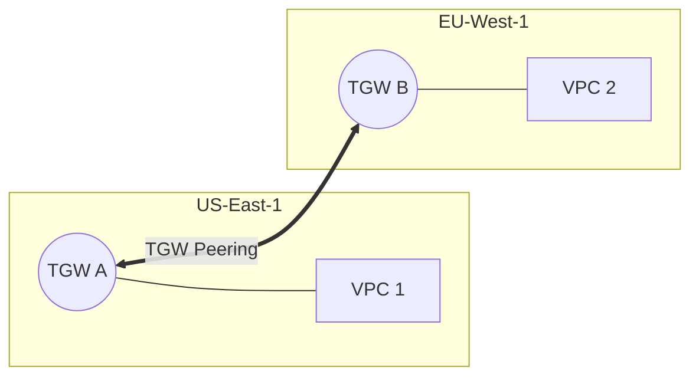

# 04. Interconnectivity Optimization

Choosing between **VPC Peering** and **Transit Gateway** isn't just about features—it's about **Cost, Complexity, and Performance**. This module explores how to optimize your interconnectivity strategy.

## Peering vs. Transit Gateway: The Decision Matrix

| Feature | VPC Peering | Transit Gateway |
| :--- | :--- | :--- |
| **Topology** | Point-to-Point (Mesh) | Hub-and-Spoke |
| **Transitive?** | No | Yes |
| **Max Throughput** | No Limit (Instance/Network restricted) | 50 Gbps per attachment |
| **Setup Cost** | **$0** (No hourly fee) | **~$36/month** per attachment |
| **Data Processing** | $0 (Only standard traffic rates) | **$0.02 per GB** (In addition to traffic) |
| **Complexity** | High for N > 5 | Low for N > 100 |

### 💡 The Golden Rule:
*   Use **Peering** for high-volume data transfers between two specific VPCs (e.g., Replication) to avoid the $0.02/GB processing fee.
*   Use **Transit Gateway** for managing "The Fleet"—centralizing control for dozens or hundreds of VPCs and Shared Services.

---

## Performance Optimization

### 1. MTU (Maximum Transmission Unit)
*   **VPC Peering**: Supports Jumbo Frames (9001 MTU) for all traffic within the same region.
*   **Transit Gateway**: Supports 8500 MTU for VPC-to-VPC traffic. If your traffic traverses a VPN or TGW Peering, it drops to 1500 MTU.

### 2. Multi-Region Optimization
Peering Transit Gateways across regions is more efficient than building a complex VPN mesh.

---

## Real-Life Scenarios

### Scenario 1: "The Surprise Bill"
**Problem**: A startup moved all their internal traffic (200 TB/month) from Peering to Transit Gateway for "simplicity".
**Discovery**: Their AWS bill jumped by $4,000. Why?
**Impact**: The TGW data processing fee ($0.02 * 200,000 GB = $4,000) was added on top of standard data transfer.
**Optimization**: For their highest-volume "Data Lake to Analytics" traffic, they moved back to a private Peering connection, saving the $0.02/GB fee.

### Scenario 2: "The Latency Gap"
**Problem**: A HFT (High Frequency Trading) app noticed a slight latency increase after switching to TGW.
**Discovery**: TGW is a managed service that adds a tiny "hop" delay (sub-millisecond, but measurable). 
**Solution**: Critical latency-sensitive nodes were placed in the same VPC or connected via Peering to remove the TGW hop.

### Scenario 3: "Centralized Egress"
**Problem**: 100 VPCs each had their own NAT Gateway ($32/month each + data). Total cost: $3,200/month just for the gateways.
**Optimization**: They created a "Central Egress VPC" with one pair of NAT Gateways and used TGW to route all internet-bound traffic from the other 99 VPCs to this central hub.
**Result**: Saved ~$3,000/month by consolidating infrastructure.

---

## ❓ Interview Questions

1. **Which is cheaper for transferring 1 PB of data: Peering or TGW?**
    - Peering, because it lacks the $0.02/GB processing fee found in TGW.
2. **When should you start considering TGW over Peering?**
    - Usually when you reach 5-10 VPCs, or when you need transitive routing/centralized egress.
3. **What is the MTU limit for Transit Gateway VPC attachments?**
    - 8500 MTU.
4. **Does TGW support Jumbo Frames (9001 MTU)?**
    - No, the maximum is 8500 for VPC traffic and 1500 for VPN/Peered TGW traffic.
5. **How can TGW help save money on NAT Gateways?**
    - By centralizing internet egress through a single "Egress VPC" shared via TGW.
6. **If you peer two TGWs in different regions, do you pay for data transfer?**
    - Yes, standard Inter-Region data transfer rates apply, plus TGW processing on both ends.
7. **Can you use TGW for "Service Insertion" (IDS/IPS)?**
    - Yes, by using TGW Route Tables to route traffic through an inspection VPC.
8. **Is TGW more performant than Peering?**
    - Theoretically no. Peering has no bandwidth cap other than the instance/network, while TGW is capped at 50Gbps per attachment.
9. **What is the limit of TGW Route Tables per Region?**
    - 20 per TGW (by default).
10. **Does TGW simplify on-premise connectivity?**
    - Yes, you connect VPN/DX once to the TGW, and all attached VPCs can reach it immediately.

---

## 🧠 Quiz

1. **Processing fee for TGW:**
    - [x] $0.02 per GB
    - [ ] $0.01 per GB
2. **Which supports Jumbo Frames (9001 MTU)?**
    - [x] VPC Peering
    - [ ] Transit Gateway
3. **Complexity of managing 100 VPCs via Peering:**
    - [x] Extremely High
    - [ ] Low
4. **Hourly cost of a TGW attachment:**
    - [x] ~$0.05 ($36/mo)
    - [ ] $0.10
5. **Best for high-volume, 1-to-1 sync:**
    - [x] VPC Peering
    - [ ] TGW
6. **MTU for TGW VPC traffic:**
    - [x] 8500
    - [ ] 1500
7. **Consolidating NAT Gateways uses a:**
    - [x] Central Egress VPC
    - [ ] Direct Connect
8. **Peering bandwidth limit:**
    - [x] None (Physical/Instance limits)
    - [ ] 50 Gbps
9. **Which supports 'Appliance Mode'?**
    - [x] Transit Gateway
    - [ ] VPC Peering
10. **TGW is shared across accounts using:**
    - [x] AWS RAM
    - [ ] Peering
11. **Do you pay for the TGW itself?**
    - [x] No (Only attachments)
    - [ ] Yes
12. **Inter-Region Peering Data Cost:**
    - [x] Same as Standard Inter-Region traffic
    - [ ] Free
13. **Centralizing DNS can be done with:**
    - [x] TGW + Route 53 Resolver
    - [ ] Peering only
14. **Which is a 'Regional Router'?**
    - [x] Transit Gateway
    - [ ] Internet Gateway
15. **If N=10, peering mesh needs:**
    - [x] 45 connections
    - [ ] 10 connections
16. **TGW processing fee applies to:**
    - [x] All data entering/leaving TGW
    - [ ] Only internet traffic
17. **Can TGW Peer with another TGW?**
    - [x] Yes
    - [ ] No
18. **MTU for traffic over TGW Peering:**
    - [x] 1500
    - [ ] 8500
19. **Who pays for cross-account TGW attachments?**
    - [x] The account owning the VPC attachment
    - [ ] The account owning the TGW
20. **TGW simplifies the 'Routing Table Explosion'?**
    - [x] Yes
    - [ ] No