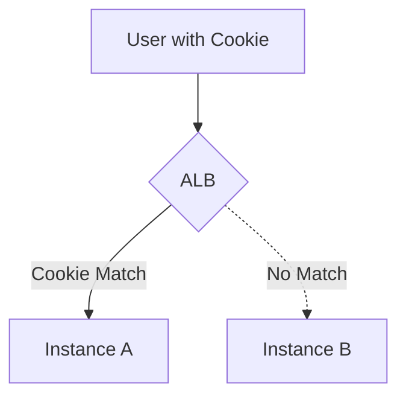
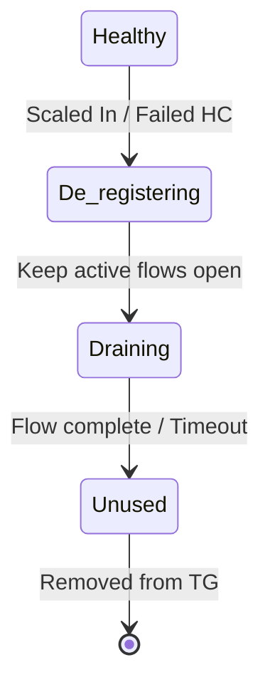

# 04. Advanced ELB Optimization

A functional Load Balancer is just the start. To make your architecture resilient, secure, and performant, you must master advanced settings like **Stickiness, Draining, and SSL/TLS Offloading.**

## 1. Sticky Sessions (Session Affinity)

By default, an ALB routes each request to a target based on the load balancing algorithm. However, stateful applications need a user to stay on the same instance.

*   **How it works**: ALB inserts a cookie (AWSALB) into the user's browser.
*   **The Problem**: If a target goes down, the session is lost. If an ASG scales up, the traffic won't rebalance until the cookie expires.
*   **Best Practice**: Build stateless applications so you don't need stickiness.

## 2. Deregistration Delay (Connection Draining)

When an instance is being "Deregistered" (due to a failing health check or an ASG scale-in), you don't want to kill active user connections immediately.

*   **Deregistration Delay**: A timeout (Default: 300s) where the LB stops sending *new* requests but allows *active* requests to finish.
*   **Outcome**: Zero-downtime maintenance and graceful scaling.

## 3. SSL/TLS Termination and Offloading

Managing certificates on every EC2 instance is a security and administrative nightmare.

*   **Termination**: The encrypted connection ends at the ALB. The ALB talks to the backend instances over HTTP (private).
*   **Benefits**: Centralized certificate management (via ACM), lower CPU load on the backend, and easier rotation.
*   **End-to-End Encryption**: If compliance (HIPAA/PCI) requires it, you can terminate at the ALB *and* re-encrypt to the backend.

---

## Real-Life Scenarios

### Scenario 1: "The Dropped Order"
**Problem**: During a deployment, some users were getting "502 Bad Gateway" errors even though the new instances were healthy.
**Discovery**: The ASG was killing "old" instances too fast. The connection draining timeout was set to 0.
**Solution**: Set the Deregistration Delay to 60 seconds.
**Outcome**: Users finishing their 10-second checkout process were allowed to finish before the instance was terminated.

### Scenario 2: "The Re-Login Loop"
**Problem**: Users on a legacy forum were being logged out randomly every time they refreshed the page.
**Discovery**: The forum used local files for sessions (stateful). Traffic was jumping between 3 different instances.
**Solution**: Enabled **Sticky Sessions** on the ALB Target Group.
**Outcome**: Users remained pinned to the instance where they logged in, stopping the log-out issue.

### Scenario 3: "The Certificate Renewal Panic"
**Problem**: An admin forgot to renew an SSL certificate on a web server, crashing the site.
**Solution**: Moved the certificate to **ACM (AWS Certificate Manager)** and attached it to the ALB.
**Outcome**: ACM handled the auto-renewal and deployment, ensuring the site never went down due to an expired cert again.

---

## ❓ Interview Questions

1. **What is 'Connection Draining' and why is it important?**
    - It allows the LB to finish servicing active requests before removing an instance, preventing errors during scaling or deployments.
2. **What is 'SSL Termination'?**
    - Decrypting the HTTPS traffic at the Load Balancer so the backend instances don't have to.
3. **What is a 'Sticky Session' (Session Affinity)?**
    - Binding a user's session to a specific instance via a cookie so they don't jump between servers.
4. **Why would you disable 'Cross-Zone Load Balancing'?**
    - To avoid inter-AZ data transfer costs (though this can lead to traffic imbalances).
5. **What is 'Pre-warming'?**
    - Asking AWS Support to scale your Load Balancer ahead of a huge, expected spike (ALB/CLB only).
6. **Can you manage SSL certificates for ELB using AWS Certificate Manager (ACM)?**
    - Yes, and it's the recommended way to handle auto-renewals.
7. **What happens to existing connections during Deregistration Delay?**
    - They are allowed to stay open until the timeout expires or the client closes them.
8. **Is it possible to have encrypted traffic between the ALB and the backend?**
    - Yes (End-to-End Encryption).
9. **How do you troubleshoot an ALB that is returning 502 errors?**
    - Usually, this means the backend instance returned an invalid response or closed the connection prematurely. Check target group health logs.
10. **How does an ALB know which certificate to use for which domain?**
    - Using **SNI (Server Name Indication)**.

---

## 🧠 Quiz

1. **Default Deregistration Delay time:**
    - [x] 300 seconds
    - [ ] 10 seconds
2. **Stickiness requires a:**
    - [x] Cookie
    - [ ] Static IP
3. **Centralized certificate management service:**
    - [x] AWS ACM
    - [ ] AWS IAM
4. **If stickiness is on, and an instance dies:**
    - [x] The session is lost
    - [ ] The session moves automatically
5. **Goal of Connection Draining:**
    - [x] Zero-downtime maintenance
    - [ ] Faster page loads
6. **Feature for site-wide HTTPS management:**
    - [x] SSL Termination
    - [ ] HTTP Proxy
7. **Does ALB support auto-scaling?**
    - [x] Yes (AWS manages its resources)
    - [ ] No
8. **Problem with stateful apps without stickiness:**
    - [x] Logout loops / Data loss
    - [ ] High latency
9. **Cross-Zone LB is enabled by default on:**
    - [x] ALB
    - [ ] NLB
10. **Which header shows the original protocol (HTTP vs HTTPS)?**
    - [x] X-Forwarded-Proto
    - [ ] X-Protocol-Type
11. **Deregistration state where traffic is forbidden but flows remain:**
    - [x] Draining
    - [ ] Unused
12. **Can ACM handle private certificates?**
    - [x] Yes (Private CA)
    - [ ] No
13. **Sticky sessions on ALB can be:**
    - [x] Duration-based or Application-based
    - [ ] Only 24 hours
14. **Best practice for HA across regions:**
    - [x] Route 53 Global Server Load Balancing (GSLB)
    - [ ] One giant ALB
15. **Status code for 'Bad Gateway' (LB error):**
    - [x] 502
    - [ ] 503
16. **Is stickiness good for traffic balancing?**
    - [x] No (leads to imbalance)
    - [ ] Yes
17. **Which LB doesn't have a 'Warm-up' delay?**
    - [x] NLB
    - [ ] ALB
18. **SSL Offloading reduces backend _______ usage:**
    - [x] CPU
    - [ ] Disk
19. **Can you use SNI with NLB?**
    - [x] Yes (TLS listeners)
    - [ ] No
20. **Is 0 a valid Deregistration Delay?**
    - [x] Yes (kills connections instantly)
    - [ ] No