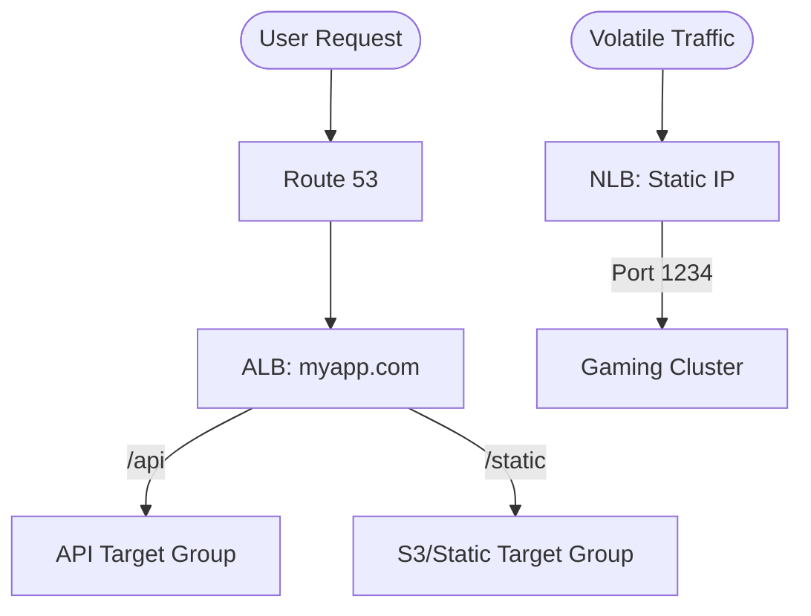

# Load Balancing (ALB, NLB, GLB)

Distribute traffic, ensure high availability, and secure your applications with AWS Elastic Load Balancing. This module explores everything from simple health checks to the complex routing of microservices.

## 📚 Learning Path

| # | Topic | Description | Key Concepts |
| :--- | :--- | :--- | :--- |
| **01** | [**ELB Fundamentals**](./01-ELB-Types-and-Fundamentals/README.md) | The Traffic Cop | Listeners, Target Groups, Health Checks |
| **02** | [**ALB Deep Dive**](./02-ALB-Deep-Dive-L7-Routing/README.md) | Layer 7 Intelligence | Path/Host Rules, WAF, Microservices |
| **03** | [**NLB & GLB**](./03-NLB-and-GLB-Architecture/README.md) | High Performance/Security | Millions of RPS, Static IPs, Appliances |
| **04** | [**Optimization**](./04-Advanced-ELB-Optimization/README.md) | Pro Management | Sticky Sessions, SSL Offloading, Draining |

---

## ⚖️ Comparison at a Glance

| Factor | ALB | NLB | GLB |
| :--- | :--- | :--- | :--- |
| **Layer** | 7 (App) | 4 (Transport) | 3 (Network) |
| **Latency** | Milliseconds | Microseconds | N/A (Transparent) |
| **IP Address** | Dynamic (DNS name) | Static (EIP) | Target-dependent |
| **Routing** | Path/Host Headers | IP/Port only | Transparent pass |

---

## 🛠️ Architecture Visualization

---

## 🏗️ Real-Life Scenarios

### Scenario 1: The "Zombie Instance" Outage
**Problem**: An application server's CPU spiked to 100%, causing the application to hang. However, the server was still responding to TCP pings.
**Crisis**: Users were being directed to a broken server that never loaded. Error rates spiked to 40%.
**Outcome**: The default health check was only "Is the port open?" which passed even though the application was "Zombie."
**Solution**: Configure **Deep Health Checks**. The ELB now checks a specific `/health` endpoint that queries the database and ensures the app logic is actually functional.
**Result**: The broken instance was marked "Unhealthy" within 30 seconds and traffic was automatically rerouted to healthy nodes.

### Scenario 2: The "Flash Sale" Bottleneck
**Problem**: A gaming company launched a new item during a stream. Traffic spiked from 10k to 1 million requests per second in 60 seconds.
**Crisis**: Their **Application Load Balancer (ALB)** couldn't scale fast enough, leading to "503 Service Unavailable" errors for the first 5 minutes of the sale.
**Outcome**: Thousands of angry customers and lost revenue.
**Solution**: Switched the gaming backend to a **Network Load Balancer (NLB)**. NLBs are designed to handle millions of requests per second with ultra-low latency and "Instant Scaling" compared to the slower pre-warming process of an ALB.
**Result**: Subsequent flash sales were handled with zero errors and sub-millisecond network latency.

### Scenario 3: The "Shopping Cart" Desync
**Problem**: An e-commerce site used local server memory to store user sessions (shopping carts).
**Crisis**: Users would add items to their cart, click "Checkout," and find their cart empty because the Load Balancer had sent the second request to a different server.
**Outcome**: Frustrated users and abandoned checkouts.
**Solution**: Enabled **Sticky Sessions** (Session Affinity) on the Target Group. This ensures that a user is consistently routed to the same server for the duration of their session. (Long-term fix: Move session data to Redis/DynamoDB).
**Result**: Users experienced a seamless shopping experience, and the company eventually migrated to a stateless architecture.

---

## ❓ Interview Questions

1.  **When would you choose an NLB over an ALB?**
    - *Answer*: Choose **NLB** for ultra-low latency (microseconds), the need for a static IP address, or handling volatile traffic that spikes in seconds (e.g., millions of requests per second). Choose **ALB** for complex HTTP routing (Path/Host based) and integrated security like WAF.
2.  **Explain 'Connection Draining' (Deregistration Delay).**
    - *Answer*: Connection Draining allows a load balancer to stop sending *new* requests to an instance that is being decommissioned or marked unhealthy, while allowing existing "In-flight" requests to complete gracefully. This prevents users from being abruptly disconnected.
3.  **What is the purpose of a 'Target Group'?**
    - *Answer*: A Target Group is a logical collection of resources (EC2 instances, Containers, IP addresses, or Lambda functions) that receive traffic from a load balancer. It defines the health check settings and the routing protocol (HTTP/HTTPS/TCP).
4.  **What is 'SSL/TLS Offloading' and why is it beneficial?**
    - *Answer*: It is the process of terminating the encrypted connection at the Load Balancer rather than the individual servers. This saves CPU resources on the backend servers and simplifies certificate management, as you only need to install the certificate on the ELB (via AWS Certificate Manager).
5.  **How does 'Cross-Zone Load Balancing' work?**
    - *Answer*: By default, each load balancer node only distributes traffic to targets in its own Availability Zone. With **Cross-Zone Load Balancing** enabled, each node distributes traffic across all healthy targets in *all* enabled AZs, ensuring a more even load distribution.
6.  **Can an Internal Load Balancer be reached from the public Internet?**
    - *Answer*: No. An Internal Load Balancer only has private IP addresses and is only accessible from within the VPC or from connected networks (VPN/Direct Connect). It is commonly used for internal service-to-service communication.

---

## 🧠 Comprehensive Quiz (25 Questions)

<b>1. At which OSI layer does the Application Load Balancer (ALB) operate?</b>

Show Answer

Answer: C

<b>2. True/False: The Network Load Balancer (NLB) provides a static Elastic IP address.</b>

Show Answer

Answer: A

<b>3. Which ELB type is best for routing based on the URL path (e.g., /api vs /images)?</b>

Show Answer

Answer: C

<b>4. 'Sticky Sessions' are also known as:</b>

Show Answer

Answer: B

<b>5. Which protocol is used by the Gateway Load Balancer (GLB) to pass traffic to appliances?</b>

Show Answer

Answer: B

<b>6. True/False: You must manually scale an Elastic Load Balancer.</b>

Show Answer

Answer: A

<b>7. 'Deregistration Delay' (Connection Draining) helps achieve:</b>

Show Answer

Answer: B

<b>8. What happens if an instance fails its health check?</b>

Show Answer

Answer: B

<b>9. ALB supports which of the following?</b>

Show Answer

Answer: D

<b>10. How does a client typically connect to an ALB (since it has dynamic IPs)?</b>

Show Answer

Answer: B

<b>11. Which ELB is 'Transparent' to the application?</b>

Show Answer

Answer: C

<b>12. 'SNI' (Server Name Indication) allows an ALB to:</b>

Show Answer

Answer: B

<b>13. True/False: Target Groups can contain Lambda functions.</b>

Show Answer

Answer: A

<b>14. Which metric determines if an ALB is overloaded?</b>

Show Answer

Answer: B

<b>15. 'Internal' vs 'Internet-Facing' determines:</b>

Show Answer

Answer: B

<b>16. True/False: You can route traffic based on HTTP Headers in an ALB.</b>

Show Answer

Answer: A

<b>17. Target Group type 'IP' allows you to load balance to:</b>

Show Answer

Answer: D

<b>18. What is the standard HTTP port for health checks?</b>

Show Answer

Answer: D

<b>19. Classic Load Balancers (CLB) are:</b>

Show Answer

Answer: B

<b>20. True/False: You can use a WAF (Web Application Firewall) with an NLB.</b>

Show Answer

Answer: A

<b>21. 'Cross-Zone Load Balancing' is ALWAYS enabled for:</b>

Show Answer

Answer: A

<b>22. How many 'Listeners' can an ALB have?</b>

Show Answer

Answer: B

<b>23. SSL/TLS termination happens at the:</b>

Show Answer

Answer: B

<b>24. A Load Balancer is the _____ of a highly available application.</b>

Show Answer

Answer: B

<b>25. Without a Load Balancer, scaling requires updating _____ records manually.</b>

Show Answer

Answer: B

