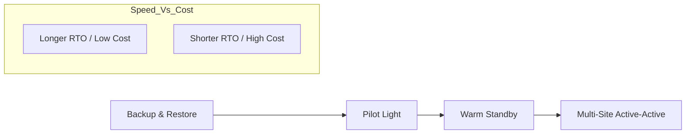
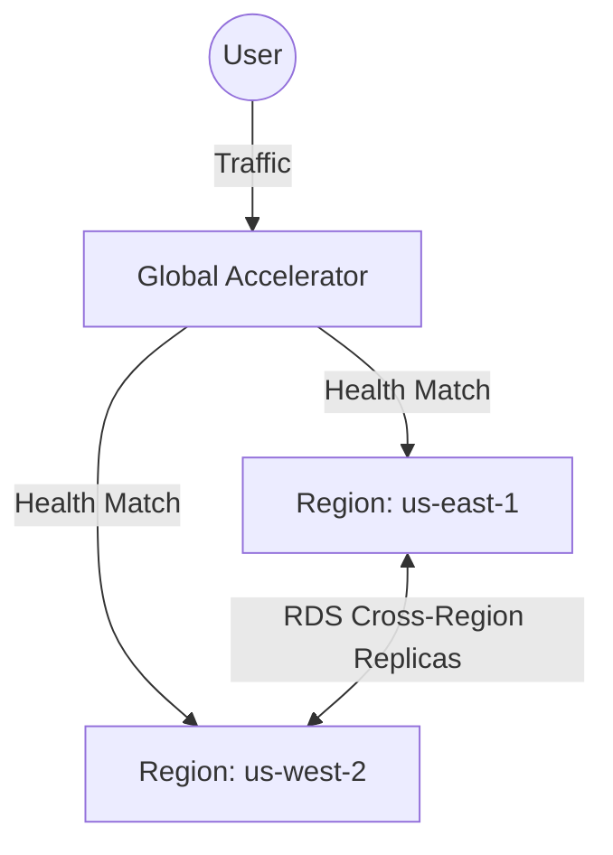

# 02. Disaster Recovery Strategies

While High Availability (HA) protects against local component failures, **Disaster Recovery (DR)** protects your business against catastrophic, region-wide events (e.g., natural disasters, massive regional outages).

## DR Metrics: RTO and RPO

Before choosing a strategy, you must define your business requirements:

1.  **RTO (Recovery Time Objective)**: The maximum acceptable "downtime." How long can we be offline before the business is in trouble?
2.  **RPO (Recovery Point Objective)**: The maximum acceptable "data loss." How much data are we willing to lose (e.g., 5 minutes of transactions vs 24 hours)?

## The Four DR Patterns

AWS defines four primary patterns, ranging from low-cost/slow-recovery to high-cost/instant-recovery.

| Strategy | Cost | RTO/RPO | Description |
| :--- | :--- | :--- | :--- |
| **Backup & Restore** | $ | 24h+ / 24h | Store backups in another region. Restore manually. |
| **Pilot Light** | $$ | Hours / Minutes | DB is replicated; small "core" services are live. |
| **Warm Standby** | $$$ | Minutes / Seconds | A scaled-down version of the app is always running. |
| **Multi-Site (A-A)** | $$$$ | Real-time | Full stack in 2+ regions serving traffic simultaneously. |

---

## Technical Implementation

### Pilot Light Architecture
In a Pilot Light setup, your data is replicated to the DR region (e.g., via RDS Read Replicas or S3 Cross-Region Replication), but your compute resources (EC2) are not running; they are stored as AMIs or Terraform code ready to deploy.

### Active-Active Networking
This requires a sophisticated global traffic manager (Route 53 or Global Accelerator) to route users to the "healthiest" or "closest" region.

---

## Real-Life Scenarios

### Scenario 1: "The 24-Hour Panic"
**Problem**: A medium-sized retail site only had local backups. A regional hurricane knocked out the primary data center.
**Outcome**: It took 48 hours to provision new infrastructure in a different region and restore the data. The business lost $2M in revenue.
**Solution**: Upgraded to a **Pilot Light** strategy. The DB is now continuously replicated to a DR region.
**Result**: Next time, the site can be back up in under 30 minutes.

### Scenario 2: "The Active-Active Cost Shock"
**Problem**: An over-eager architect insisted on **Multi-Site Active-Active** for a non-critical internal tool.
**Discovery**: The AWS bill tripled because they were paying for 2x the servers, 2x the databases, and significant cross-region data transfer fees.
**Optimization**: Downgraded to **Warm Standby** with 1 small instance running in the DR region.
**Result**: Saved 60% on costs while still meeting the 15-minute RTO requirement.

### Scenario 3: "The RDS Failover Mystery"
**Problem**: During a manual DR drill, the team promoted the RDS Read Replica in Region B to Primary. However, the app in Region B couldn't connect.
**Discovery**: The Security Group IDs in Region A do not exist in Region B. The RDS instances in B were still looking for the SG from A.
**Solution**: Standardize Security Group naming across regions and use automated scripts to update rule IDs during a failover.

---

## ❓ Interview Questions

1. **What is RTO?**
    - Recovery Time Objective: The goal for how long it takes to restore service.
2. **What is RPO?**
    - Recovery Point Objective: The goal for how much data loss is acceptable (time-based).
3. **Describe the 'Pilot Light' strategy.**
    - Only the "core" (the pilot light), usually the data layer, is active. Compute is provisioned only during a disaster.
4. **Which DR strategy is the most expensive?**
    - Multi-Site (Active-Active).
5. **How does RDS support DR?**
    - Through **Cross-Region Read Replicas**. These can be promoted to a standalone primary database in a disaster.
6. **What is the simplest way to move data from us-east-1 to us-west-2 for DR?**
    - S3 Cross-Region Replication (CRR).
7. **In a Multi-Site setup, how do you route traffic?**
    - Using Route 53 (Failover, Geoproximity, or Latency routing) or AWS Global Accelerator.
8. **True or False: Backup and Restore is the fastest way to recover.**
    - False. It is the slowest.
9. **What is 'Warm Standby'?**
    - A fully functional but scaled-down version of your environment is always running in another region.
10. **Does AWS guarantee a specific RTO for my application?**
    - No. AWS provides the tools; the RTO depends on your architecture, automation, and testing.

---

## 🧠 Quiz

1. **Goal for minimizing uptime loss:**
    - [x] RTO
    - [ ] RPO
2. **Goal for minimizing data loss:**
    - [x] RPO
    - [ ] RTO
3. **Lowest cost DR strategy:**
    - [x] Backup & Restore
    - [ ] Multi-Site
4. **Strategy where DB is live but App is dead:**
    - [x] Pilot Light
    - [ ] Warm Standby
5. **'Active-Active' is also called:**
    - [x] Multi-Site
    - [ ] Single-Site
6. **RDS tool for DR:**
    - [x] Cross-Region Read Replicas
    - [ ] Multi-AZ
7. **Failover speed of Warm Standby:**
    - [x] Minutes
    - [ ] Hours
8. **Failover speed of Backup/Restore:**
    - [x] Hours/Days
    - [ ] Real-time
9. **S3 tool for DR:**
    - [x] Cross-Region Replication (CRR)
    - [ ] Intelligent Tiering
10. **Promoting a Read Replica makes it:**
    - [x] A standard Primary DB
    - [ ] A Standby
11. **RTO of 0 implies:**
    - [x] Active-Active
    - [ ] Pilot Light
12. **Strategy with a 'scaled-down' environment:**
    - [x] Warm Standby
    - [ ] Backup & Restore
13. **Is Multi-AZ a DR strategy?**
    - [x] No (It is an HA strategy for a single region)
    - [ ] Yes
14. **Cross-Region data transfer cost is:**
    - [x] Generally higher than Inter-AZ cost
    - [ ] Free
15. **DR stands for:**
    - [x] Disaster Recovery
    - [ ] Data Restoration
16. **Route 53 routing policy for DR:**
    - [x] Failover
    - [ ] Simple
17. **Does Pilot Light require automation?**
    - [x] Yes (to spin up EC2s)
    - [ ] No
18. **A Regional outage is likely to affect:**
    - [x] All AZs in that Region
    - [ ] Only AZ-A
19. **Testing your DR plan is:**
    - [x] Essential
    - [ ] Optional
20. **Is S3 inherently multi-region?**
    - [x] No (Buckets are regional, though the namespace is global)
    - [ ] Yes