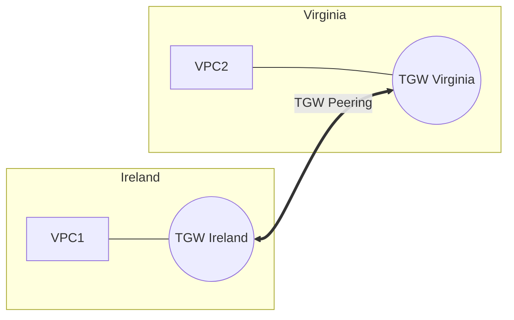

# 04. Multi-Region Networking

Building a global application isn't just about deploying code in two places; it's about **connecting those places reliably and securely.**

## Connecting Regions

To enable communication between VPCs in different regions, you have two primary architectural choices:

### 1. Inter-Region VPC Peering
*   **Best for**: Simple, one-to-one connections between regions.
*   **Security**: Traffic stays on the AWS global backbone and is encrypted at the physical layer.
*   **Cost**: Standard inter-region data transfer rates apply.

### 2. Transit Gateway (TGW) Peering
*   **Best for**: "Hub-and-Spoke" global networks.
*   **Mechanism**: You create a Transit Gateway in Region A and another in Region B, then **peer the gateways**.
*   **Transitivity**: VPCs in Region A can talk to VPCs in Region B through the peered TGWs.

## Global VPC Patterns

### 1. Centralized Shared Services
A common pattern where "Management" VPCs (containing AD, Logging, or Security tools) in a single hub region serve all other VPCs globally.

### 2. Multi-Region API Backend
Using **Global Accelerator** to find the closest region, then using inter-region networking to synchronize database state (e.g., via DynamoDB Global Tables or Aurora Global Database).

---

## Real-Life Scenarios

### Scenario 1: "The Global Mesh Disaster"
**Problem**: A company tried to connect 5 regions using Inter-Region VPC Peering.
**Discovery**: To have a full mesh between 5 regions, they needed 10 peering connections. Managing the route tables across 20+ VPCs became impossible.
**Solution**: Switched to **Transit Gateway Peering**. 
**Result**: They only needed 5 TGWs (one per region) and 4 peering links between the TGWs. Routing was centralized and automated.

### Scenario 2: "The EU Data Sovereignty"
**Problem**: A US company expanded to Germany. Strict laws required German user data to never leave the EU.
**Architecture**: They used Route 53 Geolocation to route German users to Frankfurt (eu-central-1). They used **Inter-Region Peering** only for management/logs (which were stripped of PII), while keeping the user database strictly local to Frankfurt.
**Result**: Complied with GDPR while maintaining operational visibility from the US.

### Scenario 3: "The Latency Killer"
**Problem**: An internal corporate tool was slow for Tokyo employees because the server was in London.
**Solution**: Deployed an **Aurora Global Database**.
**Outcome**: The Tokyo VPC now connected to a local Read-Only replica in Tokyo. Read latency dropped from 300ms to 2ms. Updates were still sent back to London over the AWS backbone.

---

## ❓ Interview Questions

1. **How do you connect two VPCs in different regions?**
    - Inter-Region VPC Peering or Transit Gateway Peering.
2. **True or False: Inter-Region peering traffic travels over the public internet.**
    - False. It stays on the private AWS global backbone.
3. **What is Transit Gateway Peering?**
    - Connecting two Transit Gateways in different regions to enable communication between all VPCs attached to both.
4. **Is Inter-Region Peering transitive?**
    - No. Just like standard peering, you can't "hop" through a VPC to another peer.
5. **How does AWS handle the encryption of multi-region peering traffic?**
    - It is encrypted at the physical layer on the AWS backbone.
6. **When would you choose TGW Peering over Inter-Region Peering?**
    - When you have a complex environment with many VPCs in both regions (Scalability).
7. **What is an 'Aurora Global Database'?**
    - A single database that spans multiple regions, providing low-latency reads and fast disaster recovery.
8. **Can you use a single Route Table for all regions?**
    - No. Route Tables are VPC-specific and regional.
9. **Does Inter-Region Peering support cross-region Security Group references?**
    - No (this is a major difference from same-region peering).
10. **What is 'DynamoDB Global Tables'?**
    - A fully managed, multi-region, and multi-active database (writes can happen in any region).

---

## 🧠 Quiz

1. **Best tool for global Hub-and-Spoke:**
    - [x] Transit Gateway Peering
    - [ ] VPC Peering
2. **Inter-Region peering traffic uses:**
    - [x] AWS Global Backbone
    - [ ] Public Internet
3. **Requirement for TGW Peering:**
    - [x] TGW in both regions
    - [ ] IGW in both regions
4. **Can you reference Peer SGs (Inter-Region)?**
    - [x] No
    - [ ] Yes
5. **Cross-region data transfer is:**
    - [x] Charged per GB
    - [ ] Free
6. **Inter-Region Peering ID prefix:**
    - [x] pcx-
    - [ ] tgw-
7. **Which database is 'Multi-Active' globally?**
    - [x] DynamoDB Global Tables
    - [ ] RDS Multi-AZ
8. **Global Accelerator helps reduce:**
    - [x] Jitter and Latency
    - [ ] S3 storage costs
9. **Is TGW Peering transitive?**
    - [x] Yes (between attached VPCs)
    - [ ] No
10. **Global VPC is a:**
    - [x] Concept (not a literal AWS service)
    - [ ] Specific AWS service type
11. **Encryption for Inter-Region Peering is:**
    - [x] Automatic (Physical layer)
    - [ ] Manual (VPN)
12. **Region-to-Region latency is:**
    - [x] Constant (based on physics/distance)
    - [ ] Variable based on internet traffic
13. **Routing to a peer region requires:**
    - [x] Static routes (Target: pcx- or tgw-)
    - [ ] IGW
14. **Full mesh of 3 regions (VPC Peering) needs:**
    - [x] 3 connections
    - [ ] 2 connections
15. **Full mesh of 4 regions (VPC Peering) needs:**
    - [x] 6 connections
    - [ ] 4 connections
16. **Aurora Global Database use case:**
    - [x] Global low-latency reads
    - [ ] Cheap storage
17. **Can you peer with a VPC in a separate account in another region?**
    - [x] Yes
    - [ ] No
18. **Multi-Region networking is a key part of:**
    - [x] Disaster Recovery
    - [ ] Cost Optimization
19. **Inter-Region Peering MTU:**
    - [x] 1500
    - [ ] 9001
20. **Can TGW Peering connect different AWS Accounts?**
    - [x] Yes (via RAM)
    - [ ] No