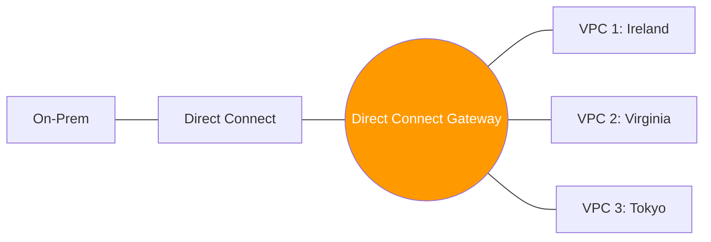
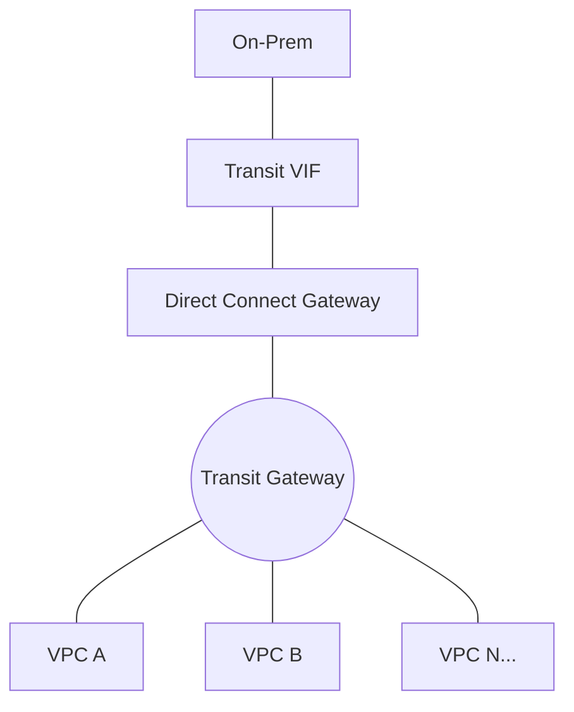

# 03. TGW and Hybrid Architectures

As organizations scale, managing individual VPNs or Direct Connect VIFs for every VPC becomes unsustainable. This module explores how to use **Transit Gateway (TGW)** and **Direct Connect Gateway (DXGW)** to build a scalable hub-and-spoke hybrid network.

## Direct Connect Gateway (DXGW)

**Direct Connect Gateway** is a global resource that acts as a middleman. 
*   **The Problem**: A standard Private VIF connects to exactly one VGW (one VPC).
*   **The Solution**: You connect your Direct Connect VIF to a DXGW. The DXGW can then be associated with up to 10 VGWs (10 VPCs) across any AWS Region (except China).

## Scaling with Transit Gateway (TGW)

If you have *hundreds* of VPCs, even DXGW isn't enough. You need **Transit Gateway**.

1.  **Transit VIF**: You create a special Transit VIF on your Direct Connect.
2.  **TGW Association**: You connect that Transit VIF to a Direct Connect Gateway, and then connect the DXGW to a **Transit Gateway**.
3.  **The Result**: Every VPC attached to the TGW can now reach on-premises via a single Direct Connect link.

---

## Real-Life Scenarios

### Scenario 1: "The Inter-Region Link"
**Problem**: A company has its data center in London and VPCs in Ireland (`eu-west-1`) and Frankfurt (`eu-central-1`). They don't want to pay for a second Direct Connect link.
**Solution**: Use a **Direct Connect Gateway**.
**Outcome**: One physical link in London provides a private connection to both Ireland and Frankfurt VPCs, saving thousands per month.

### Scenario 2: "The 10-VPC Ceiling"
**Problem**: An organization reached its 11th VPC and realized that Direct Connect Gateway has a hard limit of 10 VGW associations.
**Solution**: Switched the architecture to use **Transit Gateway**.
**Outcome**: They can now grow to thousands of VPCs while still using their existing Direct Connect infrastructure.

### Scenario 3: "Centralized VPN Backup"
**Problem**: 50 VPCs are connected to On-Prem via TGW. If the Direct Connect fails, everything goes down.
**Solution**: Create a single **Site-to-Site VPN** and attach it to the same **Transit Gateway**.
**Outcome**: If the DX goes down, the TGW automatically fails over to the VPN backup for all 50 VPCs.

---

## ❓ Interview Questions

1. **What is a Direct Connect Gateway (DXGW)?**
    - A global resource that allows a single Direct Connect VIF to connect to multiple VPCs (via VGWs) in any Region.
2. **What is the association limit for a Direct Connect Gateway?**
    - Up to 10 Virtual Private Gateways (VPC associations).
3. **How do you connect Direct Connect to a Transit Gateway?**
    - Direct Connect VIF -> Direct Connect Gateway -> Transit Gateway.
4. **Is Direct Connect Gateway Regional or Global?**
    - Global (except for China).
5. **Does TGW support transitive routing for hybrid traffic?**
    - Yes, that is its primary purpose.
6. **Can a DXGW connect to a VGW and a TGW at the same time?**
    - No. A DXGW association must be either with VGWs or a TGW, not both.
7. **What is a 'Transit VIF' again?**
    - The specific type of VIF required to connect to a Transit Gateway.
8. **How does TGW help with VPN scalability?**
    - You connect a VPN once to the TGW, and all attached VPCs can use it.
9. **Which is better for 5 VPCs: DXGW or TGW?**
    - DXGW (it's simpler and has no data processing fee like TGW).
10. **Which is better for 50 VPCs: DXGW or TGW?**
    - TGW (DXGW hits its 10-VPC limit).

---

## 🧠 Quiz

1. **Resource that allows cross-region DX:**
    - [x] Direct Connect Gateway (DXGW)
    - [ ] VGW
2. **VPC association limit for DXGW:**
    - [x] 10
    - [ ] 50
3. **Resource for connecting 100+ VPCs to On-Prem:**
    - [x] Transit Gateway
    - [ ] DXGW alone
4. **Type of VIF for TGW:**
    - [x] Transit VIF
    - [ ] Private VIF
5. **Can DXGW connect to multiple Regions?**
    - [x] Yes
    - [ ] No
6. **Data processing fee applies to:**
    - [x] Transit Gateway
    - [ ] DXGW
7. **To backup DX via VPN on TGW, both are:**
    - [x] TGW Attachments
    - [ ] Peered
8. **Is DXGW stateful?**
    - [x] No
    - [ ] Yes
9. **Primary benefit of DXGW:**
    - [x] Multi-VPC / Multi-Region access
    - [ ] Faster speed
10. **Can you use BGP with TGW?**
    - [x] Yes
    - [ ] No
11. **Hierarchy for TGW Hybrid:**
    - [x] VIF -> DXGW -> TGW
    - [ ] VIG -> TGW -> DXGW
12. **Which is a global resource?**
    - [x] DXGW
    - [ ] TGW (Regional)
13. **Can you associate TGW with DXGW in different accounts?**
    - [x] Yes (via RAM)
    - [ ] No
14. **Direct Connect Gateway allows access to:**
    - [x] Private and Public IPs
    - [ ] Only Private IPs
15. **Does TGW replace VGW?**
    - [x] Yes (in large-scale architectures)
    - [ ] No
16. **TGW processing fee for hybrid traffic:**
    - [x] Standard TGW data fee (~$0.02/GB)
    - [ ] Free
17. **Maximum TGW associations per DXGW:**
    - [x] 3
    - [ ] 10
18. **If DXGW is associated with TGW, can it reach S3?**
    - [x] Only via an Interface Endpoint inside a VPC
    - [ ] Yes, natively
19. **BGP AS-Path Prepending is used to:**
    - [x] Influence inbound traffic from AWS
    - [ ] Compress traffic
20. **Can you peer TGWs across regions for hybrid traffic?**
    - [x] Yes
    - [ ] No