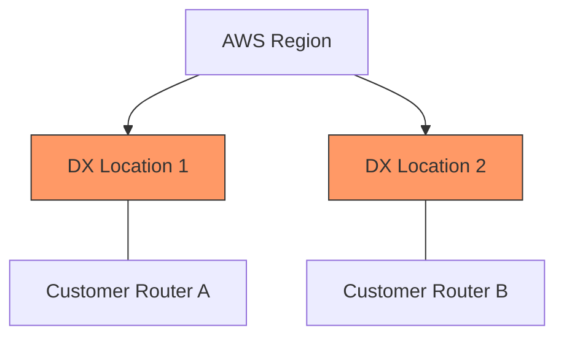

# 04. Resiliency and Security in Hybrid

A hybrid link is a single point of failure. If your company's core database is on-premises and the link to AWS dies, your business stops. This module covers how to build **resilient** and **secure** hybrid connections.

## AWS Resiliency Models

AWS suggests three primary levels of resiliency for Direct Connect (DX).

### 1. High Resiliency (Standard)
*   **Setup**: Two Direct Connect connections in **two different** colocation facilities (locations) for the same region.
*   **Failover**: If one location fails, traffic continues through the other.

### 2. Maximum Resiliency (Mission-Critical)
*   **Setup**: Two connections in two different locations, **and** two separate routers on your on-premises side for each location.
*   **Failover**: Protects against AWS location failure AND your own hardware failure.

### 3. VPN Backup (Cost-Effective)
*   **Setup**: One Direct Connect link and one Site-to-Site VPN link as backup.
*   **Strategy**: Use BGP to prefer the DX route and fail over to the VPN if BGP keepalives fail.

## Routing Priority (BGP AS-Path Prepending)

When you have two links (e.g., DX and VPN), you must tell AWS which one to prefer for **inbound** traffic (traffic from AWS to On-Prem).
*   **BGP AS-Path Prepending**: You make the backup path look "longer" by repeating your Autonomous System (AS) number multiple times. 
*   **Result**: AWS sees the shorter path (the one with fewer AS numbers) and prefers it for the DX link.

---

## Technical Security

### 1. MACsec (802.1ae)
Direct Connect is private, but by default, it is **unencrypted**. 
*   **MACsec**: Provides Layer 2 encryption over fiber at 10Gbps or 100Gbps.
*   **Requirement**: Must be supported by your physical on-premises router interface.

### 2. VPN over Direct Connect
For maximum security, you can establish an IPsec VPN tunnel *inside* your Direct Connect Public VIF.
*   **Benefit**: You get the dedicated performance of DX and the Layer 3 encryption of IPsec.

---

## Real-Life Scenarios

### Scenario 1: "The Backhoe Disaster"
**Problem**: A construction crew severed the fiber optic line entering a client's data center.
**Outcome**: The primary Direct Connect went down.
**Success**: Because they had a **VPN Backup** configured with BGP, the VPC route table automatically shifted traffic to the VPN tunnel within 30 seconds.
**Impact**: Performance was slower (1.25Gbps vs 10Gbps), but the business remained operational.

### Scenario 2: "The Compliant Cloud"
**Problem**: An auditor stated that private fiber (DX) was not enough to protect "PHI" (Protected Health Information). It must be encrypted while in transit.
**Solution**: Implemented **MACsec** on the Direct Connect Dedicated connection.
**Outcome**: The traffic was encrypted at the physical link level without the overhead of a VPN, satisfying the audit.

### Scenario 3: "The Asymmetric Routing Loop"
**Problem**: A company had DX and VPN. Traffic from On-Prem to AWS was going over DX, but traffic from AWS to On-Prem was going over VPN. This caused firewalls to drop stateful packets.
**Discovery**: They forgot to use AS-Path prepending on the VPN side.
**Solution**: Prepended the VPN BGP advertisement with 3 extra AS numbers.
**Outcome**: AWS started preferring the DX path, fixing the routing asymmetry.

---

## ❓ Interview Questions

1. **How do you ensure high availability for a Direct Connect connection?**
    - By having a second Direct Connect in a different location or a Site-to-Site VPN as a backup.
2. **What is BGP AS-Path Prepending?**
    - A technique to make a BGP route look longer (and thus less desirable) to influence path selection.
3. **Does Direct Connect provide encryption by default?**
    - No.
4. **What is MACsec?**
    - Layer 2 encryption for high-speed Direct Connect links.
5. **How can you encrypt traffic over Direct Connect at Layer 3?**
    - By running an IPsec VPN tunnel over a Public VIF.
6. **What is the advantage of two DX locations over one locations?**
    - Protection against a complete data center failure (power/cooling/connectivity) at a specific AWS partner facility.
7. **Which is preferred by AWS: Direct Connect or VPN?**
    - If both have the same route, AWS always prefers **Direct Connect**.
8. **What is the RTO for a VPN failover?**
    - Approximately 30-60 seconds (depending on BGP timers).
9. **Can you use MACsec on a 1Gbps connection?**
    - No. MACsec is only available on **Dedicated 10Gbps and 100Gbps** connections.
10. **How do you troubleshoot a 'Down' VPN?**
    - Check Phase 1 (IKE) and Phase 2 (IPsec) negotiations, verify the CGW public IP, and check if BGP is established.

---

## 🧠 Quiz

1. **Goal of AS-Path prepending:**
    - [x] Influence path selection
    - [ ] Encrypt traffic
2. **Encryption at Layer 2 for DX:**
    - [x] MACsec
    - [ ] IPsec
3. **BGP shorter path is:**
    - [x] More preferred
    - [ ] Less preferred
4. **Resiliency with 2 DX locations is:**
    - [x] High Resiliency
    - [ ] Low Resiliency
5. **VPN as a backup for DX is:**
    - [x] Cost-effective Resiliency
    - [ ] Impossible
6. **MACsec requires support on:**
    - [x] Customer Router physical port
    - [ ] S3 bucket
7. **If DX and VPN have the same route, AWS chooses:**
    - [x] Direct Connect
    - [ ] VPN
8. **Does AS-Path Prepending affect Inbound or Outbound?**
    - [x] Inbound (from AWS to On-Prem)
    - [ ] Outbound
9. **MACsec Speed requirements:**
    - [x] 10 or 100 Gbps
    - [ ] 1 Gbps
10. **VPN over DX uses a:**
    - [x] Public VIF
    - [ ] Private VIF
11. **BGP stands for:**
    - [x] Border Gateway Protocol
    - [ ] Backup Gateway Path
12. **Status after AS-Path Prepending:**
    - [x] Path looks 'longer'
    - [ ] Path looks 'faster'
13. **Can you use MACsec on Hosted connections?**
    - [x] No
    - [ ] Yes
14. **Time for BGP failover:**
    - [x] ~30-60 seconds
    - [ ] ~1 hour
15. **Critical metric for DR failover:**
    - [x] RTO
    - [ ] CPU Usage
16. **AS stands for:**
    - [x] Autonomous System
    - [ ] Access Security
17. **Is VPN over DX encrypted?**
    - [x] Yes
    - [ ] No
18. **Can you have 2 VPNs to one VGW for HA?**
    - [x] Yes
    - [ ] No
19. **Who manages 'MACsec' keys?**
    - [x] AWS Secret Manager / Customer
    - [ ] IAM
20. **Is 802.1ae another name for MACsec?**
    - [x] Yes
    - [ ] No