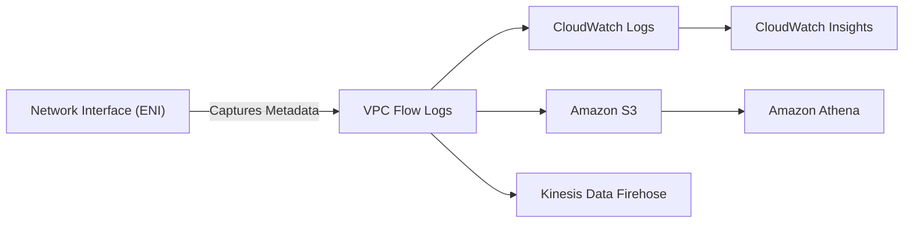

# VPC Flow Logs: Network Visibility

VPC Flow Logs is a feature that enables you to capture information about the IP traffic going to and from network interfaces in your VPC. Flow log data can be published to Amazon CloudWatch Logs, Amazon S3, or Amazon Kinesis Data Firehose.

## 🏗️ Architecture and Flow

Flow logs do not capture real-time data or the packet body; they capture metadata about the connection. They are collected "out-of-band," meaning they do not affect network latency or throughput.

## 📝 Log Formats

You can use the default format or create a custom format.

### Default Format
`version account-id interface-id srcaddr dstaddr srcport dstport protocol packets bytes start end action log-status`

### Key Fields
- **action**: `ACCEPT` (Permitted by SG/NACL) or `REJECT` (Blocked by SG/NACL).
- **protocol**: The IANA protocol number (e.g., 6 for TCP, 17 for UDP, 1 for ICMP).
- **log-status**: `OK` (Normal), `NODATA` (No traffic), `SKIPDATA` (Logs skipped due to internal error).

> [!TIP]
> Use **Custom Formats** to include fields like `pkt-srcaddr` and `pkt-dstaddr` to see the actual packet source/destination, which is useful when traffic passes through a NAT Gateway or Transit Gateway.

## 🎯 Use Cases

1.  **Security Auditing**: Identify unexpected traffic patterns or repeated rejects from specific IPs.
2.  **Troubleshooting Connectivity**: Verify if traffic is reaching your instance or being dropped before it arrives.
3.  **Cost Optimization**: Analyze data transfer patterns between AZs or regions.

## 🛠️ Performance and Limits
- **Out-of-band**: No impact on network performance.
- **Aggregation**: Logs are aggregated over a 1-minute or 10-minute interval (Configurable).

---

## 📖 Stories from the Field: The "Ghost" Rejection

**Scenario**: A developer complained that their application couldn't connect to an external API. Security Groups were "Wide Open" (0.0.0.0/0).
**Discovery**: VPC Flow Logs showed `REJECT` for outbound traffic to the API's IP on port 443.
**Cause**: While the Security Group was open, the **Subnet NACL** had an explicit DENY rule for that specific IP range, which was previously added as a temporary security measure and forgotten.
**Resolution**: Updated the NACL to allow the traffic.
**Prevention**: Always check Flow Logs `action` field first—it tells you *if* it was blocked, and then you just need to find *who* (SG or NACL) did it.

---

## ❓ Interview Questions

1.  **What is the difference between SG and NACL in Flow Logs?**
    *   *Answer*: If a Security Group blocks traffic, the Flow Log shows `REJECT`. If a NACL blocks traffic, it also shows `REJECT`. Flow Logs aggregate the result of both security layers.
2.  **Can VPC Flow Logs capture the content (payload) of a packet?**
    *   *Answer*: No. Flow Logs only capture metadata (headers). For packet content, you must use **Traffic Mirroring**.
3.  **How do you analyze flow logs stored in S3 efficiently?**
    *   *Answer*: Use **Amazon Athena** to run SQL queries against the log files.
4.  **If a flow log shows "NODATA", what does it mean?**
    *   *Answer*: It means no traffic was recorded for the specified network interface during the aggregation interval.
5.  **Why would you use a 1-minute aggregation interval instead of 10-minutes?**
    *   *Answer*: For faster troubleshooting and more granular visibility into short bursts of traffic.

---

## 🧠 Quiz

1.  **Which field in a flow log indicates if the traffic was allowed?** `(action)`
2.  **What are the three possible destinations for VPC Flow Logs?** `(S3, CloudWatch Logs, Kinesis Data Firehose)`
3.  **T/F: VPC Flow Logs capture traffic at the OS level.** `(False - it's at the ENI level in the AWS infrastructure)`
4.  **Which tool allows you to query Flow Logs in CloudWatch?** `(CloudWatch Logs Insights)`
5.  **What protocol number represents TCP in flow logs?** `(6)`