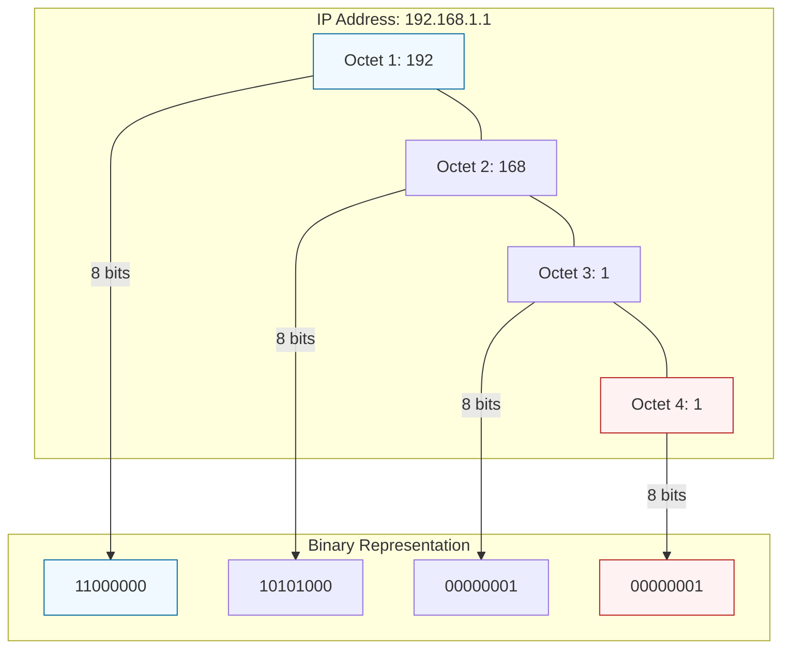

# 🔢 Module 02.01: Binary and IP Fundamentals

> **"To understand how cloud networks function, we must first understand how computers see IP addresses. An IPv4 address is not just a string of four numbers; it is a 32-bit binary integer."**

## 📚 Overview

Every packet that travels through a VPC is addressed using a 32-bit number. While humans use "Dotted Decimal" (like 192.168.1.1) to read these, computers and routers process them as 1s and 0s. This module provides the foundational knowledge of binary math required to calculate subnet masks and understand how CIDR notation actually works under the hood.

## 🎓 Learning Objectives

By the end of this module, you will:

- ✅ Understand the **32-bit Architecture** of IPv4.
- ✅ Master the **Binary-to-Decimal** conversion for octets.
- ✅ Identify the 8 core binary values used in all subnet masks.
- ✅ Explain why **Classful Networking** was replaced by CIDR.
- ✅ Recognize the **IP Parts**: Network vs. Host.

---

## 🏗️ The Anatomy of an Octet

An IPv4 address is divided into four **octets** (8 bits each). Each bit represents a power of 2, starting from the right.

| Bit Position | 7 | 6 | 5 | 4 | 3 | 2 | 1 | 0 |
| :--- | :--- | :--- | :--- | :--- | :--- | :--- | :--- | :--- |
| **Value (2^n)** | 128 | 64 | 32 | 16 | 8 | 4 | 2 | 1 |
| **Logic** | 2⁷ | 2⁶ | 2⁵ | 2⁴ | 2³ | 2² | 2¹ | 2⁰ |

**Example: Converting 192 to Binary**
- 128 is "ON" (1) → Remaining: 64
- 64 is "ON" (1) → Remaining: 0
- All others are "OFF" (0)
- **Result**: `11000000`

---

## 🚀 Professional Pattern: The Magic Octet Values

You don't need to be a math genius to do CIDR. You only need to memorize these **8 values** that appear in virtually every subnet mask:

| Binary Bits ON | Decimal Value | Subnet Equivalent |
| :--- | :--- | :--- |
| `10000000` | **128** | /25 (Split /24) |
| `11000000` | **192** | /26 (Split /24 into 4) |
| `11100000` | **224** | /27 (Split /24 into 8) |
| `11110000` | **240** | /28 (Split /24 into 16) |
| `11111111` | **255** | /32 (Single Host) |

---

## 🏆 Real-World DevOps Story: The "Classful" Ghost

**The Scenario**: A junior sysadmin was troubleshooting a connection between an AWS VPC and an On-Premise router. They saw the IP `192.168.1.5` and assumed it was a "Class C" network with a default mask of `255.255.255.0` (/24).
**The Crisis**: The network was actually a larger `/20` (4,096 IPs) supernet. By using the wrong mask, the admin blocked access to 15 other "sub-neighborhoods" because the router thought they were on a different network.
**The Fix**: A senior engineer corrected the mask to `255.255.240.0`.
**The Lesson**: **"Classes" are dead.** Since 1993, we use **CIDR**. Never assume a mask based on the first octet; always check the documentation or the CIDR prefix.

---

## ❓ Interview Preparation (Binary Foundations)

1. **Q: How many bits are in an IPv4 address?**
    *A: 32 bits, organized into four 8-bit octets.*

2. **Q: What is the maximum value of a single octet, and why?**
    *A: 255. If all 8 bits are "ON" (11111111), the sum is 128+64+32+16+8+4+2+1 = 255.*

3. **Q: Why do computers use binary instead of decimal for IP addresses?**
    *A: Computers use transistors which have two states: On and Off. Processing IPs as binary allows routers to perform extremely fast operations using "logic gates" to decide where a packet should go.*

4. **Q: What is the binary representation of the IP address 10.0.0.1?**
    *A: `00001010.00000000.00000000.00000001`.*

5. **Q: What is a 'dotted decimal' notation?**
    *A: It is the human-readable format of an IP address where the 32 bits are written as four decimal numbers (0-255) separated by dots.*

---

## 📝 Knowledge Check

1. **In an octet, what is the decimal value of the bit in the 7th position (the far left)?**
    - [ ] a) 1
    - [ ] b) 64
    - [x] c) 128
    - [ ] d) 255

2. **Converting binary `11000000` to decimal results in:**
    - [ ] a) 128
    - [x] b) 192
    - [ ] c) 168
    - [ ] d) 224

3. **How many octets make up an IPv4 address?**
    - [ ] a) 2
    - [x] b) 4
    - [ ] c) 8
    - [ ] d) 32

4. **Which year was CIDR (Classless Inter-Domain Routing) introduced to replace IP Classes?**
    - [ ] a) 1983
    - [x] b) 1993
    - [ ] c) 2003
    - [ ] d) 2013

5. **True or False: The number 256 is a valid value for an IPv4 octet.**
    - [ ] True
    - [x] False (Max is 255)

---

## 🔗 Next Steps

You've mastered the binary. Now let's use it to slice and dice networks with precision.

Proceed to: **[02. CIDR Math and Calculation](../../../../../../README.md)** →