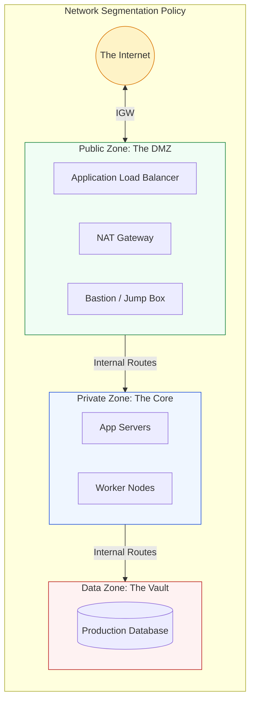

# 🏰 Module 02.03: Public and Private Zoning

> **"In AWS, the difference between a Public and a Private subnet is not a checkbox; it is a Routing Policy. A single route entry can be the difference between a secure server and a public exposure."**

## 📚 Overview

Modern secure architecture is built on the concept of **Zoning**. By partitioning your VPC into distinct tiers, you control the "Inflow" and "Outflow" of data with surgical precision. This module explores how to configure **Public Subnets** for internet-facing entry points and **Private Subnets** for internal logic and data storage, ensuring that the most sensitive parts of your infrastructure are physically unreachable from the global web.

## 🎓 Learning Objectives

By the end of this module, you will:

- ✅ Define a **Public Subnet** via its Route Table configuration.
- ✅ Implement a **Private Subnet** that uses a NAT Gateway for egress.
- ✅ Master the **3-Tier Architecture Pattern** (Web, App, Data).
- ✅ Understand the role of **Bastion Hosts** and **Jump Boxes**.
- ✅ Design for **Least Privilege** network access.

---

## 🏗️ What defines a "Zone"?

In AWS, subnets are identical until you associate them with a **Route Table**.

### 1. The Public Subnet (The "Front Porch")
- **The Rule**: Its Route Table contains a default route (`0.0.0.0/0`) pointing to an **Internet Gateway (IGW)**.
- **Common Residents**: Application Load Balancers, NAT Gateways, Bastion Hosts.
- **Security**: Directly reachable from the internet, must have strict Security Groups.

### 2. The Private Subnet (The "Living Room")
- **The Rule**: Its Route Table DOES NOT point to an IGW. It usually points to a **NAT Gateway** for outbound-only access.
- **Common Residents**: Application servers, business logic, inner microservices.
- **Security**: Hidden from the internet; unreachable from outside the VPC.

---

## 🚀 Professional Pattern: The "Isolated Data Tier"

Senior architects take security one step further by creating a **Data Tier** with NO internet access at all—not even via NAT.

**The Pro Standard**:
1. **No Egress for DBs**: Databases (RDS, MongoDB, etc.) should never need to download updates from the internet directly. 
2. **Gateway Endpoints**: Use **VPC Gateway Endpoints** for S3 and DynamoDB so your data tier can talk to other AWS services without ever needing a NAT Gateway.
3. **Internal-Only Route Tables**: The Route Table for the Data Tier should only contain the "Local" VPC route.

---

## 🏆 Real-World DevOps Story: The Exposed Database

**The Scenario**: A junior developer created a staging database in a subnet that had a route to an Internet Gateway. To "save time" during a demo, they granted the database a Public IP and set the Security Group to allow Port 5432 from `0.0.0.0/0`.
**The Crisis**: Within 4 hours, automated bots found the open port. A brute-force attack successfully guessed the simple "staging" password and dumped the entire customer database.
**The Impact**: The company had to report a data breach, costing them $25k in legal fees and a loss of investor confidence.
**The Lesson**: **Zoning is your first firewall.** If the database were in a Private Subnet, even a weak password wouldn't have mattered because it would have been physically unreachable from the internet.

---

## ❓ Interview Preparation (Zoning & Tiers)

1. **Q: Can a resource in a private subnet have a Public IP address?**
    *A: Yes, but it is useless. Without a route to an Internet Gateway in the subnet's Route Table, traffic from the internet has no way to find the instance, and the instance has no way to send packets back to the requester.*

2. **Q: Where specifically should you place a NAT Gateway?**
    *A: In a **Public Subnet**. The NAT Gateway itself needs an Internet Gateway route to perform its job of translating private traffic to the public internet.*

3. **Q: What is the difference between an 'Ingress' and 'Egress' rule in a Security Group?**
    *A: **Ingress** controls incoming traffic (who can talk to me). **Egress** controls outgoing traffic (who I can talk to). In a private subnet, you typically allow Egress to the internet for updates but block all Ingress from the internet.*

4. **Q: Why use a 3-tier architecture instead of 2-tier?**
    *A: To provide "Defense in Depth." If your Web server in Tier 1 is compromised, the attacker still has to bypass another set of firewalls to reach the Application logic in Tier 2, and even then, the Database in Tier 3 remains isolated behind its own set of rules.*

5. **Q: What is a 'Bastion Host', and why are they becoming obsolete?**
    *A: A Bastion is a hardened server in a public subnet used as a "jump point" to SSH into private instances. They are being replaced by modern services like **AWS Systems Manager (SSM) Session Manager**, which allows shell access without needing a public IP or open SSH ports.*

---

## 📝 Knowledge Check

1. **What component is REQUIRED in a Route Table to make a subnet 'Public'?**
    - [ ] a) NAT Gateway
    - [x] b) Internet Gateway (IGW)
    - [ ] c) Virtual Private Gateway
    - [ ] d) CIDR Block

2. **Where should your Production Database be placed?**
    - [ ] a) Public Subnet
    - [ ] b) Any subnet with a Public IP
    - [x] c) Private Subnet
    - [ ] d) Directly attached to the IGW

3. **A NAT Gateway provides which type of traffic flow for private instances?**
    - [ ] a) Bi-directional (In and Out)
    - [x] b) Outbound only (Egress)
    - [ ] c) Inbound only (Ingress)
    - [ ] d) No internet access

4. **In the 3-Tier model, Tier 1 (Public) is often referred to as a:**
    - [ ] a) Vault
    - [ ] b) Safe Room
    - [x] c) DMZ (Demilitarized Zone)
    - [ ] d) Mainframe

5. **True or False: A private subnet can talk to a public subnet within the same VPC by default.**
    - [x] True (Via the local VPC route)
    - [ ] False

---

## 🔗 Next Steps

You've built the walls. Now let's look at the "Hidden Taxes"—the reserved addresses that can trip up your math.

Proceed to: **[04. AWS Reserved IPs and Limits](../../../../../../README.md)** →