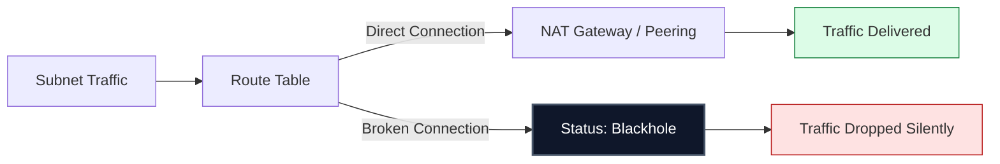

# 🕳️ Module 04.04: Troubleshooting and Blackholes

> **"A route points to a destination, but if the target is gone, the packet doesn't just wait—it vanishes. Understanding the 'Blackhole' is the key to fixing the most frustrating outages in the cloud."**

## 📚 Overview

Even a perfect network can fail if the destination targets of your routes are deleted or misconfigured. In AWS, this often leads to a **"Blackhole"** status in the route table. This module provides a diagnostic framework for identifying, resolving, and preventing routing failures, ensuring that your packets always find their way home.

## 🎓 Learning Objectives

By the end of this module, you will:

- ✅ Define and identify **Blackhole Routes**.
- ✅ Map the **Common Causes** of route target failure (NAT, Peering, VGW).
- ✅ Execute a **Diagnostic Flow** for connectivity issues.
- ✅ Utilize **VPC Reachability Analyzer** for path validation.
- ✅ Automate **Route Monitoring** using CloudWatch.

---

## 🏗️ What is a Blackhole?

A route enters **Blackhole** status when its destination is valid but its target is no longer available.

| Component | How it becomes a Blackhole |
| :--- | :--- |
| **NAT Gateway** | The gateway was deleted manually or via script. |
| **VPC Peering** | The peering connection was deleted by either side. |
| **VPN / DX** | The Virtual Private Gateway (VGW) was detached from the VPC. |
| **Middlebox** | The EC2 instance (firewall) was terminated or its ENI deleted. |

**The Danger**: Traffic hitting a blackhole is **silently dropped**. No "Destination Unreachable" message is sent back; the packet simply disappears, leading to "Time Out" errors in applications.

---

## 🚀 Professional Pattern: The Reachability Test

Senior engineers don't guess about routes. They use the **AWS Reachability Analyzer**.

**The Pro Standard**:
1. **Source to Target**: Choose your source (e.g., an EC2 instance) and your target (e.g., an IGW or Peering ID).
2. **Path Analysis**: The tool inspects every Route Table, Security Group, and NACL in the path.
3. **Clear Diagnosis**: It will tell you exactly which hop is failing: *"Denied by Route Table rt-private in Subnet A (Blackhole)."*
4. **Use Case**: Always run this tool before calling an emergency "Sev-1" bridge; it solves 90% of connectivity issues in minutes.

---

## 🏆 Real-World DevOps Story: The Silent Partner

**The Scenario**: A cross-company database sync between "Company A" and "Partner B" failed. The dashboard showed the Peering Connection as "Active."
**The Crisis**: Company A's developers swore they hadn't changed anything. The sync was critical for daily financial reporting.
**The Discovery**: While the Peering *status* was active, a junior admin at Partner B had deleted the peering connection on *their* side to "clean up unused resources." 
**The Impact**: Because the connection was gone on one side, Company A's route table entry for the Partner's CIDR went into **Blackhole** status.
**The Fix**: A quick check of the Route Table tab showed the red "Blackhole" status. They re-established peering and updated the route.
**The Lesson**: **Monitoring is two-way.** Just because the connection exists doesn't mean the path is clear. Monitor the *status of the route*, not just the *status of the resource*.

---

## ❓ Interview Preparation (Troubleshooting)

1. **Q: How do you identify a 'Blackhole' route in the AWS Console?**
    *A: Navigate to the Route Table and look at the 'Status' column in the Routes tab. If the target resource has been deleted, the status will change from 'Active' to 'Blackhole' (often highlighted in red).*

2. **Q: If a route table has a blackhole for 0.0.0.0/0, what is the impact?**
    *A: Every instance in every subnet associated with that route table will lose internet access immediately. They will experience 'Connection Timed Out' errors for all external requests.*

3. **Q: How do you fix a Blackhole route?**
    *A: You must either delete the route entry entirely (if it's no longer needed) or update the route to point to a new, valid target (like a new NAT Gateway ID).*

4. **Q: What happens if a packet's destination doesn't match any route in the table?**
    *A: The packet is dropped immediately. Unlike traditional home routers that might have a 'default' fallback, a VPC router only handles what is explicitly defined in the table.*

5. **Q: What is the VPC Reachability Analyzer?**
    *A: It is a configuration analysis tool that enables you to perform connectivity testing between a source and a destination in your VPC. It simulates the path and identifies blocked paths without sending actual traffic.*

---

## 📝 Knowledge Check

1. **What is the status of a route if the target NAT Gateway is deleted?**
    - [ ] a) Active
    - [x] b) Blackhole
    - [ ] c) Pending
    - [ ] d) Orphaned

2. **What occurs to a packet when it hits a Blackhole route?**
    - [ ] a) It is redirected to the Main Route Table
    - [x] b) It is silently dropped
    - [ ] c) An error message is sent to the sender
    - [ ] d) It is stored in a buffer

3. **Which tool would you use to find the specific hop causing a 'Time Out' error?**
    - [ ] a) CloudTrail
    - [ ] b) S3 Bucket Logs
    - [x] c) VPC Reachability Analyzer
    - [ ] d) Route 53 Resolver

4. **True or False: A Blackhole route still respects the Longest Prefix Match (LPM) rule.**
    - [x] True
    - [ ] False

5. **Why might a route be 'Active' but traffic still fails?**
    - [ ] a) The VPC is too full
    - [x] b) A Security Group or Network ACL is blocking the traffic
    - [ ] c) The subnet mask is too long
    - [ ] d) The Internet Gateway is sleepy

---

## 🏁 Routing Mastery Complete

Congratulations! You have mastered the GPS and the logic of cloud networking. You can now build, secure, and troubleshoot the most complex paths in the cloud.

Proceed to: **[Module 05: Network Security (NACLs & SGs)](../../../../../../README.md)** →