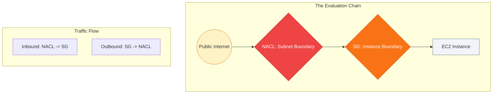

# 🏰 Module 05.03: Layered Defense Strategies

> **"Security is not a single wall; it is a fortress with multiple gates. Even if one guard falls, the citadel must remain standing. This is Defense in Depth."**

## 📚 Overview

In AWS, security is not built around a single firewall, but around **tiers** of security. This approach, known as **Defense in Depth**, ensures that a single misconfiguration or compromise doesn't lead to a total data breach. This module explores how NACLs and SGs interact in the evaluation chain and how to design a professional 3-tier architecture that keeps your data isolated and secure.

## 🎓 Learning Objectives

By the end of this module, you will:

- ✅ Trace the **Inbound/Outbound Evaluation Order**.
- ✅ Implement the **3-Tier Web Stack** security pattern.
- ✅ Understand the **"Security Group Chain"** (Logic Abstraction).
- ✅ Design for **Blast Radius Reduction**.
- ✅ Identify the **Failure Points** in layered defense.

---

## 🏗️ The Evaluation Chain

When traffic enters or leaves an instance, it must pass through both "guards." If either one says "No," the traffic is dropped.

### Inbound Path (incoming)
1. **Network ACL (The Fence)**: First check. Filters by IP CIDR and rule number.
2. **Security Group (The Door)**: Second check. Filters by protocol and SG-ID reference.

### Outbound Path (outgoing)
1. **Security Group (The Door)**: First check. (Usually allowed automatically for responses due to state tracking).
2. **Network ACL (The Fence)**: Second check. (Must have an explicit outbound rule for ephemeral ports).

---

## 🚀 Professional Pattern: The 3-Tier Fortress

Professional DevOps teams use a standard "Tiered" approach to minimize the access surface of their data.

| Tier | Subnet | Security Policy |
| :--- | :--- | :--- |
| **Web Tier** | Public | Only allows **443/80** from the Internet. |
| **App Tier** | Private | Only allows traffic from the **Web SG**. (Blocked from the direct internet). |
| **Data Tier** | Isolated | Only allows **3306/5432** from the **App SG**. (No internet route at all). |

**The Result**: If a hacker breaks into a Web server, they have zero access to the Data tier. They must first compromise the App tier, which is significantly harder because it isn't reachable from the internet.

---

## 🏆 Real-World DevOps Story: The Tiered Breakthrough

**The Scenario**: A major e-commerce site suffered a compromise on one of its public-facing web servers via a zero-day vulnerability in their CMS.
**The Crisis**: The attacker gained "root" access to the web server and immediately began running network scans (`nmap`) to find a way to the customer database.
**The Discovery**: 
- The **NACL** for the private subnet blocked the attacker's scan at the subnet boundary.
- Even where the NACL allowed traffic, the **Database Security Group** only allowed traffic from the App Server SG ID. 
**The Outcome**: Because the web server's Security Group was not trusted by the Database, the attacker could see nothing. They were stuck on the "porch" of the house, unable to enter the "living room" (App) or the "vault" (Data).
**The Lesson**: **Isolation is the best security.** By layering NACLs and SGs with the 3-tier pattern, the company saved millions of customer records despite a successful initial breach.

---

## ❓ Interview Preparation (Layered Defense)

1. **Q: What is the evaluation order for inbound traffic?**
    *A: **Network ACL first**, then **Security Group**. Think of the NACL as the gate to the parking lot (Subnet) and the Security Group as the lock on the building door (Instance).*

2. **Q: If a NACL allows traffic but the Security Group denies it, what happens?**
    *A: The traffic is **Denied**. Both layers must explicitly allow the traffic for it to reach the instance.*

3. **Q: Why is referencing a Security Group ID better than using CIDR ranges for tier-to-tier communication?**
    *A: It follows the principle of 'Identity-based Security'. It doesn't matter what the IP of the server is; if it belongs to the 'App Tier' group, it is trusted. This makes your infrastructure resilient to scaling and IP changes.*

4. **Q: How does a 3-tier architecture improve security?**
    *A: It creates 'choke points'. An attacker cannot skip from the Web tier to the Database; they must move through each layer, and each layer has strictly defined incoming rules that only trust the layer directly above it.*

5. **Q: What happens if you forget to add an outbound rule for ephemeral ports in a NACL?**
    *A: Inbound requests will reach your instance (if allowed by the SG), but the instance will be unable to send its response back out. The client will see a 'Connection Timed Out' error.*

---

## 📝 Knowledge Check

1. **Which layer is evaluated FIRST for OUTBOUND traffic?**
    - [ ] a) Network ACL
    - [x] b) Security Group
    - [ ] c) Internet Gateway
    - [ ] d) IAM Policy

2. **In a 3-tier architecture, what should the Database Security Group trust?**
    - [ ] a) 0.0.0.0/0
    - [ ] b) The Web Tier SG
    - [x] c) The App Tier SG
    - [ ] d) The Internet Gateway

3. **If an SG is stateful, why do we still need outbound rules in a NACL?**
    - [ ] a) We don't
    - [x] b) Because NACLs are stateless and don't benefit from SG state tracking
    - [ ] c) To encrypt the traffic
    - [ ] d) To increase bandwidth

4. **What is 'Defense in Depth'?**
    - [ ] a) Using a very deep ocean for data storage
    - [ ] b) Using a single, complex firewall
    - [x] c) Layering multiple security controls throughout a system
    - [ ] d) Hiring 10 security guards

5. **True or False: A VPC Peering connection allows you to bypass the NACL of the target subnet.**
    - [ ] True
    - [x] False (Peering traffic is subject to all VPC security rules)

---

## 🔗 Next Steps

You've built the fortress. Now let's learn how to look inside the logs to find out who is knocking at the gate.

Proceed to: **[04. Advanced Troubleshooting](../../../../../../README.md)** →