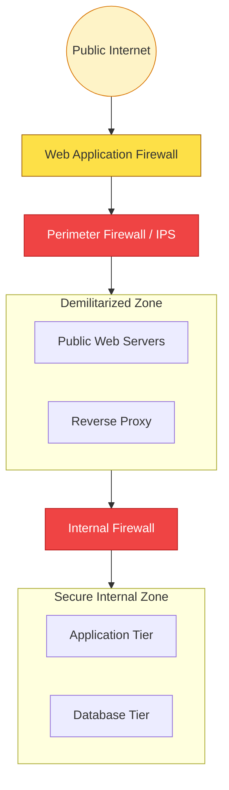

# 🛡️ Module 04: Network Security Fundamentals

> **"Security is not a single door you lock; it is a series of interconnected rooms. If you don't secure the hallways (the network), the strength of the door doesn't matter."**

## 📚 Overview

For a DevOps engineer, network security is the boundary where application logic meets infrastructure reality. It's not just about "blocking IPs"; it's about architecting a system that fails safely. This module covers the foundational pillars of network defense: **Stateful Firewalls**, **Intrusion Detection/Prevention (IDS/IPS)**, **Web Application Firewalls (WAF)**, and **Internal Segmentation**. We move beyond the cloud console to understand the Linux-level tools and industry patterns that keep production workloads secure.

## 🎓 Learning Objectives

By the end of this module, you will:

- ✅ Design and implement **Multi-Tier Firewall** architectures (DMZ).
- ✅ Configure Linux-level packet filtering using **iptables/nftables**.
- ✅ Deploy and tune **IDS/IPS** systems (Snort/Suricata).
- ✅ Protect web applications from common attacks using **WAF** (ModSecurity).
- ✅ Master **Service Isolation** and the "Default Deny" philosophy.
- ✅ Automate **Incident Response** and security monitoring.

---

## 🏗️ Core Security Tiers

### 1. The Perimeter: Firewalls & IPS
The first line of defense.
- **Stateless/Stateful Filtering**: Deciding which packets can enter based on IP, port, and connection state.
- **IPS (Intrusion Prevention)**: Inspecting the actual *content* of the packet for known attack patterns (signatures).

### 2. The Application Layer: WAF
Filters traffic at Layer 7 (Application).
- **Focus**: Specifically designed to block SQL Injection (SQLi), Cross-Site Scripting (XSS), and bot scrapers.
- **Tooling**: Nginx with ModSecurity or Cloud WAFs.

### 3. The Internal Vault: Micro-Segmentation
Protecting against **Lateral Movement**.
- **Strategy**: Even if a hacker compromises a web server, they should NOT be able to talk directly to the database. Internal firewalls must restrict east-west traffic.

---

## 🚀 Professional Pattern: The "Default Deny" Philosophy

Junior admins often keep everything open and "block the bad stuff." Senior security engineers do the opposite.

**The Pro Standard**:
1. **Explicit Allow Only**: Start with a policy that drops 100% of traffic.
2. **The "Just-in-Time" Rule**: Only open a port when you have a specific, documented requirement.
3. **Egress Control**: Don't just control what comes *in*; control what goes *out*. A compromised server shouldn't be allowed to "phone home" to a command-and-control server on the internet.

---

## 🏆 Real-World DevOps Story: The Lateral Move Breach

**The Scenario**: A growing startup had a single, massive "Production" network. They focused 100% on their perimeter firewall but left the internal network open so servers could "easily talk to each other."
**The Crisis**: An attacker exploited a vulnerability in an old WordPress blog that was hosted on the same network as the main payment API.
**The Impact**: Once inside the blog server, the attacker used simple network scanning (`nmap`) to find the production database. Because there were no internal firewalls or segmentation, they bypassed all perimeter security and exfiltrated 500k customer records.
**The Fix**: The company implemented **VLAN Segmentation** and internal firewalls. They moved the blog to an isolated DMZ and enforced a policy where the Data tier only accepts traffic from the App tier.
**The Lesson**: **Perimeters are brittle.** If your security is a "hard shell with a soft center," one crack is enough to lose everything. Build walls inside your walls.

---

## ❓ Interview Preparation (Network Security)

1. **Q: What is the difference between a Stateful and a Stateless firewall?**
    *A: A **Stateless** firewall treats every packet independently (like a NACL). A **Stateful** firewall remembers the context of a connection. If you send a request out, it automatically allows the response back in because it "knows" you started the conversation.*

2. **Q: Where would you place a WAF in your architecture?**
    *A: A WAF is typically placed at the very edge, either as part of a Load Balancer or right in front of your Web Servers, to filter malicious HTTP/HTTPS requests before they hit your application logic.*

3. **Q: What is the 'DMZ' (Demilitarized Zone)?**
    *A: It is a physical or logical subnetwork that contains an organization's external-facing services to an untrusted network (the Internet). It acts as a buffer between the public internet and the sensitive internal network.*

4. **Q: What is a 'False Positive' in the context of an IPS?**
    *A: It is when legitimate traffic is incorrectly identified as an attack and blocked. In an IPS, too many false positives can "break" the application, leading many teams to run IDS (Alert only) before switching to IPS (Block).*

5. **Q: How can you prevent an attacker from 'phoning home' if they compromise a server?**
    *A: By implementing **Egress Filtering**. You should restrict servers to only talk to the specific updates sites or APIs they need, blocking all other outbound traffic to the internet.*

---

## 📝 Knowledge Check

1. **Which tool is the standard command-line firewall for most Linux distributions?**
    - [ ] a) Snort
    - [x] b) iptables
    - [ ] c) Wireshark
    - [ ] d) Nginx

2. **An IDS (Intrusion Detection System) operates in which primary mode?**
    - [x] a) Passive (Alerting only)
    - [ ] b) Inline (Blocking active traffic)
    - [ ] c) Encryption
    - [ ] d) Defragmentation

3. **Which OSI layer does a WAF (Web Application Firewall) primarily operate at?**
    - [ ] a) Layer 3 (Network)
    - [ ] b) Layer 4 (Transport)
    - [x] c) Layer 7 (Application)
    - [ ] d) Layer 2 (Data Link)

4. **What is the main goal of 'Micro-segmentation'?**
    - [ ] a) Making the subnet masks smaller
    - [ ] b) Increasing network speed
    - [x] c) Reducing the 'Blast Radius' and preventing lateral movement
    - [ ] d) Encrypting every packet

5. **True or False: A stateful firewall automatically allows return traffic for an established outbound connection.**
    - [x] True 
    - [ ] False

---

## 🔗 Next Steps

You've mastered the defensive boundaries. Now let's dive into the cloud-specific implementation of these patterns using AWS Security Groups and NACLs.

Proceed to: **[05. Cloud Network Security (SGs & NACLs)](../../../../../README.md)** →
Node: This link points to the next logical step in the curriculum.