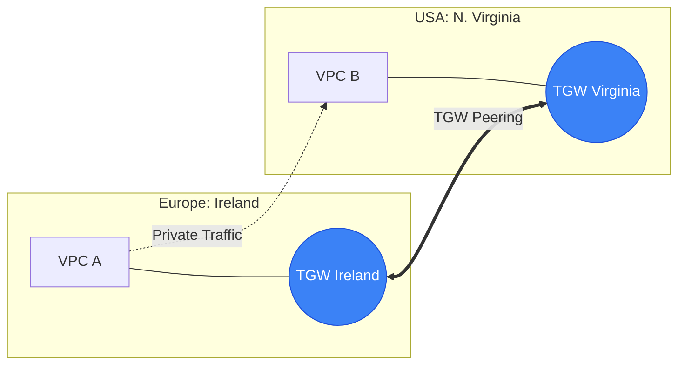

# 🌐 Module 08.04: Multi-Region Networking

> **"Building a global application isn't just about deploying code in two places; it's about connecting those places reliably and securely. The distance between London and Tokyo is 6,000 miles, but on the AWS backbone, it's just a 140ms hop."**

## 📚 Overview

For global enterprises, a single region is just an island. **Multi-Region Networking** is the bridge that connects these islands into a unified global empire. Whether you are replicating databases for disaster recovery or centralizing security logging in a hub region, you need a high-speed, private way to move data across the planet. This module covers the two primary ways to connect your regions: **Inter-Region VPC Peering** and **Transit Gateway (TGW) Peering**.

## 🎓 Learning Objectives

By the end of this module, you will:

- ✅ Compare **Inter-Region Peering** vs. **TGW Peering** for global scale.
- ✅ Understand the security of the **AWS Global Backbone**.
- ✅ Identify the limitations of **Inter-Region MTU** (Max Transmission Unit).
- ✅ Architect global **Shared Services Hubs** using multi-region links.
- ✅ Navigate the constraints of **Cross-Region Security Group Referencing**.

---

## 🏗️ Connecting the World

### 1. Inter-Region VPC Peering
- **Concept**: A direct, 1-to-1 link between two VPCs in different regions.
- **Latency**: Fixed by physics (speed of light over fiber). 
- **Security**: Traffic stays 100% within the private AWS network and is encrypted at the hardware layer.
- **MTU**: Limited to **1500 bytes** (no Jumbo Frames).

### 2. Transit Gateway (TGW) Peering
- **Concept**: You create a Transit Gateway in each region and "Peer" the gateways.
- **Benefit**: Scales better. If you have 50 VPCs in Region A and 50 in Region B, you just need ONE peering link between the TGWs, and all 100 VPCs can talk to each other.
- **Management**: Centralized routing tables for the entire global network.

---

## 🚀 Professional Pattern: The "Global Management Hub"

Instead of deploying a full suite of monitoring, active directory, and security tools in every region (expensive!), senior architects use a **Management Hub**.

**The Pro Standard**:
1. **The Hub**: designate one stable region (e.g., `us-east-1`) as the Management Hub.
2. **The Links**: Use **Transit Gateway Peering** to connect all other "Worker" regions to the Hub.
3. **The Logic**: All worker VPCs send their logs, authentication requests, and monitoring data to the Hub.
4. **The Benefit**: You save thousands in licensing fees and only maintain one set of security tools while maintaining 100% visibility over your global infrastructure.

---

## 🏆 Real-World DevOps Story: The Global Mesh Disaster

**The Scenario**: A world-wide streaming company expanded from 2 regions to 6. To connect them, they used standard Inter-Region VPC Peering.
**The Crisis**: To create a "Full Mesh" (every region talking to every other region), they had to manage **15 separate peering connections**. Every time they added a new VPC, they had to update 30 different route tables. A typo in one table caused a "Routing Blackhole" that took down the Japanese market for 4 hours.
**The Discovery**: They hit the "Scale Ceiling" of manual peering.
**The Fix**: They migrated to **Transit Gateway Peering**. They set up one TGW per region and peered them in a simple hub-and-spoke or ring topology.
**The Result**: Adding a new region now takes 10 minutes instead of 4 hours. Routing is centralized in the TGW tables.
**The Lesson**: **If it looks like a spider web, you're doing it wrong.** Switch to TGW before your mesh strangles your productivity.

---

## ❓ Interview Preparation (Multi-Region Networking)

1. **Q: Does inter-region peering traffic travel over the public internet?**
    *A: **No.** All traffic stays within the private AWS global network backbone. It is more secure and has more consistent latency than a traditional VPN over the internet.*

2. **Q: Can you reference a Security Group ID in an Inter-Region Peer?**
    *A: **No.** This is a major limitation. Unlike same-region peering, you cannot reference `sg-12345 (us-east-1)` in a rule in `eu-west-1`. You must use CIDR blocks (IP ranges) for your security rules.*

3. **Q: What is the MTU limit for inter-region traffic?**
    *A: It is limited to **1500 MTU**. You cannot use Jumbo Frames (9001 MTU) for traffic crossing regional boundaries.*

4. **Q: How do you share a Transit Gateway between regions and accounts?**
    *A: You use **AWS Resource Access Manager (RAM)** to share the TGW with other accounts, and then you use the **Peering Attachment** feature to link TGWs in different regions.*

5. **Q: Is Inter-Region Peering transitive?**
    *A: **No.** Just like standard peering, if Region A is peered to Region B, and B is peered to C, A cannot reach C through B. You must create a direct link between A and C.*

---

## 📝 Knowledge Check

1. **Which connectivity option is best for a 'Hub-and-Spoke' global network architecture?**
    - [ ] a) Inter-Region VPC Peering
    - [x] b) Transit Gateway (TGW) Peering
    - [ ] c) Site-to-Site VPN
    - [ ] d) NAT Gateway

2. **Where does Inter-Region peering traffic reside when traveling between London and New York?**
    - [ ] a) The Public Internet
    - [ ] b) Third-party undersea cables
    - [x] c) The private AWS Global Backbone
    - [ ] d) Encrypted VPN tunnels

3. **What is the maximum MTU size for traffic between two peered VPCs in different regions?**
    - [x] a) 1500
    - [ ] b) 8500
    - [ ] c) 9001
    - [ ] d) 65535

4. **True or False: Using TGW Peering allows VPCs in different regions to communicate even if they are in different AWS accounts.**
    - [x] True 
    - [ ] False

5. **Which tool is used to share a Transit Gateway with another account?**
    - [ ] a) IAM
    - [ ] b) AWS Organizations
    - [x] c) AWS RAM (Resource Access Manager)
    - [ ] d) CloudFormation

---

## 🔗 Next Steps

You've built and connected a global empire. Now let's explore how to bridge your cloud world with your physical data centers.

Proceed to: **[Module 09: Hybrid Connectivity](../../../../../../README.md)** →
Node: This link points to the next level of the curriculum.