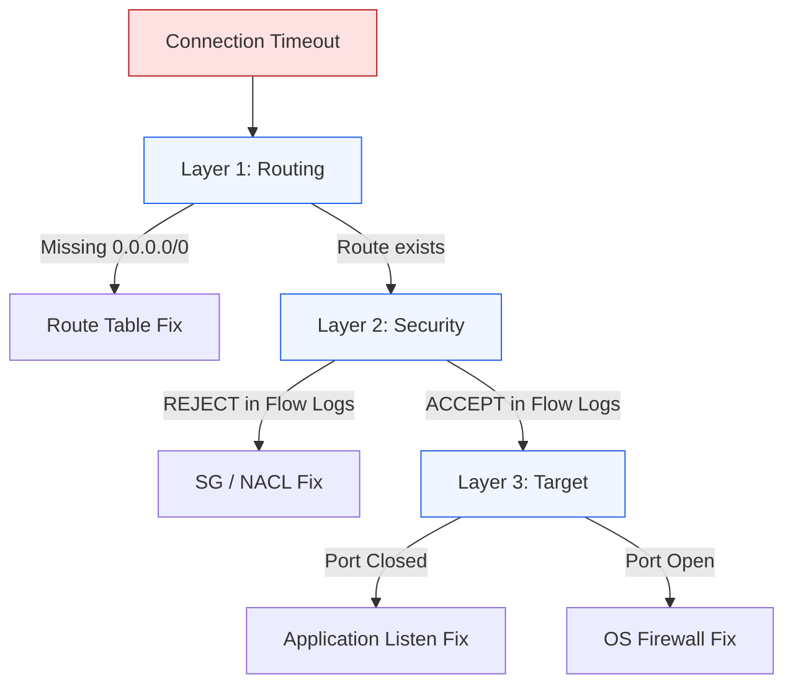

# 🛠️ Module 10.04: Common Troubleshooting Scenarios

> **"Troubleshooting is a mental process of elimination. You don't guess; you isolate. In AWS networking, you isolate layers until there is nowhere left for the bug to hide."**

## 📚 Overview

Networking in AWS is built in layers—from the high-level Internet Gateway down to the low-level operating system firewall. When a connection fails, junior engineers often change settings randomly, hoping for a "fix." Professional DevOps engineers follow a **Top-Down Checklist**. This module consolidates everything you've learned into a repeatable battle-plan for fixing the most common (and most frustrating) networking "Gotchas" in the cloud.

## 🎓 Learning Objectives

By the end of this module, you will:

- ✅ Follow the **"Standard Troubleshooting Flow"** to isolate network blocks.
- ✅ Fix **"Blackhole"** routes and Route Table misconfigurations.
- ✅ Resolve **Asymmetric Routing** loops in hybrid and multi-VPC setups.
- ✅ Differentiate between **"Connection Refused"** and **"Connection Timeout"**.
- ✅ Debug **DNS Resolution** issues at the VPC level.

---

## 🏗️ The Troubleshooting Checklist

### 1. Does the Subnet have a path out?
Check the **Route Table**. For a public subnet, there MUST be a route for `0.0.0.0/0` pointing to an `igw-`. For a private subnet, it should point to a `nat-`, `pcx-`, or `tgw-`. Look for the word **Blackhole**—if it's there, your target was deleted.

### 2. Is the "Gatekeeper" blocking the packet?
Check **Security Groups** (Stateful) and **Network ACLs** (Stateless).
- **The NACL Trap**: If you allow port 80 'In', you MUST allow Ephemeral Ports (1024-65535) 'Out' because NACLs don't remember the return path.

### 3. Is the Server "listening"?
Use `telnet <ip> <port>` or `nc -zv <ip> <port>`.
- **Connection Timeout**: The packet was dropped (AWS Layer issue).
- **Connection Refused**: The packet reached the server, but nothing is "listening" on that port (App Layer issue).

---

## 🚀 Professional Pattern: The "Nitro-System" Test

Sometimes the AWS network is fine, but the server is "silent."

**The Pro Standard**:
1. **The Test**: If Flow Logs show `ACCEPT`, but you still can't connect, use the **EC2 Instance Connect Endpoint** to log into the server without a public IP.
2. **The Command**: Run `netstat -tuln` (Linux) or `netstat -an` (Windows).
3. **The Discovery**: Verify the application is actually bound to `0.0.0.0` (all interfaces) and not just `127.0.0.1` (local only).
4. **The Benefit**: This separates "Network Problems" from "Server Problems" instantly.

---

## 🏆 Real-World DevOps Story: The "Migrated" Firewall Trap

**The Scenario**: A company migrated a legacy web server from an on-premises data center to an AWS VPC. They opened the Security Group for port 80. Flow logs showed thousands of `ACCEPT` entries coming from the internet.
**The Crisis**: No user could reach the site. The browser just spun forever and then timed out.
**The Discovery**: The server was a Linux box that had `iptables` rules hardcoded from the old data center. These rules only allowed traffic from the old corporate IP range (10.1.x.x).
**The Fix**: Since the AWS VPC was using 172.31.x.x, the local `iptables` were dropping every single packet that the AWS network had "allowed" through.
**The Result**: They cleared the `iptables` (since Security Groups are a better way to handle this in AWS), and the site went live immediately.
**The Lesson**: **AWS Security is a perimeter; OS Security is a moat.** You have to clear both for traffic to flow.

---

## ❓ Interview Preparation (Troubleshooting)

1. **Q: What does it mean when a route table has a 'Blackhole' status?**
    *A: It means the target of that route (like a NAT Gateway, Peering Connection, or Transit Gateway) was deleted, but the route entry still exists. All traffic hitting that route will be dropped.*

2. **Q: Why can I ping an IP address but not a domain name (like google.com) from my instance?**
    *A: You likely have a **DNS Resolution** issue. Check if `DNS Hostnames` and `DNS Support` are enabled in your VPC settings, and ensure your instance is using the AWS-provided DNS server at the base of your VPC range (e.g., 10.0.0.2).*

3. **Q: What is 'Asymmetric Routing' and why is it bad?**
    *A: It's when a packet goes out through one path (e.g., Direct Connect) but tries to come back through another (e.g., Internet Gateway). Stateful firewalls and security groups will drop the return packet because they didn't see the original request on that specific path.*

4. **Q: A Flow Log shows 'REJECT'. Is this definitely a Security Group issue?**
    *A: **No.** Both **Security Groups** and **Network ACLs** result in a 'REJECT' status in a flow log. You must check both to see which one has the blocking rule.*

5. **Q: How can you test if a specific port (like 5432) is open on a remote VPC server from your local machine?**
    *A: I would use a tool like **netcat** (`nc -zv <ip> 5432`) or **Test-NetConnection** in PowerShell. If it times out, the network is blocking; if it's refused, the application isn't running.*

---

## 📝 Knowledge Check

1. **What is the first thing you should check if an instance has no internet connectivity?**
    - [ ] a) CPU Usage
    - [ ] b) IAM Roles
    - [x] c) Route Table (Does it have a 0.0.0.0/0 route?)
    - [ ] d) S3 Bucket Permissions

2. **Which 'Status' in a route indicates the target resource was deleted?**
    - [ ] a) Active
    - [ ] b) Pending
    - [x] c) Blackhole
    - [ ] d) Orphaned

3. **If a Security Group allows traffic but a NACL blocks it, what action will be shown in the Flow Logs?**
    - [ ] a) ACCEPT
    - [x] b) REJECT
    - [ ] c) PENDING
    - [ ] d) NO_DATA

4. **What is the AWS VPC DNS server address for a network with the CIDR 172.16.0.0/16?**
    - [ ] a) 8.8.8.8
    - [ ] b) 172.16.0.1
    - [x] c) 172.16.0.2
    - [ ] d) 169.254.169.254

5. **True or False: 'Connection Refused' usually means the AWS Security Group is blocking the traffic.**
    - [ ] True 
    - [x] False ('Refused' means you reached the server but the app isn't listening)

---

## 🔗 Next Steps

**Congratulations!** You have completed the 01-Networking phase of the Intermediate Curriculum. You now have the skills to design, build, and fix complex global networks in the cloud.

Proceed to: **[Phase 2: Linux Mastery](../../../../../../README.md)** →
Node: This link points to the next phase of the journey.