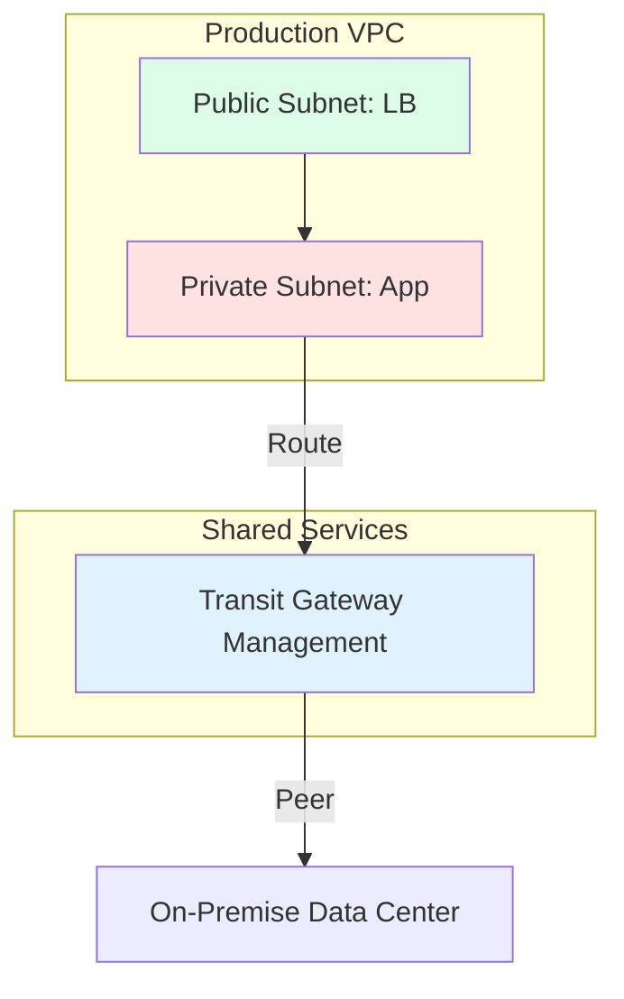

# 🌐 Intermediate Networking: The digital Highway

> **"Listen carefully, Junior. In the cloud, if your network is slow, your app is slow. If your network is open, your data is gone. Networking is the foundation of everything we build."**

---

## 🧠 The Mental Model: The Digital Highway

**The Junior Struggle**: "I just use a Load Balancer and it works. Why do I need to know about BGP, CIDR math, or the difference between L4 and L7 balancing?"

**The Senior Solution**: You realize that networking is like a **City Highway System**:
- **IP/CIDR**: The GPS coordinates and zip codes that tell packets where to go.
- **Firewalls/SG**: The security checkpoints and toll booths that verify who can enter.
- **Load Balancers**: The traffic lights and lane dividers that prevent gridlock.
- **DNS**: The directory service (Yellow Pages) that translates "Google.com" into a physical address.

---

## 🆚 Junior Way vs. Senior Way

| Feature | The Junior Way (Problematic) | The Senior Way (Architected) |
|:---|:---|:---|
| **Subnetting** | Using `/16` for everything (Too big) | **Sized-right subnets** (`/24` or `/28`) |
| **Connectivity** | Overlapping IP ranges | **Non-overlapping** CIDR designs |
| **Peering** | Messy "Full Mesh" peering | **Transit Gateway** for centralized routing |
| **Security** | Security Groups open to `0.0.0.0/0` | **Micro-segmentation** (Least privilege) |
| **Resolution** | Manual `/etc/hosts` entries | **Private DNS Zones** with conditional forwarding |

---

## 🏗️ Visual: The Cloud Network Architecture

---

## 🗺️ Curriculum Path

### 1. [Part 1: Fundamentals](./Part-1-Fundamentals/README.md)
*Junior, don't build on sand.* 
Master the OSI & TCP/IP models, IPv4 subnetting logic, and the mechanics of DNS and DHCP.

### 2. [Part 2: Advanced Networking](./Part-2-Advanced-Networking/README.md)
*Traffic control is an art form.* 
VLANs, Switching, L4 (TCP) vs L7 (Application) Load Balancing, and Enterprise firewall architectures.

### 3. [Part 3: Tools & Utilities](./Part-3-Tools-and-Utilities/README.md)
*If you can't see it, you can't fix it.* 
Mastering `tcpdump`, `wireshark`, `ip route`, and cloud-native observability tools.

---

## 🏆 Real-World DevOps Story: The Overlapping IP Disaster

**The Scenario**: A Junior engineer merged two startups' cloud accounts. Both used `10.0.0.0/16` for their main VPC.
**The Crisis**: When they tried to peer the networks to share a database, it failed. They couldn't route traffic because every server "thought" it was in the local network. 
**The Fix**: A massive 3-month project to re-IP thousands of instances and update every hardcoded connection string.
**The Lesson**: **Junior, always assume your network will need to talk to another network.** Never start with the default CIDR blocks.

---

## 🎤 Interview Preparation (Networking)

1. **Q: Junior, explain the TCP 3-Way Handshake.**
   - *A: SYN (Sequence), SYN-ACK (Acknowledgement), ACK. It's the protocol 'greeting' that ensures both sides are ready to talk before data starts flowing.*

2. **Q: What is the difference between a Layer 4 and a Layer 7 Load Balancer?**
   - *A: L4 balances based on **IP and Port** (Fast, but blind to data). L7 balances based on **URL, Headers, or Cookies** (Smarter, but slower as it must decrypt traffic).*

3. **Q: Why would we use a Private Link instead of VPC Peering?**
   - *A: Private Link allows connecting to a specific service without exposing the entire network. It also solves the 'Overlapping IP' problem by using its own private IP mapping.*

4. **Q: What is a CIDR `/24`? How many usable IPs are in it?**
   - *A: A `/24` has 256 IPs. In the cloud (e.g., AWS), there are **251** usable IPs (the provider reserves 5 for networking tasks like DNS and Gateway).*

5. **Q: Explain the 'TTL' in a DNS record.**
   - *A: Time-To-Live. It tells recursive resolvers how long to cache the record before asking the authoritative server for an update. Low TTL is for migrations; High TTL is for stability.*

6. **Q: What is BGP (Border Gateway Protocol)?**
   - *A: It is the 'routing' protocol of the internet. It allows different networks (Autonomous Systems) to exchange routing information so packets can find the shortest path across the globe.*

7. **Q: How does a NAT Gateway differ from an Internet Gateway?**
   - *A: An Internet Gateway allows **bidirectional** traffic (Public-facing). A NAT Gateway allows **outbound-only** traffic (Private-facing servers downloading updates).*

8. **Q: What is a VPC Endpoint?**
   - *A: It allows instances in a private subnet to talk to cloud services (like S3) without the traffic ever leaving the provider's private backbone network (no NAT needed).*

9. **Q: Explain MTU (Maximum Transmission Unit).**
   - *A: It is the size of the largest packet that can be sent over a network. Standard is 1500 bytes. If a packet is too big, it gets 'Fragmented,' which slows down the network.*

10. **Q: What is 'Micro-segmentation'?**
    - *A: A security technique that isolates every single workload or service from each other even within the same network, typically using identity-based firewalls.*

---

## 📝 Knowledge Check

1. **Which layer of the OSI model does an IP router operate at?**
   - [x] Layer 3 (Network).

2. **True/False: A `/16` subnet is larger than a `/24` subnet.**
   - [x] **True**. (Lower number means more IPs).

3. **What is the standard port for HTTPS?**
   - [x] 443.

4. **Which protocol is 'connectionless' and faster for streaming?**
   - [x] UDP.

5. **Which service translates a domain name into an IP?**
   - [x] DNS.

6. **In a `/32` CIDR block, how many IPs are available?**
   - [x] 1 (It represents a single host).

7. **What does ARP stand for?**
   - [x] Address Resolution Protocol (IP to MAC).

8. **Which component allows a private subnet to reach the internet for updates?**
   - [x] NAT Gateway.

9. **What is the default TTL for many DNS records?**
   - [x] Varies, but 3600 (1 hour) is common.

10. **Which OSI layer handles encryption (SSL/TLS)?**
    - [x] Layer 6 (Presentation).

---

## 🔗 Next Steps
Junior, the digital highway is ready for traffic. Let's start with the fundamentals.
1. Proceed to: **[Part 1: Fundamentals](./Part-1-Fundamentals/README.md)** →
2. Return to: **[Phase 1 Hub](../README.md)** →
