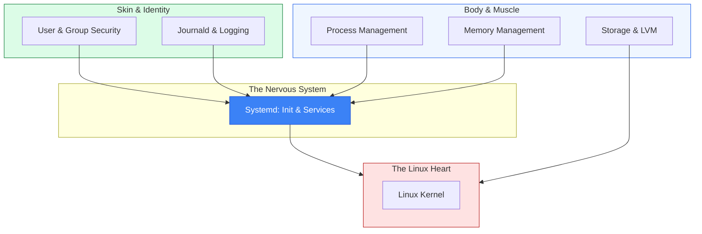

# 🖥️ Phase 1.02.01: Linux System Administration

> **"A server is a living thing. It breathes through its processes, consumes resources from its hardware, and leaves a trail of its life in the logs. A great administrator doesn't just fix servers; they understand their heartbeat."**

## Core Concept: The System Lifecycle
**[REFERENCE: System Architecture & Services](./REFERENCE/System-Architecture-Services-Ref.md)**

Mastering the internal mechanics that keep enterprise servers running:
- **Service Orchestration**: Utilizing `systemd` to manage application lifecycles, dependencies, and automated recovery.
- **Process Dynamics**: Understanding process states, signals, and priority management to optimize resource contention.
- **Kernel-User Interface**: Navigating the boundary between hardware-level kernel operations and isolated user-space applications.

## Enterprise Governance: Compliance & Resilience
**[REFERENCE: Storage, Security & Governance](./REFERENCE/Storage-Security-Governance-Ref.md)**

Scaling Linux management with professional standards and strict guardrails:
- **Flexible Storage (LVM)**: Designing resilient disk architectures that can expand dynamically without downtime.
- **Identity & Privilege Control**: Implementing granular `sudo` policies and lifecycle management to enforce the Principle of Least Privilege.
- **Audit & Forensics**: Utilizing `journald` and metric-enriched logging to provide an immutable trail of system activity for compliance.

---

## 📚 Overview

Linux System Administration is the core of the DevOps world. While cloud providers manage the hypervisors, you are responsible for the **System Lifecycle**. This phase shifts your focus from "using" Linux to "managing" it. You will learn to orchestrate services via `systemd`, balance process priorities, manage complex storage with **LVM**, and secure the system through a robust user and logging framework.

## 🎓 Learning Objectives

By the end of this phase, you will:

- ✅ Orchestrate complex service architectures using **Systemd Unit Files**.
- ✅ Balance system performance using **Nice**, **Renice**, and **Process Signal** control.
- ✅ Implement scalable and flexible storage using **Logical Volume Management (LVM)**.
- ✅ Secure the system with granular **Sudoers** policies and identity management.
- ✅ Perform forensic analysis using **Journald** and automated log rotation.
- ✅ Harden the kernel and services for production-grade security.

---

## 📂 Curriculum Modules

| Module | Description | Key Tools |
| :--- | :--- | :--- |
| **[01. Systemd & Service Management](./01-Systemd-and-Services/)** | Control the lifecycle of your applications. | `systemctl`, `journalctl` |
| **[02. Process Management](./02-Process-Management/)** | Monitor and optimize system resources. | `htop`, `top`, `kill`, `nice` |
| **[03. User & Identity Management](./03-User-and-Group-Management/)** | Secure access and define privilege boundaries. | `visudo`, `chage`, `usermod` |
| **[04. Storage & LVM](./04-Storage-and-LVM/)** | Design flexible and resilient disk architectures. | `pvcreate`, `vgextend`, `lvextend` |
| **[05. Logging & Forensics](./05-Log-Management/)** | Capture and analyze the system's heartbeat. | `logrotate`, `journalctl -f` |

---

## 🚀 Professional Pattern: The "Immaculate" Admin

Junior admins fix things by typing commands in the shell. Senior admins fix things by updating **Unit Files** and **Configurations**.

**The Pro Standard**:
1. **Never manual**: Don't just `start` a service; define a `Restart=always` policy in its `.service` file.
2. **Immutable Identity**: Don't share the `root` password; use `sudo` with individual keys and granular policies.
3. **Storage Flexibility**: Never use plain partitions; always use **LVM** so you can grow the disk without unmounting.
4. **Visibility First**: If it's not logged, it didn't happen. Ensure every custom app sends logs to `stdout` for `journald` to capture.

---

## 🏆 Real-World DevOps Story: The "Zombie" Outage

**The Scenario**: A high-traffic stock trading app slowed to a crawl. The server had 128GB of RAM and was 90% idle, but users couldn't connect.
**The Crisis**: The team tried adding more servers, but they also failed within minutes.
**The Discovery**: A senior admin ran `ulimit -n` and realized the app was hitting the **File Descriptor** limit (default 1024). The app was opening connections but never closing them, creating "Zombies" that consumed the OS's ability to open new sockets.
**The Fix**:
1. Increased the limit in `/etc/security/limits.conf`.
2. Updated the `.service` file with `LimitNOFILE=65536`.
3. Applied `systemctl daemon-reload`.
**The Result**: The site went from 0% availability to 100% in seconds.
**The Lesson**: **Hardware isn't the only bottleneck.** Understanding the kernel and system-level limits is often more important than "just adding more RAM."

---

## ❓ Interview Preparation (SysAdmin Fundamentals)

1. **Q: What is the difference between 'Requires' and 'Wants' in a Systemd unit file?**
    *A: `Requires` is a hard dependency; if the required unit fails, the main unit will not start. `Wants` is a soft dependency; the main unit will attempt to start even if the wanted unit fails.*

2. **Q: How does LVM differ from traditional partitioning?**
    *A: Traditional partitions are fixed blocks on a disk. LVM (Logical Volume Management) adds an abstraction layer, allowing you to pool multiple physical disks (PVs) into a Volume Group (VG) and slice out Logical Volumes (LVs) that can be resized dynamically while the system is running.*

3. **Q: Why would you use 'journalctl -u' instead of looking at /var/log/syslog?**
    *A: `journalctl -u` filters the binary system logs for a specific unit (service). It is faster, more precise, and handles log rotation/parsing automatically, whereas `syslog` is a flat text file that contains mixed noise from every service.*

4. **Q: What is a 'Sticky Bit' on a directory?**
    *A: It is a permission bit (e.g., on `/tmp`) that ensures only the file's owner (or root) can delete or rename a file, even if others have write access to the directory. It prevents "accidental deletion" in shared environments.*

5. **Q: What is the purpose of 'systemctl daemon-reload'?**
    *A: Systemd caches the unit files in memory for speed. If you edit a file on disk (like a .service file), you must run `daemon-reload` to force Systemd to refresh its cache and recognize the new changes.*

---

## 📝 Knowledge Check

1. **Which command is used to permanently enable a service to start at boot?**
    - [ ] a) systemctl start
    - [x] b) systemctl enable
    - [ ] c) systemctl persist
    - [ ] d) chkconfig on

2. **In LVM, which component is created first?**
    - [x] a) Physical Volume (PV)
    - [ ] b) Volume Group (VG)
    - [ ] c) Logical Volume (LV)
    - [ ] d) File System

3. **Which file is the primary configuration for Sudo access?**
    - [ ] a) /etc/passwd
    - [ ] b) /etc/group
    - [x] c) /etc/sudoers (via visudo)
    - [ ] d) /etc/shadow

4. **Which 'signal' is sent by the command 'kill -9 <PID>'?**
    - [ ] a) SIGTERM (Graceful)
    - [x] b) SIGKILL (Forced)
    - [ ] c) SIGHUP (Reload)
    - [ ] d) SIGSTOP (Pause)

5. **True or False: Logrotate is used to move the system logs to a remote server.**
    - [ ] True 
    - [x] False (Logrotate manages local rotation/compression; tools like Rsyslog or Fluentd handle remote shipping)

---

## 🔗 Next Steps

The journey into the machine begins with the heart of the system: services.

Proceed to: **[01. Systemd & Service Management](./01-Systemd-and-Services/README.md)** →
Node: This link points to the first technical deep-dive.
