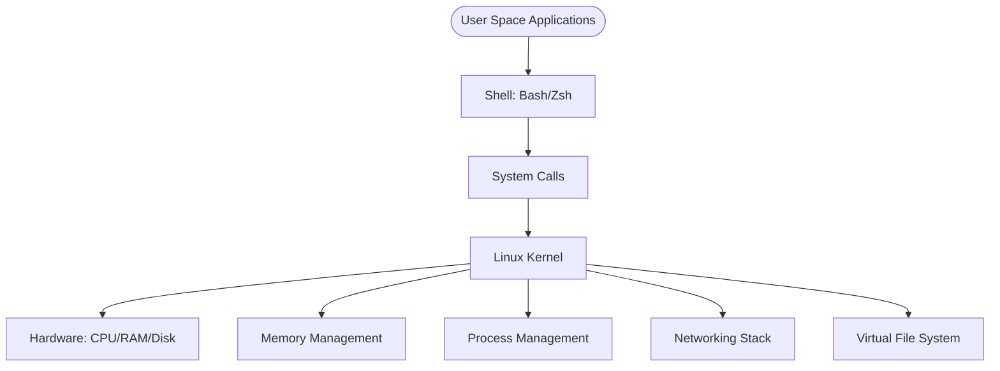

# Intermediate Linux: System Administration & Operations

Moving beyond basic commands, this level focuses on managing production Linux systems, understanding service lifecycles, and automating complex operations.

## Core Concept: Everything is a Process
**[REFERENCE: Linux Kernel Architecture](./REFERENCE/Linux-Kernel-Architecture-Ref.md)**

Linux is fundamentally about **processes** managed by the **kernel**:
- **User Space vs Kernel Space**: Applications run in isolated user space; only the kernel has direct hardware access.
- **System Calls**: The ONLY way user programs communicate with the kernel (`open()`, `read()`, `write()`, `fork()`).
- **Process States**: Running (R), Sleeping (S), Zombie (Z). Understanding states is critical for troubleshooting.
- **Systemd (PID 1)**: The init system that starts all services, manages logs (`journald`), and enforces resource limits (`cgroups`).

> See **[Linux-Kernel-Architecture-Ref.md](./REFERENCE/Linux-Kernel-Architecture-Ref.md)** for the memory layout, process hierarchy, OOM killer, and VFS architecture.

## Enterprise Governance & Security
**[REFERENCE: Linux Security & Hardening](./REFERENCE/Linux-Security-Hardening-Ref.md)**

Production Linux systems require defense in depth:
- **Permissions**: Use `chmod 600` for private keys, `755` for scripts. Audit SUID binaries (`find / -perm -4000`).
- **SELinux/AppArmor**: Mandatory Access Control (MAC) restricts what processes can do, even as root.
- **SSH Hardening**: Disable password auth, use key-based auth only, change default port, implement Fail2Ban.
- **Audit Logging**: Use `auditd` to track all privileged actions (required for PCI-DSS, HIPAA compliance).

> See **[Linux-Security-Hardening-Ref.md](./REFERENCE/Linux-Security-Hardening-Ref.md)** for SELinux contexts, sudo configuration, iptables rules, and bastion host patterns.

---

## 📂 Module Structure

### 🚀 Intermediate Topics
- [System Administration](./System-Administration/README.md): Master the core engine - Systemd, Processes, Storage, and Identity.

- [Shell Scripting](../02-Automation/01-Shell-Scripting-Basics/): Writing reusable Bash scripts and logic.

- [Linux Networking](./Networking/): Troubleshooting interfaces, routing, and ports.

- [Intermediate SSH](./SSH/): Keys, config files, and tunneling.

---

## 🏗️ Core Concepts

### 1. Systemd Service Management
DevOps engineers must know how to keep applications running.
- **`systemctl start/stop/restart`**: basic control.
- **`systemctl enable/disable`**: managing persistence across boots.
- **`systemctl status`**: the first step in troubleshooting.

### 2. Process Lifecycle
- **`top` / `htop`**: Monitoring resource consumption.
- **`kill` / `pkill` / `killall`**: Handling runaway processes.
- **`nice` / `renice`**: Managing process priority.

### 3. Log Analysis
- **`journalctl`**: The modern interface for systemd logs.
- **`tail -f /var/log/syslog`**: Classic real-time log monitoring.
- **`grep` / `awk` / `sed`**: Extracting meaning from large log files.

---

## 📊 Linux System Architecture

---

## ❓ Interview Questions & Quiz
**[Explore Interview Questions & Quizzes](./Interview_Questions_and_Quiz.md)**

---

## ✅ Intermediate Knowledge Check
- [ ] Create and manage custom `systemd` services
- [ ] Write a Bash script with loops and conditionals
- [ ] Troubleshoot network connectivity using `ip`, `ss`, and `dig`
- [ ] Configure SSH for key-based authentication
- [ ] Manage disk space using LVM or simple partitions
- [ ] Analyze application logs to identify root causes
