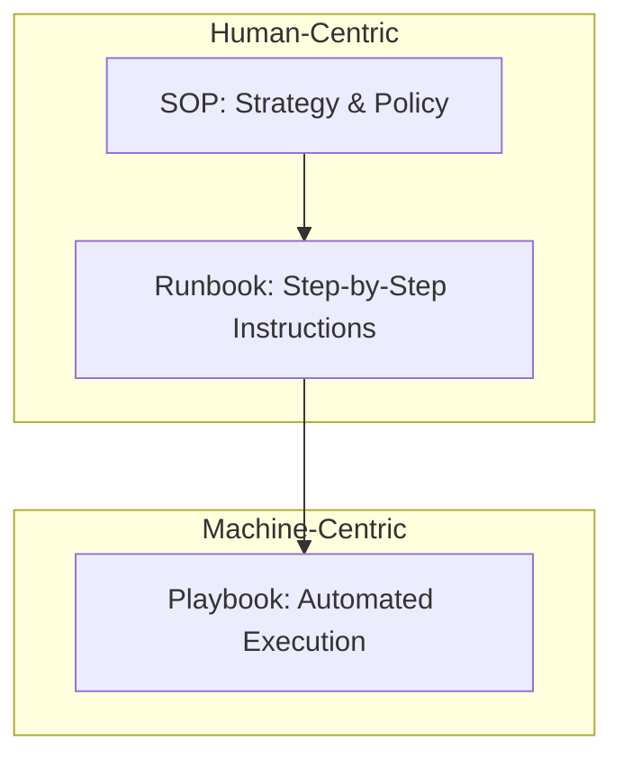

# Documentation Hierarchy

Not all documentation is created equal. Understanding the difference between an SOP, a Runbook, and a Playbook is essential for operational clarity.

## The Three Layers

### 1. SOP (Standard Operating Procedure)
- **What**: Higher-level policy and governance.
- **Goal**: Compliance and "The Big Picture."
- **Example**: "Incident Communication Policy" or "How to request production access."

### 2. Runbook (The Instructions)
- **What**: A specific, step-by-step procedure for a task.
- **Goal**: Actionable execution for humans.
- **Example**: "Restarting the PostgreSQL Cluster after a crash."

### 3. Playbook (The Automation)
- **What**: Executable code (Ansible, Terraform, Python).
- **Goal**: Machine execution.
- **Example**: `ansible-playbook restart_db.yml`.

## Relationship Table

| Level | Audience | Execution | Format |
| :--- | :--- | :--- | :--- |
| **SOP** | Managers / Legal | Human Strategy | Narrative Text |
| **Runbook** | SREs / Developers | Human Action | Checklist / Steps |
| **Playbook** | The System | Automated | Code (YAML/Python) |

---

## The Hierarchy Visualized

---

## 🏗️ Real-Life Scenarios

### Scenario 1: The Confusion Matrix
**Problem**: An auditor asks to see the "Backup Procedure." The engineer shows them a 5,000-line Python script.
**Auditor Response**: "I don't read Python. I need to see the human process for verifying that the backup worked."
**Solution**: The team creates an **SOP** that defines *why* we backup, a **Runbook** that explains *how* a human checks the logs, and keeps the Python **Playbook** for the actual work.
**Result**: Both the machine and the auditor are happy.

### Scenario 2: The "Silent Failure" of Automation
**Problem**: A database cleanup script (Playbook) failed silently because the disk was 100% full. The automation simply exited with code 1, but no one saw it.
**Solution**: Create a **Hybrid Runbook**. The human runbook has a prerequisite step: "Run the cleanup script. If it returns an error, follow Section 4: Manual Disk Cleanup."
**Result**: The human-in-the-loop ensures that even when the machine fails, the operation is successfully completed.

### Scenario 3: The Junior On-Call "Ghost"
**Problem**: A junior engineer was on-call for the first time. The automated "Service Restart" script worked, but the engineer didn't know they were supposed to notify the customer success team, as that step wasn't in the script.
**Solution**: Update the **SOP** for Incident Management to include mandatory communication steps, and link that SOP in the **Runbook** that triggers the script.
**Result**: The next incident was resolved technically and communicatively, preventing customer frustration.

---

## ❓ Interview Questions

1.  **If you have an automated script (Playbook), do you still need a Runbook?**
    - *Answer*: Yes. The Runbook explains the context, prerequisites, and what to do if the automation fails. It is the "Human-in-the-loop" safety manual.
2.  **At what stage of an incident do you move from an SOP to a Runbook?**
    - *Answer*: The SOP tells you *to* declare an incident and notify stakeholders. The Runbook is accessed once you begin the specific technical troubleshooting and mitigation steps.
3.  **Why is an SOP considered "Governance"?**
    - *Answer*: Because it defines the rules, policies, and standards that the organization must follow (e.g., "All passwords must be stored in Vault"). It ensures compliance across teams.
4.  **What is a "Hybrid Runbook"?**
    - *Answer*: A document that combines human instructions with links to automated scripts (Playbooks). It uses the human for judgment and the machine for heavy lifting.
5.  **How do you handle versioning in this hierarchy?**
    - *Answer*: Ideally all three should be stored in Git. Changes to the Playbook (code) should trigger a review of the Runbook to ensure the human steps still match the machine steps.
6.  **Can an SOP be partially automated?**
    - *Answer*: Usually no. SOPs are about "Policy" (e.g., Who is allowed to approve a deploy?). These are business rules that usually require human signatures or high-level approvals.

---

## 🧠 Comprehensive Quiz (25 Questions)

<b>1. Which document is most likely to be written in YAML or Python?</b>

Show Answer

Answer: C

<b>2. An SOP (Standard Operating Procedure) primarily targets:</b>

Show Answer

Answer: C

<b>3. If you need step-by-step human instructions to "Reset a User Password," you look at a:</b>

Show Answer

Answer: B

<b>4. True/False: A Playbook is more flexible than a Runbook for handling unexpected errors.</b>

Show Answer

Answer: B** - Humans (using Runbooks) are better at adapting to unexpected scenarios than static code.

<b>5. Which layer defines 'Who is authorized to approve production changes'?</b>

Show Answer

Answer: B

<b>6. The "Human-in-the-Loop" philosophy specifically values which layer?</b>

Show Answer

Answer: B

<b>7. A "Playbook" is ideally:</b>

Show Answer

Answer: B

<b>8. What is the risk of having a Playbook WITHOUT a Runbook?</b>

Show Answer

Answer: B

<b>9. "Policy Compliance" is the main goal of which layer?</b>

Show Answer

Answer: C

<b>10. Which layer is most likely to be audited by a regulator like SOC2?</b>

Show Answer

Answer: D** - Auditors check if policies (SOP) exist and if they are followed (Runbook logs).

<b>11. A "Prerequisite" section is most common in a:</b>

Show Answer

Answer: B

<b>12. True/False: Ansible is a tool used to create Playbooks.</b>

Show Answer

Answer: A

<b>13. Which layer is considered "Machine-Centric"?</b>

Show Answer

Answer: B

<b>14. A Runbook is "Actionable," while an SOP is:</b>

Show Answer

Answer: B

<b>15. What is "Tribal Knowledge" in this context?</b>

Show Answer

Answer: B

<b>16. "Separation of Concerns" in documentation means:</b>

Show Answer

Answer: B

<b>17. If a process is "Frequent and Lower-Risk," you should move toward:</b>

Show Answer

Answer: B

<b>18. A "Reference Document" (like a diagram) belongs in which layer?</b>

Show Answer

Answer: C

<b>19. Why should Runbooks be 'Version Controlled'?</b>

Show Answer

Answer: B

<b>20. An 'Executable Runbook' (like a Jupyter Notebook) sits between:</b>

Show Answer

Answer: B

<b>21. "Compliance drift" happens when:</b>

Show Answer

Answer: B

<b>22. Which layer provides the 'BIG WHY' for a task?</b>

Show Answer

Answer: B

<b>23. A "Call-Out" or "Escalation" procedure is part of a:</b>

Show Answer

Answer: B

<b>24. "Cognitive Load" is reduced most by which layer during a crisis?</b>

Show Answer

Answer: B

<b>25. The ultimate goal of the Hierarchy is:</b>

Show Answer

Answer: B

