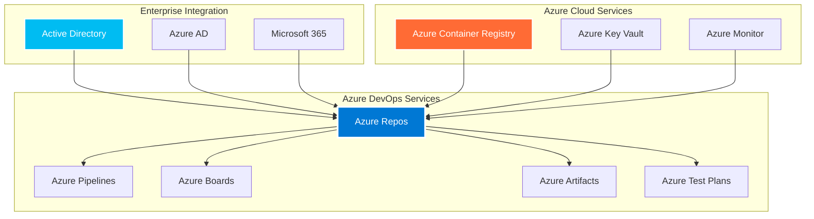
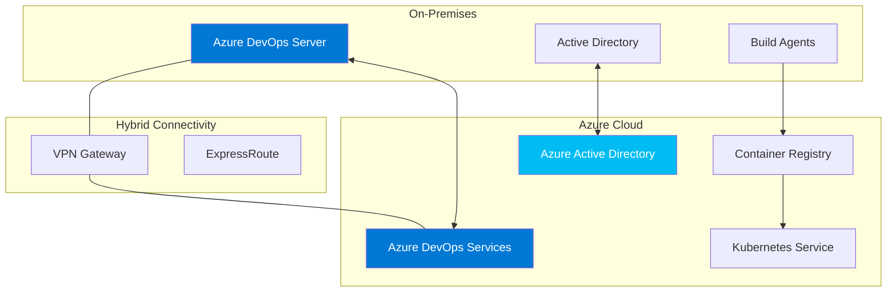

# 🔷 Azure DevOps Repos - Microsoft Enterprise Repository Management


Azure DevOps Repos provides Git repositories with enterprise-grade security, compliance, and integration with the Microsoft ecosystem. It's the cornerstone of Microsoft's DevOps platform, offering seamless integration with Azure services and enterprise Active Directory.

---

## 🎯 Learning Objectives

By completing this module, you will master:
- Azure DevOps Repos administration and configuration
- Enterprise Active Directory integration
- Advanced branch policies and security features
- Integration with Azure services and Microsoft ecosystem
- Hybrid cloud repository strategies
- Migration from other platforms to Azure DevOps

---

## 🏗️ Azure DevOps Architecture Overview



---

## 📂 Module Structure

### 🚀 01-Azure-Repos-Fundamentals
**Core Concepts and Setup**
- Azure DevOps organization setup
- Repository creation and configuration
- Git operations in Azure Repos
- Team and project management
- Permissions and security basics

### 🔐 02-Enterprise-Integration
**Microsoft Ecosystem Connectivity**
- Active Directory integration
- Azure AD authentication and authorization
- Microsoft 365 integration
- Hybrid identity management
- Single Sign-On (SSO) configuration

### 🛡️ 03-Branch-Policies-Security
**Advanced Repository Governance**
- Branch protection policies
- Pull request workflows
- Code review requirements
- Build validation policies
- Security and compliance features

### ☁️ 04-Azure-Services-Integration
**Cloud-Native Development**
- Azure Container Registry integration
- Azure Key Vault for secrets management
- Azure Monitor and Application Insights
- Azure Functions and Logic Apps
- Infrastructure as Code with ARM/Bicep

### 🏢 05-Enterprise-Administration
**Large-Scale Management**
- Azure DevOps Server (on-premises)
- Organization and project administration
- Backup and disaster recovery
- Performance optimization
- License and cost management

### 🔄 06-Migration-Strategies
**Platform Transitions**
- Migration from TFS to Azure DevOps
- GitHub to Azure DevOps migration
- GitLab to Azure DevOps migration
- Hybrid cloud strategies
- Team adoption and training

---

## 🔐 Enterprise Security & Compliance

### 🛡️ Branch Policy Configuration

```json
{
  "type": {
    "id": "fa4e907d-c16b-4a4c-9dfa-4906e5d171dd",
    "displayName": "Minimum number of reviewers"
  },
  "isEnabled": true,
  "isBlocking": true,
  "settings": {
    "minimumApproverCount": 2,
    "creatorVoteCounts": false,
    "allowDownvotes": false,
    "resetOnSourcePush": true,
    "requireVoteOnLastIteration": true,
    "blockLastPusherVote": true
  }
}
```

### 🔍 Advanced Security Policies

```yaml
# Azure DevOps YAML Pipeline with Security
trigger:
  branches:
    include:
    - main
    - develop

pool:
  vmImage: 'ubuntu-latest'

variables:
  - group: security-variables
  - name: buildConfiguration
    value: 'Release'

stages:
- stage: SecurityScan
  displayName: 'Security Scanning'
  jobs:
  - job: StaticAnalysis
    displayName: 'Static Code Analysis'
    steps:
    - task: SonarCloudPrepare@1
      inputs:
        SonarCloud: 'SonarCloud'
        organization: 'myorg'
        scannerMode: 'MSBuild'
        projectKey: 'myproject'
    
    - task: DotNetCoreCLI@2
      displayName: 'Build'
      inputs:
        command: 'build'
        configuration: $(buildConfiguration)
    
    - task: SonarCloudAnalyze@1
    
    - task: SonarCloudPublish@1
      inputs:
        pollingTimeoutSec: '300'

  - job: DependencyCheck
    displayName: 'Dependency Vulnerability Scan'
    steps:
    - task: dependency-check-build-task@6
      inputs:
        projectName: 'MyProject'
        scanPath: '$(Build.SourcesDirectory)'
        format: 'ALL'
    
    - task: PublishTestResults@2
      inputs:
        testResultsFormat: 'JUnit'
        testResultsFiles: 'dependency-check-junit.xml'
        searchFolder: '$(Common.TestResultsDirectory)'
```

---

## 🔗 Microsoft Ecosystem Integration

### 📊 Power BI Integration for Repository Analytics

```powershell
# PowerShell script for Azure DevOps API integration
$organization = "myorg"
$project = "myproject"
$pat = $env:AZURE_DEVOPS_PAT

$headers = @{
    Authorization = "Basic " + [Convert]::ToBase64String([Text.Encoding]::ASCII.GetBytes(":$pat"))
    'Content-Type' = 'application/json'
}

# Get repository statistics
$repoUrl = "https://dev.azure.com/$organization/$project/_apis/git/repositories?api-version=6.0"
$repositories = Invoke-RestMethod -Uri $repoUrl -Headers $headers

foreach ($repo in $repositories.value) {
    # Get commit statistics
    $commitsUrl = "https://dev.azure.com/$organization/$project/_apis/git/repositories/$($repo.id)/commits?api-version=6.0&`$top=100"
    $commits = Invoke-RestMethod -Uri $commitsUrl -Headers $headers
    
    # Get pull request statistics
    $prUrl = "https://dev.azure.com/$organization/$project/_apis/git/repositories/$($repo.id)/pullrequests?api-version=6.0&searchCriteria.status=completed"
    $pullRequests = Invoke-RestMethod -Uri $prUrl -Headers $headers
    
    Write-Output "Repository: $($repo.name)"
    Write-Output "Commits: $($commits.count)"
    Write-Output "Pull Requests: $($pullRequests.count)"
    Write-Output "---"
}
```

### 🔄 Azure Logic Apps Integration

```json
{
  "definition": {
    "$schema": "https://schema.management.azure.com/providers/Microsoft.Logic/schemas/2016-06-01/workflowdefinition.json#",
    "triggers": {
      "When_a_pull_request_is_created": {
        "type": "ApiConnectionWebhook",
        "inputs": {
          "host": {
            "connection": {
              "name": "@parameters('$connections')['azuredevops']['connectionId']"
            }
          },
          "body": {
            "eventType": "git.pullrequest.created",
            "resource": {
              "repository": {
                "id": "@parameters('repositoryId')"
              }
            }
          }
        }
      }
    },
    "actions": {
      "Send_Teams_notification": {
        "type": "ApiConnection",
        "inputs": {
          "host": {
            "connection": {
              "name": "@parameters('$connections')['teams']['connectionId']"
            }
          },
          "method": "post",
          "body": {
            "text": "New pull request created: @{triggerBody()?['resource']?['title']}"
          }
        }
      }
    }
  }
}
```

---

## 🏢 Enterprise Deployment Patterns

### 🌐 Hybrid Cloud Architecture



### 📈 Performance Optimization

```powershell
# Azure DevOps Server Performance Tuning
# Application Tier Configuration

# IIS Application Pool Settings
Set-ItemProperty -Path "IIS:\AppPools\Azure DevOps Server Application Pool" -Name processModel.idleTimeout -Value "00:00:00"
Set-ItemProperty -Path "IIS:\AppPools\Azure DevOps Server Application Pool" -Name recycling.periodicRestart.time -Value "00:00:00"

# SQL Server Optimization
$sqlQuery = @"
-- Index maintenance for Azure DevOps databases
ALTER INDEX ALL ON dbo.tbl_Content REBUILD WITH (FILLFACTOR = 90, ONLINE = ON)
ALTER INDEX ALL ON dbo.tbl_Version REBUILD WITH (FILLFACTOR = 90, ONLINE = ON)
ALTER INDEX ALL ON dbo.tbl_File REBUILD WITH (FILLFACTOR = 90, ONLINE = ON)

-- Update statistics
UPDATE STATISTICS dbo.tbl_Content WITH FULLSCAN
UPDATE STATISTICS dbo.tbl_Version WITH FULLSCAN
UPDATE STATISTICS dbo.tbl_File WITH FULLSCAN
"@

Invoke-Sqlcmd -Query $sqlQuery -ServerInstance "SQL-SERVER" -Database "AzureDevOps_Configuration"
```

---

## 🔄 Migration Strategies

### 📦 TFS to Azure DevOps Services Migration

```powershell
# TFS Migration Tool Configuration
$migrationConfig = @{
    Source = @{
        Collection = "http://tfs-server:8080/tfs/DefaultCollection"
        Project = "MyProject"
        Authentication = "Windows"
    }
    Target = @{
        Organization = "https://dev.azure.com/myorg"
        Project = "MyProject"
        PAT = $env:AZURE_DEVOPS_PAT
    }
    Options = @{
        IncludeHistory = $true
        MigrateWorkItems = $true
        MigrateTestCases = $true
        ValidateOnly = $false
    }
}

# Execute migration
Start-TfsMigration -Config $migrationConfig -Verbose
```

### 🔧 GitHub to Azure DevOps Migration

```bash
#!/bin/bash
# GitHub to Azure DevOps Migration Script

GITHUB_ORG="myorg"
GITHUB_REPO="myrepo"
AZURE_ORG="myazureorg"
AZURE_PROJECT="myproject"
AZURE_REPO="myrepo"

# Clone GitHub repository with full history
git clone --mirror https://github.com/$GITHUB_ORG/$GITHUB_REPO.git temp-migration

cd temp-migration

# Add Azure DevOps remote
git remote add azure https://dev.azure.com/$AZURE_ORG/$AZURE_PROJECT/_git/$AZURE_REPO

# Push all branches and tags
git push azure --all
git push azure --tags

# Migrate GitHub Issues to Azure DevOps Work Items
python3 << EOF
import requests
import json

# GitHub API
github_headers = {'Authorization': 'token $GITHUB_TOKEN'}
github_url = f'https://api.github.com/repos/$GITHUB_ORG/$GITHUB_REPO/issues'

# Azure DevOps API
azure_headers = {
    'Authorization': f'Basic {base64.b64encode(f":{AZURE_PAT}".encode()).decode()}',
    'Content-Type': 'application/json-patch+json'
}
azure_url = f'https://dev.azure.com/$AZURE_ORG/$AZURE_PROJECT/_apis/wit/workitems/\$Bug?api-version=6.0'

# Get GitHub issues
issues = requests.get(github_url, headers=github_headers).json()

for issue in issues:
    # Create Azure DevOps work item
    work_item = [
        {
            "op": "add",
            "path": "/fields/System.Title",
            "value": issue['title']
        },
        {
            "op": "add", 
            "path": "/fields/System.Description",
            "value": issue['body']
        }
    ]
    
    response = requests.post(azure_url, headers=azure_headers, json=work_item)
    print(f"Migrated issue: {issue['title']}")
EOF

# Cleanup
cd ..
rm -rf temp-migration

echo "Migration completed successfully!"
```

---

## 🧪 Hands-On Labs

### Lab 1: Enterprise Repository Setup
**Objective**: Configure Azure DevOps with enterprise security policies
**Duration**: 60 minutes
**Skills**: Organization setup, branch policies, security configuration

### Lab 2: Azure Services Integration
**Objective**: Integrate repository with Azure Container Registry and Key Vault
**Duration**: 90 minutes
**Skills**: Service connections, pipeline integration, secrets management

### Lab 3: Hybrid Cloud Configuration
**Objective**: Set up hybrid connectivity between on-premises and cloud
**Duration**: 120 minutes
**Skills**: VPN configuration, hybrid agents, identity synchronization

### Lab 4: Migration Project
**Objective**: Migrate repository from GitHub to Azure DevOps
**Duration**: 150 minutes
**Skills**: Migration tools, history preservation, work item migration

---

## 📋 Interview Questions & Quiz (25+ Questions)

### 🎯 Technical Questions

1. **What are the key differences between Azure DevOps Services and Azure DevOps Server?**
   - A) Services is cloud-hosted, Server is on-premises
   - B) Services uses Git, Server uses TFVC
   - C) Services is free, Server requires licenses
   - D) No significant differences

2. **Which authentication method is recommended for enterprise Azure DevOps deployments?**
   - A) Basic authentication
   - B) Personal Access Tokens (PAT)
   - C) Azure Active Directory integration
   - D) SSH keys only

3. **What is the maximum file size supported in Azure Repos?**
   - A) 100 MB
   - B) 250 MB
   - C) 5 GB
   - D) No limit

### 🏢 Enterprise Scenarios

4. **Your organization has 1000+ developers across multiple time zones. How would you design the Azure DevOps architecture for optimal performance?**

5. **Design a branch policy strategy for a financial services company with strict compliance requirements.**

6. **How would you implement disaster recovery for Azure DevOps Server in a hybrid environment?**

### 🔧 Troubleshooting

7. **Azure DevOps build agents are failing to connect. What are the possible causes and solutions?**

8. **How would you troubleshoot slow Git operations in large repositories?**

---

## 🎯 Real-Life Scenarios

### Scenario 1: Enterprise Digital Transformation
**Context**: Large corporation migrating from TFS 2015 to Azure DevOps Services
**Challenge**: 500+ projects, 2000+ users, compliance requirements
**Solution**: Phased migration with parallel systems and comprehensive training

### Scenario 2: Hybrid Cloud Strategy
**Context**: Government agency with on-premises requirements
**Challenge**: Maintain security while enabling cloud capabilities
**Solution**: Azure DevOps Server with selective cloud integration

### Scenario 3: Multi-Cloud Repository Strategy
**Context**: Global company using multiple cloud providers
**Challenge**: Centralized source control across AWS, Azure, and GCP
**Solution**: Azure DevOps as central hub with cross-cloud deployment

### Scenario 4: Compliance and Audit
**Context**: Healthcare organization requiring HIPAA compliance
**Challenge**: Implement audit trails and access controls
**Solution**: Advanced security policies with comprehensive logging

---

## 📊 Azure DevOps vs Competitors

| Feature | Azure DevOps | GitHub | GitLab | Bitbucket |
|---------|--------------|--------|--------|-----------|
| **Microsoft Integration** | ✅ Native | ❌ Limited | ❌ Limited | ❌ Limited |
| **On-Premises Option** | ✅ Server | ✅ Enterprise | ✅ Self-managed | ✅ Server |
| **Work Item Tracking** | ✅ Azure Boards | ✅ Issues | ✅ Issues | 🔗 Jira |
| **Test Management** | ✅ Test Plans | ❌ | ❌ | ❌ |
| **Package Management** | ✅ Artifacts | ✅ Packages | ✅ Package Registry | ❌ |
| **Enterprise Security** | ✅ Advanced | ✅ Advanced | ✅ Advanced | ✅ Advanced |

---

## 📚 Additional Resources

### 📖 Official Documentation
- [Azure DevOps Documentation](https://docs.microsoft.com/en-us/azure/devops/)
- [Azure Repos Documentation](https://docs.microsoft.com/en-us/azure/devops/repos/)
- [Azure DevOps Server Documentation](https://docs.microsoft.com/en-us/azure/devops/server/)

### 🎥 Video Resources
- [Azure DevOps Tutorial](https://www.youtube.com/watch?v=JhqpF-5E10I)
- [Enterprise DevOps with Azure](https://www.youtube.com/watch?v=DoWhZO7nbCY)

### 🛠️ Tools & Extensions
- [Azure DevOps CLI](https://docs.microsoft.com/en-us/azure/devops/cli/) - Command line interface
- [Visual Studio Integration](https://visualstudio.microsoft.com/) - IDE integration
- [Azure DevOps Marketplace](https://marketplace.visualstudio.com/azuredevops) - Extensions and integrations

### 🏆 Certifications
- **AZ-400: Microsoft Azure DevOps Engineer Expert**
- **AZ-104: Microsoft Azure Administrator Associate**
- **AZ-500: Microsoft Azure Security Engineer Associate**

---

## ✅ Completion Checklist

- [ ] Set up Azure DevOps organization and projects
- [ ] Configure Azure Active Directory integration
- [ ] Implement advanced branch policies
- [ ] Set up Azure services integration (ACR, Key Vault)
- [ ] Complete repository migration exercise
- [ ] Configure enterprise security policies
- [ ] Set up monitoring and analytics
- [ ] Pass the comprehensive quiz (85%+ score)

---

**"Azure DevOps Repos isn't just version control - it's the foundation of Microsoft's enterprise DevOps ecosystem."**

*Master Azure DevOps to unlock seamless integration with the entire Microsoft technology stack.*