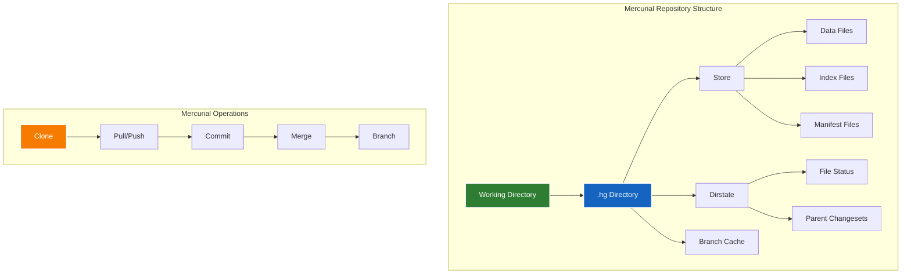
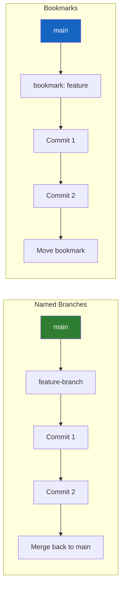

# 🐍 Mercurial - High-Performance Distributed Version Control


Mercurial (Hg) is a distributed version control system designed for high performance and scalability. While Git dominates the market, Mercurial excels in handling large repositories and complex branching scenarios, making it valuable for enterprise environments with massive codebases.

---

## 🎯 Learning Objectives

By completing this module, you will master:
- Mercurial fundamentals and architecture
- Advanced branching and merging strategies
- Large repository management techniques
- Migration strategies between Mercurial and Git
- Enterprise deployment and administration
- Performance optimization for massive codebases

---

## 🏗️ Mercurial Architecture Overview



---

## 📂 Module Structure

### 🚀 01-Mercurial-Fundamentals
**Core Concepts and Setup**
- Mercurial installation and configuration
- Repository initialization and basic operations
- Understanding changesets and revisions
- Working directory and repository states
- Basic branching and merging

### 🌿 02-Advanced-Branching
**Complex Workflow Management**
- Named branches vs bookmarks
- Branch management strategies
- Advanced merging techniques
- Conflict resolution
- Grafting and transplanting

### 📈 03-Performance-Optimization
**Large Repository Management**
- Repository optimization techniques
- Narrow clone and sparse checkouts
- Bundle repositories
- Performance tuning
- Memory and disk optimization

### 🔄 04-Migration-Strategies
**Platform Transitions**
- Git to Mercurial migration
- Mercurial to Git migration
- SVN to Mercurial migration
- History preservation techniques
- Tool compatibility

### 🏢 05-Enterprise-Deployment
**Large-Scale Management**
- Mercurial server setup
- Access control and permissions
- Backup and disaster recovery
- Monitoring and maintenance
- Integration with CI/CD systems

### 🛠️06-Tools-Extensions
**Ecosystem and Integrations**
- Essential Mercurial extensions
- GUI tools and IDEs
- Web interfaces (hgweb)
- Third-party integrations
- Custom extensions development

---

## 🚀 Mercurial Fundamentals

### 📋 Basic Commands Comparison

| Operation | Mercurial | Git Equivalent |
|-----------|-----------|----------------|
| **Initialize** | `hg init` | `git init` |
| **Clone** | `hg clone URL` | `git clone URL` |
| **Status** | `hg status` | `git status` |
| **Add** | `hg add file` | `git add file` |
| **Commit** | `hg commit -m "msg"` | `git commit -m "msg"` |
| **Push** | `hg push` | `git push` |
| **Pull** | `hg pull -u` | `git pull` |
| **Branch** | `hg branch name` | `git checkout -b name` |
| **Merge** | `hg merge` | `git merge` |
| **Log** | `hg log` | `git log` |

### 🔧 Configuration Setup

```ini
# ~/.hgrc (Mercurial configuration file)
[ui]
username = John Doe <john.doe@company.com>
editor = vim
merge = vimdiff

[extensions]
# Essential extensions
color =
pager =
progress =
rebase =
shelve =
strip =

# Advanced extensions
evolve =
topic =
largefiles =

[alias]
# Useful aliases
st = status
ci = commit
co = checkout
br = branch
lg = log --graph --template '{rev}:{node|short} {desc|firstline}\n'

[web]
# Web interface configuration
port = 8000
address = 0.0.0.0
allow_push = *
push_ssl = false

[hooks]
# Pre-commit hooks
precommit.lint = python scripts/lint.py
pretxncommit.test = python scripts/test.py
```

---

## 🌿 Advanced Branching Strategies

### 📊 Named Branches vs Bookmarks



### 🔄 Complex Workflow Example

```bash
#!/bin/bash
# Advanced Mercurial Workflow

# Create feature branch
hg branch feature/user-authentication
hg commit -m "Start user authentication feature"

# Work on feature
echo "auth code" > auth.py
hg add auth.py
hg commit -m "Add authentication module"

# Update from main branch
hg update main
hg pull
hg update

# Merge feature branch
hg merge feature/user-authentication
hg commit -m "Merge user authentication feature"

# Alternative: Rebase workflow
hg update feature/user-authentication
hg rebase -d main
hg update main
hg merge feature/user-authentication
```

---

## 📈 Performance Optimization

### 🚀 Large Repository Techniques

```bash
# Narrow Clone (similar to Git sparse-checkout)
hg clone --narrow ssh://server/repo local-repo \
  --include "src/frontend/" \
  --include "docs/"

# Shallow Clone (limited history)
hg clone --depth 100 ssh://server/repo local-repo

# Bundle Repository for Offline Distribution
hg bundle --all repo-backup.hg
hg unbundle repo-backup.hg

# Repository Optimization
hg debugrebuilddirstate
hg debugrebuildstate
hg verify
```

### ⚡ Performance Configuration

```ini
# .hg/hgrc (Repository-specific configuration)
[format]
# Use more efficient storage format
revlogv1 = True
generaldelta = True
dotencode = True

[server]
# Server optimization
uncompressed = True
bundle1 = False
bundle2 = True

[experimental]
# Experimental performance features
sparse-read = True
sparse-read.density-threshold = 0.25
sparse-read.min-gap-size = 262144

[remotefilelog]
# For large repositories with many files
server = True
serverdatapack = True
serverhistorypack = True
```

---

## 🔄 Migration Strategies

### 📦 Git to Mercurial Migration

```python
#!/usr/bin/env python3
"""
Git to Mercurial Migration Tool
Converts Git repositories to Mercurial with history preservation
"""

import subprocess
import os
import sys
from pathlib import Path

class GitToHgMigrator:
    def __init__(self, git_repo_path, hg_repo_path):
        self.git_repo = Path(git_repo_path)
        self.hg_repo = Path(hg_repo_path)
    
    def migrate(self):
        """Perform the migration"""
        try:
            # Step 1: Clone Git repository
            print("Cloning Git repository...")
            subprocess.run(['git', 'clone', '--bare', str(self.git_repo), 'temp-git'], check=True)
            
            # Step 2: Convert using hg-git extension
            print("Converting to Mercurial...")
            os.chdir('temp-git')
            subprocess.run(['hg', 'init', str(self.hg_repo)], check=True)
            
            # Step 3: Import Git history
            subprocess.run(['hg', 'gimport'], check=True)
            
            # Step 4: Push to new Mercurial repository
            subprocess.run(['hg', 'push', str(self.hg_repo)], check=True)
            
            print("Migration completed successfully!")
            
        except subprocess.CalledProcessError as e:
            print(f"Migration failed: {e}")
            sys.exit(1)
        
        finally:
            # Cleanup
            os.chdir('..')
            subprocess.run(['rm', '-rf', 'temp-git'], check=True)

# Usage
if __name__ == "__main__":
    migrator = GitToHgMigrator(
        git_repo_path="https://github.com/user/repo.git",
        hg_repo_path="/path/to/new/hg/repo"
    )
    migrator.migrate()
```

### 🔧 Mercurial to Git Migration

```bash
#!/bin/bash
# Mercurial to Git Migration Script using fast-export

HG_REPO="$1"
GIT_REPO="$2"

if [ -z "$HG_REPO" ] || [ -z "$GIT_REPO" ]; then
    echo "Usage: $0 <hg-repo-path> <git-repo-path>"
    exit 1
fi

# Clone the Mercurial repository
hg clone "$HG_REPO" temp-hg-repo
cd temp-hg-repo

# Initialize Git repository
git init "$GIT_REPO"
cd "$GIT_REPO"

# Import Mercurial history using hg-fast-export
git config core.ignoreCase false
../hg-fast-export/hg-fast-export.sh -r ../temp-hg-repo

# Clean up
cd ..
rm -rf temp-hg-repo

echo "Migration from Mercurial to Git completed!"
echo "Git repository created at: $GIT_REPO"
```

---

## 🏢 Enterprise Deployment

### 🌐 Mercurial Server Setup

```python
#!/usr/bin/env python3
"""
Mercurial Server Configuration
Enterprise-grade Mercurial server setup
"""

import configparser
import os
from pathlib import Path

class MercurialServer:
    def __init__(self, server_root="/var/hg"):
        self.server_root = Path(server_root)
        self.config_file = self.server_root / "hgweb.config"
    
    def setup_server(self):
        """Set up Mercurial server configuration"""
        
        # Create server directory structure
        self.server_root.mkdir(exist_ok=True)
        (self.server_root / "repos").mkdir(exist_ok=True)
        (self.server_root / "logs").mkdir(exist_ok=True)
        
        # Create hgweb configuration
        config = configparser.ConfigParser()
        
        # Web interface settings
        config['web'] = {
            'port': '8080',
            'address': '0.0.0.0',
            'allow_push': '*',
            'allow_read': '*',
            'push_ssl': 'false',
            'style': 'paper',
            'contact': 'admin@company.com',
            'description': 'Company Mercurial Server',
            'encoding': 'UTF-8',
            'errorlog': str(self.server_root / "logs" / "error.log"),
            'accesslog': str(self.server_root / "logs" / "access.log")
        }
        
        # Repository collections
        config['collections'] = {
            str(self.server_root / "repos"): str(self.server_root / "repos")
        }
        
        # Authentication
        config['auth'] = {
            'default.prefix': '*',
            'default.username': 'admin',
            'default.password': 'secure_password'
        }
        
        # Write configuration
        with open(self.config_file, 'w') as f:
            config.write(f)
        
        print(f"Mercurial server configured at {self.server_root}")
    
    def create_repository(self, repo_name):
        """Create a new repository"""
        repo_path = self.server_root / "repos" / repo_name
        repo_path.mkdir(exist_ok=True)
        
        os.chdir(repo_path)
        os.system("hg init")
        
        print(f"Repository '{repo_name}' created at {repo_path}")

# Usage
if __name__ == "__main__":
    server = MercurialServer()
    server.setup_server()
    server.create_repository("project1")
    server.create_repository("project2")
```

### 🔐 Access Control Configuration

```ini
# hgacl.conf - Access Control Configuration
[groups]
developers = alice, bob, charlie
managers = david, eve
admins = frank, grace

[repositories]
# Project repositories
project1/* = @developers:rw, @managers:rw, @admins:rw
project2/* = @developers:r, @managers:rw, @admins:rw
internal/* = @admins:rw

# Branch-specific permissions
project1/main = @managers:rw, @admins:rw
project1/develop = @developers:rw, @managers:rw, @admins:rw

[hooks]
# Enforce access control
pretxnchangegroup.acl = python:hgext.acl.hook
```

---

## 🛠️ Tools and Extensions

### 📊 Essential Extensions

```ini
# Essential Mercurial Extensions Configuration
[extensions]
# Core extensions
color =           # Colorized output
pager =           # Paged output
progress =        # Progress bars
rebase =          # Rebase commits
shelve =          # Temporarily save changes
strip =           # Remove changesets

# Advanced workflow
evolve =          # Changeset evolution
topic =           # Topic branches
histedit =        # Interactive history editing
absorb =          # Automatically absorb changes

# Large repositories
largefiles =      # Handle large binary files
lfs =             # Git LFS compatibility
narrow =          # Narrow/sparse checkouts

# Integration
hgk =             # Graphical history viewer
transplant =      # Cherry-pick commits
mq =              # Mercurial Queues (patch management)

# Development
blackbox =        # Debug logging
fsmonitor =       # File system monitoring
```

### 🖥️ GUI Tools Integration

```python
#!/usr/bin/env python3
"""
Mercurial GUI Tools Launcher
Provides easy access to various Mercurial GUI tools
"""

import subprocess
import sys
import os

class HgGUILauncher:
    def __init__(self):
        self.tools = {
            'tortoisehg': 'thg',
            'hgk': 'hg view',
            'qct': 'qct',
            'hg-review': 'hg-review'
        }
    
    def launch_tool(self, tool_name):
        """Launch specified GUI tool"""
        if tool_name not in self.tools:
            print(f"Unknown tool: {tool_name}")
            print(f"Available tools: {list(self.tools.keys())}")
            return False
        
        try:
            subprocess.Popen(self.tools[tool_name].split())
            print(f"Launched {tool_name}")
            return True
        except FileNotFoundError:
            print(f"Tool {tool_name} not found. Please install it first.")
            return False
    
    def list_tools(self):
        """List available GUI tools"""
        print("Available Mercurial GUI tools:")
        for tool, command in self.tools.items():
            print(f"  {tool}: {command}")

# Usage
if __name__ == "__main__":
    launcher = HgGUILauncher()
    
    if len(sys.argv) > 1:
        launcher.launch_tool(sys.argv[1])
    else:
        launcher.list_tools()
```

---

## 🧪 Hands-On Labs

### Lab 1: Mercurial Fundamentals
**Objective**: Master basic Mercurial operations and workflows
**Duration**: 45 minutes
**Skills**: Repository setup, branching, merging, conflict resolution

### Lab 2: Large Repository Management
**Objective**: Optimize Mercurial for large codebases
**Duration**: 90 minutes
**Skills**: Performance tuning, narrow clones, bundle repositories

### Lab 3: Migration Project
**Objective**: Migrate repository between Mercurial and Git
**Duration**: 120 minutes
**Skills**: Migration tools, history preservation, team coordination

### Lab 4: Enterprise Server Setup
**Objective**: Deploy enterprise Mercurial server with access control
**Duration**: 150 minutes
**Skills**: Server configuration, security, monitoring, backup

---

## 📋 Interview Questions & Quiz (20+ Questions)

### 🎯 Technical Questions

1. **What is the main difference between Mercurial and Git architecture?**
   - A) Mercurial uses centralized model, Git uses distributed
   - B) Mercurial stores complete snapshots, Git stores deltas
   - C) Mercurial uses revision numbers, Git uses SHA hashes
   - D) No significant architectural differences

2. **Which Mercurial command is equivalent to `git rebase`?**
   - A) `hg rebase`
   - B) `hg transplant`
   - C) `hg graft`
   - D) All of the above

3. **What is the purpose of Mercurial bookmarks?**
   - A) Save repository state
   - B) Lightweight branch references
   - C) Mark important commits
   - D) Create repository backups

### 🏢 Enterprise Scenarios

4. **Your organization has a 50GB repository with 100,000+ files. How would you optimize Mercurial performance?**

5. **Design a branching strategy for a team using Mercurial with strict release cycles.**

6. **How would you migrate a large SVN repository to Mercurial while preserving branch history?**

---

## 🎯 Real-Life Scenarios

### Scenario 1: Facebook's Mercurial Usage
**Context**: Facebook used Mercurial for their massive monorepo
**Challenge**: Handle millions of files and thousands of developers
**Solution**: Custom extensions, performance optimizations, and tooling

### Scenario 2: Mozilla's Migration
**Context**: Mozilla migrated from Mercurial to Git
**Challenge**: Preserve 15+ years of Firefox development history
**Solution**: Careful migration planning with community involvement

### Scenario 3: Enterprise Legacy System
**Context**: Large enterprise with existing Mercurial infrastructure
**Challenge**: Modernize while maintaining compatibility
**Solution**: Hybrid approach with gradual Git adoption

---

## 📊 Mercurial vs Git Comparison

| Aspect | Mercurial | Git |
|--------|-----------|-----|
| **Learning Curve** | Easier | Steeper |
| **Performance** | Better for large repos | Better for small-medium repos |
| **Branching** | Simpler model | More flexible |
| **Ecosystem** | Smaller | Massive |
| **Enterprise Support** | Good | Excellent |
| **Market Share** | ~3% | ~87% |

---

## 📚 Additional Resources

### 📖 Official Documentation
- [Mercurial Documentation](https://www.mercurial-scm.org/doc/)
- [Mercurial Book](https://book.mercurial-scm.org/)
- [Mercurial Wiki](https://www.mercurial-scm.org/wiki/)

### 🎥 Video Resources
- [Mercurial Tutorial](https://www.youtube.com/watch?v=U-JvjaCy0co)
- [Advanced Mercurial Workflows](https://www.youtube.com/watch?v=2NPinHwAD8s)

### 🛠️ Tools
- [TortoiseHg](https://tortoisehg.bitbucket.io/) - Windows GUI client
- [Mercurial Eclipse Plugin](https://www.mercurial-scm.org/wiki/MercurialEclipse)
- [hg-git](https://hg-git.github.io/) - Git interoperability

---

## ✅ Completion Checklist

- [ ] Install and configure Mercurial
- [ ] Master basic and advanced commands
- [ ] Implement branching strategies
- [ ] Optimize repository performance
- [ ] Complete migration exercises
- [ ] Set up enterprise server
- [ ] Configure access control and security
- [ ] Pass the comprehensive quiz (80%+ score)

---

**"Mercurial may not be the most popular, but it excels where performance and simplicity matter most."**

*Master Mercurial to handle the most demanding version control scenarios.*