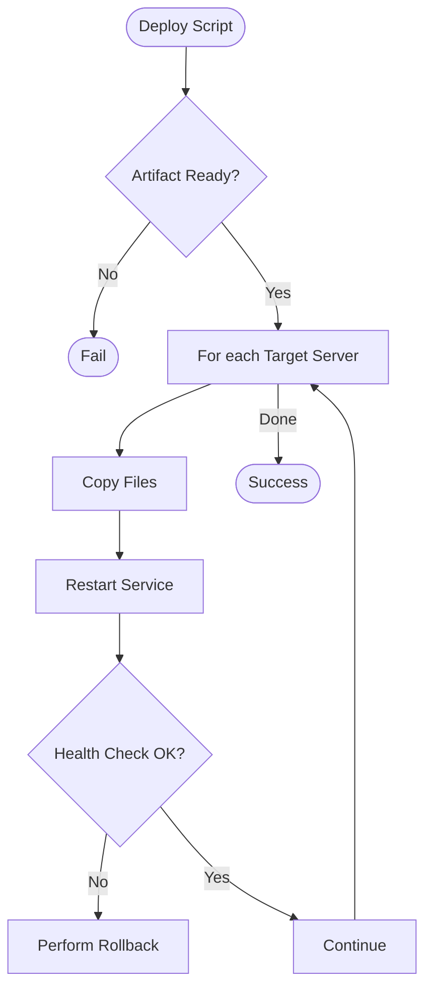

# Logic and Flow Control

Logic allows your scripts to make decisions and repeat tasks. In DevOps, this is used for everything from checking system health to rolling out deployments across multiple servers.

## 🚦 Conditionals (If/Else)

### The `if` Statement
The syntax uses `[` (which is actually a command called `test`) to evaluate expressions.

```bash
# Check if a file exists
if [ -f "/etc/nginx/nginx.conf" ]; then
    echo "Nginx config found."
else
    echo "Nginx not installed?"
fi
```

### Common Test Operators
-   **File Operators**: `-f` (file), `-d` (directory), `-s` (not empty).
-   **String Operators**: `-z` (empty string), `-n` (not empty), `==` (equals).
-   **Integer Operators**: `-eq` (equal), `-ne` (not equal), `-gt` (greater than), `-lt` (less than).

> [!TIP]
> Use `[[ ... ]]` (extended test) in Bash for more powerful features like regex matching and easier logical operators (`&&` and `||`).

## 🔄 Loops (For and While)

### For Loops
Best for iterating over a predefined list of items.

```bash
# Iterating over servers
for SERVER in app01 app02 app03; do
    echo "Updating $SERVER..."
    ssh "$SERVER" "yum update -y"
done
```

### While Loops
Best for repeating a task until a condition is met (e.g., waiting for a service to start).

```bash
# Wait for database to be ready
while ! nc -z localhost 3306; do
  echo "Waiting for DB..."
  sleep 2
done
echo "DB is UP!"
```

## 📊 Deployment Logic Flow



---

## 📖 Stories from the Field: The "Infinite" Loop

**Scenario**: A script was designed to monitor a log file and alert if it saw "FATAL". It used a `while true` loop.
**Problem**: The script worked fine, but one day the log file was deleted during rotation. The `tail` command inside the loop failed, but the loop kept spinning at 100% CPU because it had no internal checks for the file's existence.
**Discovery**: `top` showed the script consuming an entire core.
**Resolution**: Added an `if [ ! -f "$LOG" ]` check inside the loop to wait or exit gracefully if the file vanishes.
**Prevention**: Always ensure your `while` loops have a "Safe Exit" or a `sleep` interval to prevent CPU starvation.

---

## ❓ Interview Questions

1.  **What is the difference between `[` and `[[`?**
    *   *Answer*: `[` is the old POSIX standard tool (`test`). `[[` is a Bash keyword that is safer (no word splitting on variables), supports regex (`=~`), and allows `&&`/`||` instead of `-a`/`-o`.
2.  **How do you exit a loop prematurely?**
    *   *Answer*: Use the `break` command.
3.  **What is the `case` statement used for?**
    *   *Answer*: It's a cleaner alternative to multiple `if/elif` blocks when checking a variable against many patterns (often used in service init scripts).
4.  **How do you iterate through all files in a directory?**
    *   *Answer*: `for FILE in /path/to/dir/*; do ... done`.
5.  **What does `! command` do in a condition?**
    *   *Answer*: It negates the result. If the command succeeds (exit 0), the condition is false.

---

## 🧠 Quiz

1.  **Which operator checks if a directory exists?** `(-d)`
2.  **Which loop is best for strictly counting or iterating over a list?** `(for)`
3.  **How do you check if string A is NOT equal to string B?** `([ "$A" != "$B" ])`
4.  **True/False: Spaces are required inside the brackets `[ ... ]`.** `(True - [ is a command and ] is its last argument)`
5.  **What operator checks if a string is empty?** `(-z)`
