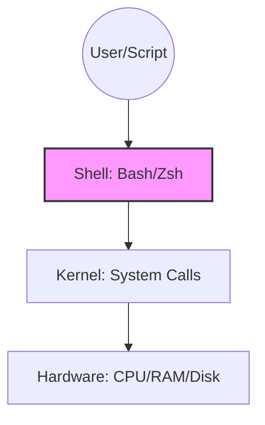
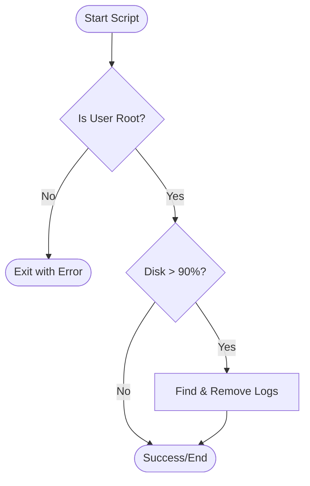

The shell is the native language of the server. Mastering it allows you to manipulate files, manage processes, and glue different tools together into a coherent automation pipeline.

---
## 🏛️ The OS Hierarchy
To understand Shell Scripting, you must understand where the Shell sits in relation to the hardware and the user.


---
## 🏗️ Core Concepts

### 1. Variables and Data
In Bash, variables are defined without spaces: `NAME="DevOps"`.
- **Local Variables**: `VARIABLE="value"`
- **Environment Variables**: `export PATH=$PATH:/custom/bin`
- **Accessing**: Always use quotes to prevent word splitting: `echo "$NAME"`.

### 2. Standard Streams & Redirection
Bash manages three primary data streams:
- `stdin` (0): Keyboard or file input.
- `stdout` (1): Standard output (normal messages).
- `stderr` (2): Error output.

| Action | Command |
| :--- | :--- |
| **Overwrite Output** | `ls > files.txt` |
| **Append Output** | `echo "log" >> app.log` |
| **Redirect Errors** | `command 2> error.log` |
| **Combine Both** | `command > output.log 2>&1` |

---
## 🛠️ Logic & Flow Control

### 📊 Automation Flowchart



### 3. Conditionals (if/else)
Useful for making decisions based on file existence or command status codes.
```bash
if [ -f "/etc/passwd" ]; then
    echo "System file found."
else
    echo "Warning: File missing!"
fi
```
### 4. Loops (for/while)
Iterate over lists of files, servers, or results from other commands.
```bash
# Loop through a list
for SERVER in web01 web02 web03; do
    ssh "$SERVER" "uptime"
done
```

---
## 💡 Best Practices

- **Shebang**: Always start with `#!/bin/bash` or `#!/usr/bin/env bash`.
- **Fail Fast**: Use `set -euo pipefail` at the top of your scripts.
    - `-e`: Exit immediately on failure.
    - `-u`: Error on undefined variables.
    - `-o pipefail`: Catch failures inside pipes (e.g., `false | true`).
- **Comments**: Describe "Why" you are doing something, not just "What".

---

## ❓ Interview Preparation

### Top 5 Interview Questions
1. **What is the difference between `"$@"` and `"$*"`?** (`$@` preserves arguments as separate strings, `$*` joins them).
2. **What does the shebang line do?** (Tells the OS which interpreter to use to run the file).
3. **How do you capture the output of a command into a variable?** (`VAR=$(ls)`).
4. **What does `set -e` do?** (Ensures the script stops if any individual command fails).
5. **How do you check the exit status of the previous command?** (Check the variable `$?`).

---

## 📝 Practice Quiz
1. **Which code indicates a successful command execution?**
   - [x] 1
   - [ ] 127
   - [ ] 0
   - [ ] -1

2. **How do you redirect standard error to a file?**
   - [ ] `> file`
   - [ ] `1> file`
   - [x] `2> file`
   - [ ] `&> file`

3. **What is the purpose of double quotes around variables?**
   - [ ] To make them faster
   - [x] To prevent word splitting and globbing
   - [ ] To convert them to integers
   - [ ] To hide them from other users

---

## 🏢 Real-Life Scenario: Automated Log Cleanup

**Requirement**: A web server is running out of disk space due to cumulative logs. You need a script that runs every night to delete logs older than 30 days.

**Solution**:
```bash
#!/bin/bash
# set -e to stop if find fails
set -e

LOG_DIR="/var/log/nginx"
DAYS=30

echo "Starting cleanup in $LOG_DIR..."

# Check if directory exists
if [ -d "$LOG_DIR" ]; then
    find "$LOG_DIR" -type f -name "*.log" -mtime +$DAYS -delete
    echo "Cleanup complete."
else
    echo "Error: Directory not found."
    exit 1
fi
```

