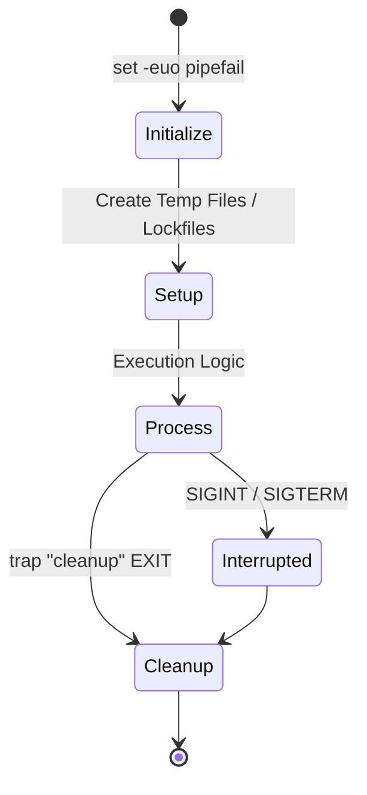

# Robust Execution and Traps

Production-grade scripts must handle errors silently, clean up after themselves, and prevent parallel execution of critical tasks.

## 🚀 The Resilient Script Lifecycle

Advanced automation handles unexpected interruptions and system signals to maintain system integrity.



## 🛠️ The "Strict Mode" Settings

Fail-fast behavior is essential to stop a script before it does damage with undefined variables or failed pipe segments.

```bash
#!/bin/bash
set -euo pipefail
```

- **`-e` (errexit)**: Stol immediately on any non-zero exit code.
- **`-u` (nounset)**: Exit if any variable is called before it is defined.
- **`-o pipefail`**: Ensures that the exit code of a pipeline is the value of the last command to exit with a non-zero status.

## 🪤 Signal Management (Traps)

The `trap` command ensures that a cleanup function runs regardless of how the script ends.

```bash
# Define a cleanup function
cleanup() {
    local status=$?
    echo "[$(date +'%Y-%m-%d %H:%M:%S')] Cleaning up..."
    [[ -f "$LOCKFILE" ]] && rm -f "$LOCKFILE"
    exit $status
}

# Attach function to EXIT and common interruption signals
trap cleanup EXIT SIGINT SIGTERM
```

> [!TIP]
> Use `trap - EXIT` to clear a trap once it is no longer needed (e.g., at the very end of a successful script if you want different terminal behavior).

## 🔒 Atomicity and Lockfiles

To prevent two instances of a script from running simultaneously (which could corrupt data or lead to race conditions), use a lockfile.

```bash
LOCKFILE="/tmp/service_deploy.lock"

# Check if lock exists or use flock for atomic locking
if ! mkdir "$LOCKFILE" 2>/dev/null; then
    echo "Error: Another deployment is already in progress." >&2
    exit 1
fi
```

---

## 📖 Stories from the Field: The Memory Hog

**Scenario**: A nightly backup script was using a temporary directory to compress 500GB of logs.
**Problem**: The script was killed by the OOM (Out of Memory) killer or interrupted by a sysadmin.
**Outcome**: Because no `trap` was used, the temporary directory (filled with 500GB of data) remained on the disk. After 3 nights, the disk was 100% full, crashing the production database.
**Resolution**: Added a `trap` to remove the temporary directory on `EXIT`.
**Prevention**: Never create temporary files without a corresponding `trap` cleanup.

---

## ❓ Interview Questions

1. **What is the difference between `trap "cmd" EXIT` and `trap "cmd" ERR`?**
   * *Answer*: `EXIT` triggers whenever the script finishes (success or failure). `ERR` only triggers when a command fails (non-zero exit).
2. **How do you handle a command that is EXPECTED to fail occasionally within `set -e`?**
   * *Answer*: Append `|| true` to the command, or wrap it in an `if` block. `[ -f missing_file ] || true`.
3. **What is `flock` and why is it better than `mkdir` for locking?**
   * *Answer*: `flock` is an external tool that manages file locks at the kernel level. It handles "stale locks" automatically if the process crashes, as the kernel releases the lock when the file descriptor closes.
4. **When would you NOT use `set -e`?**
   * *Answer*: In interactive shell sessions where you want to keep working after a failure, or in complex scripts where you have manual error handling logic that is more sophisticated than a simple exit.
5. **How do you pass the script's exit code through a trap function?**
   * *Answer*: Capture it using `local status=$?` at the very start of the trap function and then `exit $status`.

---

## 🧠 Quiz

1. **Which flag ensures a script fails if a variable is used but not defined?** `(-u)`
2. **What signal is sent by the `kill <pid>` command by default?** `(SIGTERM - 15)`
3. **True/False: A trap on EXIT will run even if the script finishes successfully.** `(True)`
4. **What is the result of `false | true` if `pipefail` is enabled?** `(Failure - Returns non-zero)`
5. **Which command is used to catch and handle system signals?** `(trap)`
