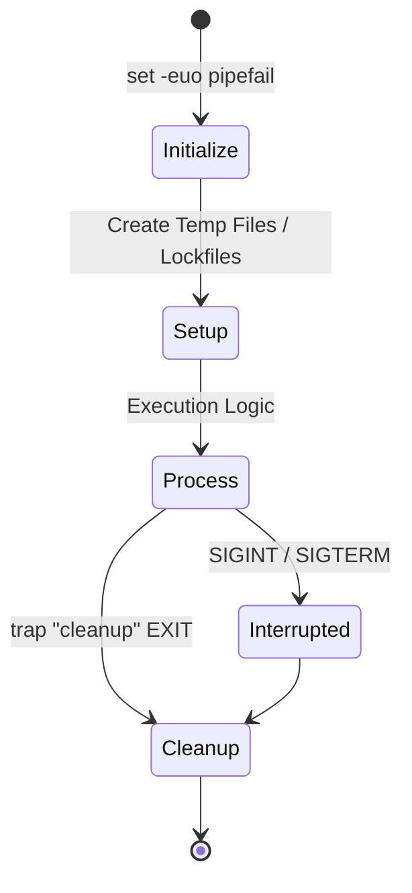
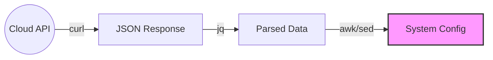

## Production-Grade Reliability
Move beyond "one-liners" to resilient, production-grade automation scripts that handle errors gracefully, parse complex data, and scale across infrastructure.

---
## 🏗️ The Resilient Script Lifecycle
Advanced automation isn't just about what the script does, but how it handles unexpected interruptions and system signals.



---

## 🧠 Advanced Techniques

### 1. Robust Error Handling (Signal Traps)
The `trap` command allows you to execute a cleanup function regardless of how a script ends (success, error, or manual interruption).
```bash
# Define a cleanup function
cleanup() {
    echo "Cleaning up temporary files..."
    rm -f /tmp/app_temp_*
}

# Attach function to EXIT and INTERRUPT signals
trap cleanup EXIT INT TERM
```
### 2. Standard CLI Patterns (`getopts`)
Don't rely on positional parameters (`$1`, `$2`) for complex scripts. Use `getopts` to create professional flag-based interfaces.
```bash
while getopts "e:d" opt; do
  case $opt in
    e) ENV="$OPTARG" ;;
    d) DRY_RUN=true ;;
    *) echo "Usage: $0 [-e environment] [-d]" ; exit 1 ;;
  esac
done
```

---
## 📊 Data Processing Pipelines
DevOps engineers bridge the gap between APIs and system configuration.



### 3. Deep Integration with `jq`
`jq` is the standard for parsing JSON in the shell.
```bash
# Extract complex nested data and handle nulls
INSTANCE_ID=$(curl -s "$EC2_METADATA" | jq -r '.instance_id // "local-test"')
```

### 4. SSH Multiplexing & Scale
For large fleets, use SSH connection sharing and timeouts.
```bash
# ~/.ssh/config: ControlMaster auto, ControlPath /tmp/ssh-%r@%h:%p
cat hosts.txt | xargs -P 5 -I {} ssh -o ConnectTimeout=2 {} "uname -a"
```

---

## ❓ Interview Preparation

### Top 5 Advanced Interview Questions
1. **What is Process Substitution `<(command)` and how does it differ from a pipe?** (It creates a temporary file-like descriptor, allowing commands that don't support pipes to read output).
2. **How do you handle secrets (passwords/keys) in a Bash script?** (Env variables, HashiCorp Vault, or encrypted files; NEVER hardcoded).
3. **What is the difference between `trap`ing EXIT and `trap`ing a specific signal?** (EXIT covers all ways out, including success; specific signals only cover the interruption).
4. **Explain the functionality of `2>&1`.** (Redirects file descriptor 2/stderr to the same location as 1/stdout).
5. **How do you perform floating-point arithmetic in Bash?** (Bash only handles integers natively; you must use `bc` or `awk`).

---

## 📝 Practice Quiz

1. **Which command is used to catch a CTRL+C signal?**
   - [ ] catch
   - [ ] listen
   - [x] trap
   - [ ] handle

2. **In `jq -r`, what does the `-r` flag do?**
   - [ ] Recursive search
   - [ ] Read-only mode
   - [x] Output raw strings (removing quotes)
   - [ ] Remote fetch

3. **What is the benefit of `set -o pipefail`?**
   - [ ] Makes the pipe faster
   - [ ] Compresses output
   - [x] Returns the exit code of the last command in a pipe that failed
   - [ ] Ignores all errors in a pipe

---

## � Real-Life Scenario: Multi-Region Backup Validator

**Requirement**: You have backups stored in multiple S3 buckets across regions. You need to verify their status via API and generate a report.

**Solution**:
```bash
#!/bin/bash
set -euo pipefail

REGIONS=("us-east-1" "eu-west-1" "ap-south-1")

check_backups() {
    local region=$1
    echo "Checking backups in $region..."
    
    # Use jq to filter for specific tags and status
    aws s3api list-objects --region "$region" --bucket "backup-$region" | \
    jq -r '.Contents[] | select(.LastModified | contains("2025")) | .Key'
}

for R in "${REGIONS[@]}"; do
    check_backups "$R" || echo "Failed to fetch $R"
done
```
This script uses arrays, functions, `set` flags, and `jq` to create a production-ready audit tool.

