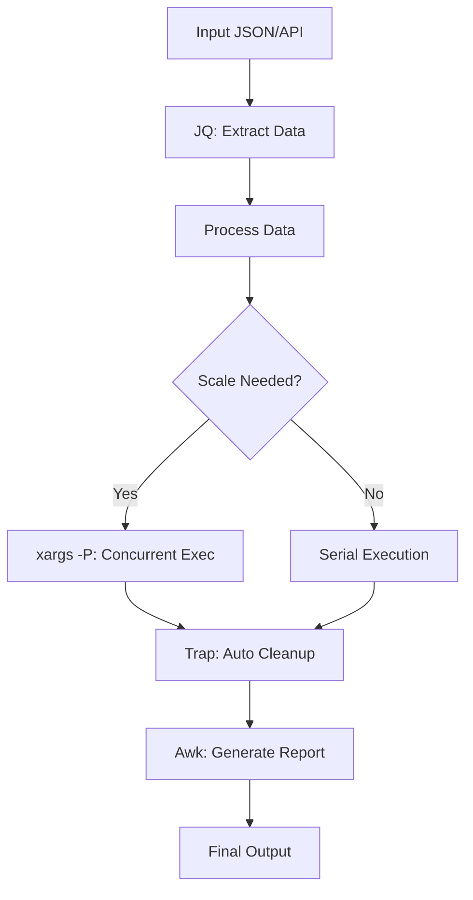

# Advanced Bash Automation

Move beyond "one-liners" to resilient, production-grade automation scripts that handle errors gracefully, parse complex data, and scale across infrastructure.

## 📚 Learning Path

| # | Topic | Description | Key Tools |
| :--- | :--- | :--- | :--- |
| **01** | [**Robust Execution**](./01-Robust-Execution-and-Traps/README.md) | Defensive Programming | set -euo pipefail, Traps, Lockfiles |
| **02** | [**Argument Parsing**](./02-Advanced-Argument-Parsing-Getopts/README.md) | CLI Interfaces | getopts, long-flags, usage menus |
| **03** | [**JSON with JQ**](./03-JSON-Processing-with-JQ/README.md) | API Integration | Filtering, Selecting, Mapping |
| **04** | [**Sed and Awk**](./04-Data-Wrangling-with-Sed-and-Awk/README.md) | Text Powerhouses | Stream editing, Column processing |
| **05** | [**Parallelism**](./05-Scaling-Bash-Multiplexing-Parallelism/README.md) | Fleet Scaling | xargs -P, GNU Parallel, Backgrounding |

---

## 🏗️ Advanced Workflow Diagram

---

## 🏗️ Real-Life Scenarios

### Scenario 1: The "API Response" Chaos
**Problem**: A cloud-native startup needed to rotate credentials for 500 IAM users. The API returned a massive 10MB JSON file containing all user metadata.
**Crisis**: Using basic `grep` and `sed` to find user IDs was slow and prone to errors (e.g., matching substrings incorrectly).
**Outcome**: The rotation script took 2 hours to run and accidentally skipped users with names containing special characters.
**Solution**: Switched to **jq**. Using `jq -r '.Users[] | .UserId'`, the script extracted precise IDs in milliseconds, regardless of nesting or special characters.
**Result**: The rotation time dropped from 2 hours to 5 minutes with 100% accuracy.

### Scenario 2: The "Overlapping Cron" Race Condition
**Problem**: A database synchronization script was scheduled to run every 10 minutes.
**Crisis**: One day, the database was particularly slow, and the first script took 15 minutes. The second script started while the first was still running.
**Outcome**: Both scripts fought for the same data files, leading to database corruption and a 6-hour production outage.
**Solution**: Implement an **Atomic Lockfile**. Use `flock` or a simple `mkdir` check at the start of the script. If the lock exists, the script exits immediately with a message: "Already running."
**Result**: Synchronization became "Race-Condition-Proof," and the team added monitoring for "Long-running locks."

### Scenario 3: The "Log Rotation" Disk Full Outage
**Problem**: A legacy application generated 50GB of logs per day. A simple cron job ran `rm -f *.log` at midnight.
**Crisis**: The `rm` command failed one night because the argument list was too long (too many files). The disk hit 100% capacity, crashing the app.
**Outcome**: The application's main database stopped accepting writes because the disk was full.
**Solution**: Use **Advanced xargs and find**. Instead of `rm *.log`, the team used `find . -name "*.log" -print0 | xargs -0 -P 4 rm`. This handled millions of files efficiently using 4 concurrent processes.
**Result**: Log rotation became indestructible and significantly faster, preventing disk-full outages forever.

---

## ❓ Interview Questions

1.  **Explain the significance of 'set -o pipefail' in a production script.**
    - *Answer*: By default, a pipe return code is the exit code of the *last* command in the pipeline (e.g., in `fail_cmd | success_cmd`, the status is 0). `set -o pipefail` ensures the entire pipeline fails if *any* command within it fails, preventing silent failures in data processing.
2.  **How does 'jq' differ from traditional text tools like 'grep' or 'sed' for JSON?**
    - *Answer*: `grep` and `sed` are line-based and treat JSON as flat text, making them fragile when JSON structure changes (e.g., whitespace or field order). `jq` is JSON-aware; it understands objects, arrays, and types, allowing for robust queries based on logic rather than text patterns.
3.  **What is the 'Fail-Fast' philosophy and how do you implement it in Bash?**
    - *Answer*: Fail-Fast means the script should stop immediately upon encountering an error to prevent further damage. It is implemented using `set -e` (Exit on error), `set -u` (Exit on unset variable), and `set -o pipefail`.
4.  **When would you use 'awk' instead of 'sed'?**
    - *Answer*: Use **sed** for simple string replacements or modifications across a stream. Use **awk** when you need to process data in columns/fields (like CSVs or log files) or when you need programming logic like loops and math within the text processor.
5.  **How do you handle 'long-running background tasks' to ensure they don't become zombies?**
    - *Answer*: Use the `wait` command to wait for background PIDs to finish, or use a `trap` on the `EXIT` signal to kill any remaining child processes using `kill $(jobs -p)` when the parent script terminates.
6.  **Explain the importance of 'flock' in high-frequency automation.**
    - *Answer*: `flock` (File Lock) provides a kernel-level lock on a file. It is the most reliable way to prevent multiple instances of a script from running concurrently (concurrency gate). If one copy is running, the others will either wait or exit based on the configuration.

---

## 🧠 Comprehensive Quiz (25 Questions)

<b>1. Which command provides a robust 'Strict Mode' for Bash?</b>

Show Answer

Answer: B

<b>2. True/False: 'jq' can convert JSON data into CSV format.</b>

Show Answer

Answer: A

<b>3. Which tool is best for extracting the 3rd column from a space-delimited text file?</b>

Show Answer

Answer: B

<b>4. 'set -e' will cause a script to exit if:</b>

Show Answer

Answer: B

<b>5. How do you run 4 tasks in parallel using xargs?</b>

Show Answer

Answer: B

<b>6. 'trap "cleanup" EXIT' will run the cleanup function when:</b>

Show Answer

Answer: B

<b>7. True/False: 'getopts' only supports single-character flags (e.g., -a).</b>

Show Answer

Answer: A

<b>8. Which jq filter returns the length of an array?</b>

Show Answer

Answer: B

<b>9. 'sed -i' stands for:</b>

Show Answer

Answer: B

<b>10. What is the exit code of 'grep' if it does NOT find a match?</b>

Show Answer

Answer: B

<b>11. Which tool allows for 'Atomic File Locking'?</b>

Show Answer

Answer: B

<b>12. 'awk' uses which variable to represent the entire line?</b>

Show Answer

Answer: B

<b>13. How do you make a Bash script 'Indempotent'?</b>

Show Answer

Answer: B

<b>14. True/False: JQ filters can be chained using the pipe '|' symbol.</b>

Show Answer

Answer: A

<b>15. Which command is used to remove a lockfile even if the script crashes?</b>

Show Answer

Answer: B

<b>16. What does 'OPTARG' contain in a getopts loop?</b>

Show Answer

Answer: B

<b>17. 'GNU Parallel' is often more powerful than xargs because it:</b>

Show Answer

Answer: B

<b>18. Which sed command deletes the first line of a file?</b>

Show Answer

Answer: A

<b>19. In awk, 'NR' represents:</b>

Show Answer

Answer: A

<b>20. True/False: You can use regex inside a JQ select statement.</b>

Show Answer

Answer: A

<b>21. 'SIGINT' (Signal 2) is triggered by which key combination?</b>

Show Answer

Answer: B

<b>22. Which command shows all currently running background jobs in the current shell?</b>

Show Answer

Answer: B

<b>23. 'set -x' is used for:</b>

Show Answer

Answer: B

<b>24. Advanced Bash scripts are often used as an _____ layer for complex tools.</b>

Show Answer

Answer: A

<b>25. If a script doesn't handle errors, it is a _____ liability.</b>

Show Answer

Answer: B

