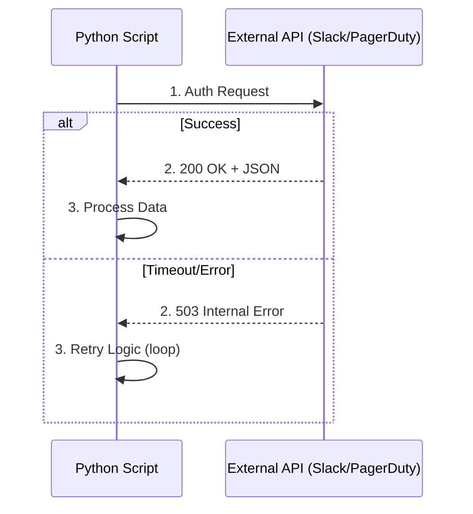

# API Mastery with Requests

Most DevOps automation involves talking to third-party services (Slack, Jira, PagerDuty, GitHub). The `requests` library is the industry standard for making HTTP calls in Python due to its simple, intuitive API.

## 🚀 Making Requests

The `requests` library handles the complexity of HTTP protocols automatically.

```python
import requests

# GET Request
response = requests.get("https://api.github.com/users/octocat")
data = response.json()
print(f"User Name: {data['name']}")

# POST Request (with JSON payload)
payload = {"text": "Deployment Started! 🚀"}
requests.post("https://slack.com/api/chat.postMessage", json=payload)
```

## 🛡️ Robust API Interactions

External services can be slow or intermittent. Your automation must handle these failures gracefully.



### Essential Error Handling
Always check status codes and implement timeouts.

```python
try:
    response = requests.get("https://api.example.com/data", timeout=5)
    
    # Check for HTTP errors (4xx, 5xx)
    response.raise_for_status()
    
except requests.exceptions.HTTPError as err:
    print(f"HTTP Error: {err}")
except requests.exceptions.Timeout:
    print("Error: The request timed out!")
```

## 🔑 Authentication

Most DevOps APIs require authentication, usually via Tokens or Basic Auth.

```python
# Token/Bearer Auth (Common for modern APIs)
headers = {"Authorization": "Bearer MY_SECRET_TOKEN"}
response = requests.get(url, headers=headers)

# Basic Auth (Username/Password)
from requests.auth import HTTPBasicAuth
response = requests.get(url, auth=HTTPBasicAuth('user', 'pass'))
```

---

## 📖 Stories from the Field: The Slack Bomb

**Scenario**: A monitoring script was designed to send a Slack alert whenever a server's CPU hit 95%.
**Problem**: A server's CPU started fluctuating around 95% every second.
**Outcome**: The script sent 3,600 Slack messages in one hour, causing Slack to "Rate Limit" the company's entire workspace.
**Resolution**: The script was refactored to use a "Cooldown" period. It stored the last alert time in a variable and only sent a new message if at least 10 minutes had passed.
**Prevention**: Always implement "Throttling" or "Debouncing" when connecting automation to notification channels.

---

## ❓ Interview Questions

1. **How do you handle a JSON response from an API?**
   * *Answer*: Use the `.json()` method on the response object: `data = response.json()`. This automatically parses the content into a Python Dictionary/List.
2. **What does `response.raise_for_status()` do?**
   * *Answer*: It raises an `HTTPError` exception if the HTTP request returned an unsuccessful status code (4xx or 5xx). This is a best practice for failing fast.
3. **Difference between `params` and `json` arguments in `requests`?**
   * *Answer*: `params` is used for Query Parameters in the URL (`?key=val`). `json` is used for the Request Body (payload) in POST/PUT requests.
4. **How do you set a timeout for an API call?**
   * *Answer*: Pass the `timeout` argument (in seconds) to the request method: `requests.get(url, timeout=5)`.
5. **How do you handle multiple retries if an API is down?**
   * *Answer*: You can use a `while` loop with a counter and `time.sleep()`, or better yet, use the `HTTPAdapter` and `Retry` classes from the `urllib3` library within a `requests.Session`.

---

## 🧠 Quiz

1. **Which library is used to make HTTP requests?** `(requests)`
2. **What is the HTTP status code for a successful request?** `(200)`
3. **How do you send a JSON payload in a POST request?** `(requests.post(url, json=payload))`
4. **True/False: Timeouts are enabled by default in `requests`.** `(False - you must specify them)`
5. **Which method converts a response into a Python dictionary?** `(.json())`
