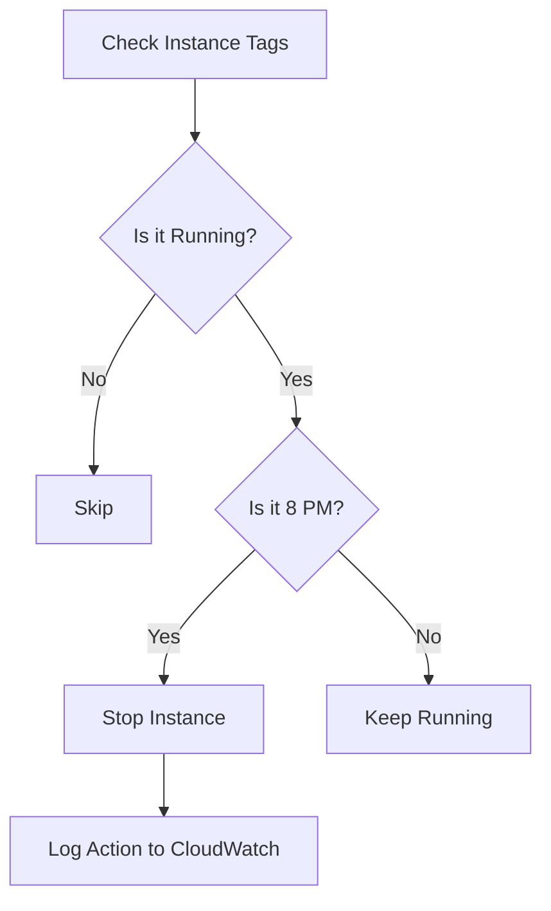

# Cloud Automation: Boto3 Deep Dive

Boto3 is the AWS SDK for Python. It allows you to create, configure, and manage AWS services directly from your Python scripts.

## 🏗️ The Boto3 Patterns: Client vs. Resource

Boto3 provides two different ways to interact with AWS services. Understanding when to use which is the mark of an advanced DevOps engineer.

### 1. The Resource (High-Level)
Resources represent an object-oriented interface to AWS. They cover most common tasks and are easier to read but don't cover 100% of AWS features.

```python
import boto3

# Object-oriented approach
ec2 = boto3.resource('ec2')
for instance in ec2.instances.all():
    print(f"ID: {instance.id} | Type: {instance.instance_type}")
```

### 2. The Client (Low-Level)
Clients provide a 1-to-1 mapping to the underlying AWS Query API. They are more powerful, returning raw dictionaries, and cover every feature AWS offers.

```python
# Direct API approach
client = boto3.client('ec2')
response = client.describe_instances()
# The response is a massive dictionary
instance_id = response['Reservations'][0]['Instances'][0]['InstanceId']
```

## 🔐 Sessions and Authentication

Boto3 automatically looks for credentials in environment variables (`AWS_ACCESS_KEY_ID`, etc.) or your `~/.aws/credentials` file. For complex scripts (multi-account/multi-region), use **Sessions**.

```python
# Multi-Region Session
dev_session = boto3.Session(region_name='us-east-1', profile_name='dev')
s3_dev = dev_session.resource('s3')
```

## 📊 Logic Flow: Instance Lifecycle Manager



---

## 📖 Stories from the Field: The Orphaned Volumes

**Scenario**: A company noticed their monthly AWS bill was creeping up, even though they were deleting unused EC2 instances.
**Problem**: When deleting an EC2 instance via the console, "Delete on termination" is checked by default. However, when using custom scripts or some IaC tools, attached EBS volumes are often left behind as "Available" (but still costing money).
**Discovery**: A Boto3 script was written to find all volumes in the `available` state.
**Outcome**: The script found 2,000 orphaned volumes across 10 regions, totaling $800/month in waste.
**Resolution**: The script was automated to send a report every Friday and delete volumes that had been orphaned for more than 7 days.
**Prevention**: Always include cleanup logic in your resource lifecycle scripts.

---

## ❓ Interview Questions

1. **What is the difference between a Client and a Resource in Boto3?**
   * *Answer*: Resources are higher-level, object-oriented, and return objects you can act on (e.g., `instance.stop()`). Clients are lower-level, service-oriented, return raw dictionaries, and support every AWS API call.
2. **How does Boto3 handle pagination?**
   * *Answer*: Clients often return truncated results for large datasets (e.g., 10,000 S3 objects). You must either check for a `NextToken` and repeat the call or use Boto3's built-in **Paginators**.
3. **How do you handle AWS API Throttling (Rate Limiting) in Python?**
   * *Answer*: Boto3 has built-in retry logic with exponential backoff. You can configure this logic via the `Config` object when initializing a client.
4. **What is a "Waiter" in Boto3?**
   * *Answer*: It's a way to block the script until a resource reaches a certain state (e.g., `waiter = client.get_waiter('instance_running'); waiter.wait(InstanceIds=['i-123'])`).
5. **How do you perform a cross-account action in Boto3?**
   * *Answer*: Use `sts.assume_role()` to get temporary credentials for the destination account, and then create a new `boto3.Session` using those credentials.

---

## 🧠 Quiz

1. **Which Boto3 interface is object-oriented?** `(Resource)`
2. **Which module manages multiple AWS regions/profiles?** `(Session)`
3. **How do you stop an instance using a Resource object?** `(instance.stop())`
4. **True/False: Boto3 supports all AWS services.** `(True)`
5. **Which client method is used to list all S3 buckets?** `(list_buckets())`