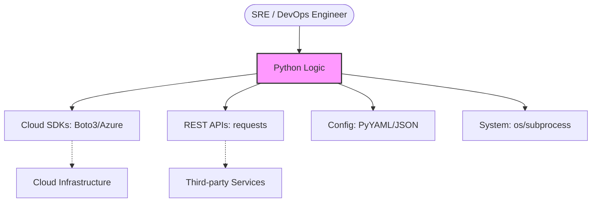
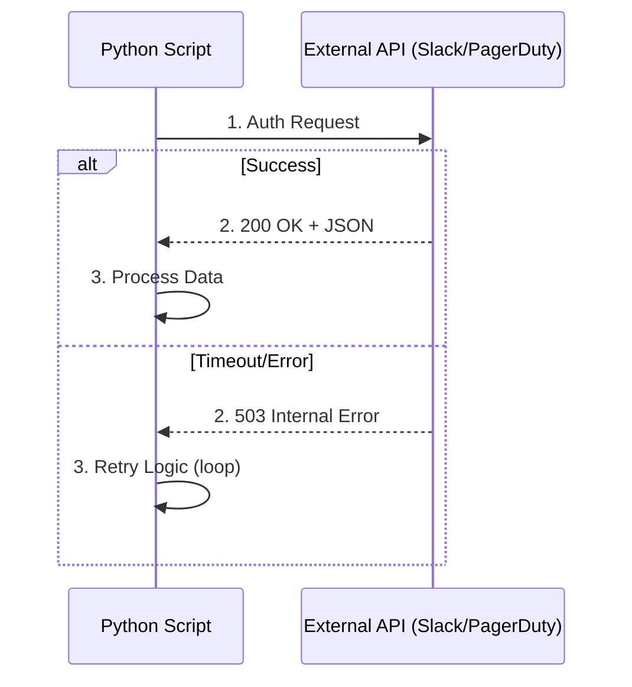

## Beyond the Shell
When shell scripts become too complex or require heavy API interaction, Python is the tool of choice. It bridges the gap between infrastructure management and software engineering.

---

## 🏗️ Python's Role in DevOps
Python serves as the "Universal Glue" for modern infrastructure.



---

## 📊 Bash vs. Python for Automation

| Feature             | Bash / Shell                         | Python                                 |
| :------------------ | :----------------------------------- | :------------------------------------- |
| **Complexity**      | Best for simple file/cli tasks       | Best for complex logic & data          |
| **Data Types**      | Limited (strings/arrays)             | Rich (classes, dicts, tuples)          |
| **API Integration** | External tools needed (`jq`, `curl`) | Native excellence (`requests`, `json`) |
| **Maintenance**     | Hard to test at scale                | Highly testable (pytest)               |

---
## 🏗️ Core Use Cases & Technical Deep-Dives

### 1. Cloud SDK Mastery: Boto3 (AWS)
Understanding the difference between **Resources** and **Clients** is key to efficient AWS automation.
- **Resource**: High-level, object-oriented (easier to use).
- **Client**: Low-level, 1-to-1 mapping with AWS APIs (more powerful).

```python
import boto3

# Resource Example (User-friendly)
ec2 = boto3.resource('ec2')
for instance in ec2.instances.all():
    print(f"ID: {instance.id} | State: {instance.state['Name']}")

# Client Example (Detailed Control)
client = boto3.client('ec2')
response = client.describe_instances()
```
### 2. Robust API Interaction (`requests`)
Always implement error handling and timeouts when talking to external services.



---

## 💡 Best Practices

- **Virtual Environments**: Always use `python -m venv .venv` to isolate your automation dependencies.
- **Type Hinting**: Use `def monitor_cpu(threshold: int) -> bool:` to make your scripts self-documenting.
- **Fail Gracefully**: Wrap network and file operations in `try...except` blocks to prevent silent pipeline failures.

---

## ❓ Interview Preparation

### Top 5 Interview Questions
1. **When would you choose Python over Bash for a DevOps task?** (When complex logic, multi-step error handling, or specific JSON/YAML parsing is required).
2. **What is the difference between a `Client` and a `Resource` in Boto3?** (Resource is higher-level/OO; Client is lower-level/direct API mapping).
3. **How do you manage dependencies for a Python script running on a remote server?** (Using `requirements.txt` and a Virtual Environment).
4. **How do you handle secrets safely in a Python script?** (Using environment variables via `os.getenv` or secret managers).
5. **What library would you use to parse a Kubernetes manifest?** (`PyYAML`).

---

## 📝 Practice Quiz

1. **Which library is standard for making HTTP requests in Python?**
   - [ ] http.lib
   - [ ] curl
   - [x] requests
   - [ ] boto

2. **What is the recommended tool for managing isolated Python environments?**
   - [ ] pip
   - [ ] conda
   - [x] venv
   - [ ] pyenv

3. **In Boto3, which type provides a 1-to-1 mapping with the AWS API?**
   - [ ] Resource
   - [x] Client
   - [ ] Session
   - [ ] Core

---

## 🏢 Real-Life Scenario: AWS Cost Safeguard
**Requirement**: Every morning, check the current month's AWS bill. If it exceeds $500, send a Slack notification to the engineering team.

**Solution**:
```python
import boto3
import requests
import os

SLACK_URL = os.getenv("SLACK_WEBHOOK")
THRESHOLD = 500.0

# Initialize Cost Explorer
ce = boto3.client('ce')

def check_costs():
    # Fetch costs for current month (simplified example)
    results = ce.get_cost_and_usage(
        TimePeriod={'Start': '2025-01-01', 'End': '2025-01-30'},
        Granularity='MONTHLY',
        Metrics=['UnblendedCost']
    )
    
    total = float(results['ResultsByTime'][0]['Total']['UnblendedCost']['Amount'])
    
    if total > THRESHOLD:
        msg = f"⚠️ WARNING: AWS Cost ({total:.2f}) exceeded threshold (${THRESHOLD})"
        requests.post(SLACK_URL, json={"text": msg})

if __name__ == "__main__":
    check_costs()
```

