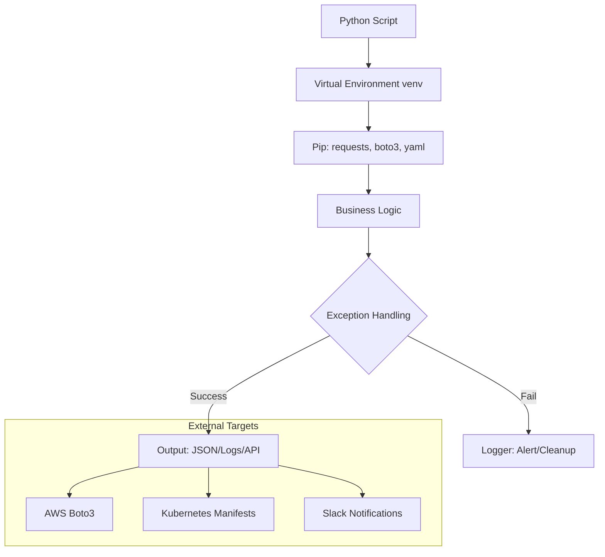

# Python for DevOps: The Universal Glue

When shell scripts become too complex or require heavy API interaction, Python is the tool of choice. It bridges the gap between infrastructure management and software engineering, serving as the "Universal Glue" for modern platform engineering.

## 📚 Learning Path

| # | Topic | Description | Key Modules |
| :--- | :--- | :--- | :--- |
| **01** | [**Environment & Basics**](./01-Python-Environment-and-Basics/README.md) | Isolation and Safety | venv, pip, Exception Handling |
| **02** | [**System Operations**](./02-System-and-File-Operations/README.md) | OS Interaction | os, sys, subprocess, pathlib |
| **03** | [**Data Manipulation**](./03-Working-with-Data-JSON-YAML/README.md) | Config Processing | json, yaml, Dicts/Sets |
| **04** | [**API Mastery**](./04-API-Mastery-with-Requests/README.md) | Service Integration | requests, HTTP, Webhooks |
| **05** | [**Cloud Automation**](./05-Cloud-Automation-Boto3-Deep-Dive/README.md) | AWS Programming | Boto3, Sessions, Clients/Resources |

---

## 🏗️ Python Automation Lifecycle

---

## 🏗️ Real-Life Scenarios

### Scenario 1: The "Fragile Shell" Migration
**Problem**: A DevOps team had a 2,000-line Bash script for deploying applications. It used complex regex to parse YAML files and `ssh` to run commands.
**Crisis**: When the YAML structure changed (adding a nested array), the Bash script's regex failed, leading to a misconfigured deployment that took the site down.
**Outcome**: The team spent 8 hours manually fixing the production environment.
**Solution**: Rewrote the deployment logic in **Python** using the `PyYAML` library and `pathlib`. Python's native handling of nested dictionaries made the script resistant to structure changes.
**Result**: Deployment reliability increased to 100%, and the script size was reduced by 50%.

### Scenario 2: The "API Rate Limit" Block
**Problem**: An automation script was checking the status of 1,000 Jira tickets every minute to update a dashboard.
**Crisis**: The Jira API started blocking the script with "429 Too Many Requests" errors. The simple script crashed, leaving the dashboard blank for the CTO.
**Outcome**: Lack of visibility led to delayed decisions during a major milestone.
**Solution**: Used the **Requests** library with a custom `HTTPAdapter` to implement **Exponential Backoff and Retries**.
**Result**: The script now gracefully waits when throttled, ensuring the dashboard is always eventually updated without being permanently blocked.

### Scenario 3: The "Ghost Resource" Cost Leak
**Problem**: A company had hundreds of unattached EBS volumes and idle Elastic IPs in AWS, costing them $5,000/month.
**Crisis**: Manual cleanup was impossible across 10 different regions and 5 accounts.
**Outcome**: Financial audit flagged the "Cloud Waste" as a primary concern for the engineering budget.
**Solution**: Developed a **Boto3** script that iterates through all regions, identifies unattached resources based on specific tags and status, and generates a CSV report for approval before deletion.
**Result**: Monthly AWS costs were reduced by $4,500 immediately, and the script now runs as a Lambda function once a week.

---

## ❓ Interview Questions

1.  **Why should you use a 'Virtual Environment' (venv) for DevOps scripts?**
    - *Answer*: Virtual environments isolate the Python interpreter and the installed packages for a specific project. This prevents "Dependency Hell" where one script requires `requests v2.0` and another requires `v3.0`, which would otherwise conflict on a global system installation.
2.  **Explain the safety benefit of using 'subprocess.run' over 'os.system'.**
    - *Answer*: `os.system` executes commands in a subshell and is vulnerable to shell injection if user input is passed. `subprocess.run` (with `shell=False`, the default) bypasses the shell and passes arguments directly to the executable, which is much more secure.
3.  **How do you handle 'Multiple AWS Profiles' or 'MFA' in a Boto3 script?**
    - *Answer*: You should use `boto3.Session(profile_name='my-profile')` instead of the default client. This allows you to explicitly manage credentials for different accounts/environments within a single script.
4.  **What is the difference between a 'List' and a 'Set' in Python, and when would you use a Set in DevOps?**
    - *Answer*: A List is an ordered collection that allows duplicates. A Set is an unordered collection of *unique* elements. In DevOps, Sets are perfect for finding the difference between "Desired State" and "Actual State" (e.g., finding instances that are missing a required tag).
5.  **Explain the significance of the `__name__ == "__main__"` block.**
    - *Answer*: It ensures that specific code only runs if the script is executed directly, and NOT if it is imported as a module in another script. This is essential for building reusable automation libraries.
6.  **How do you handle JSON data that might have missing keys without crashing the script?**
    - *Answer*: Instead of using direct access (e.g., `data['key']`), use the `.get()` method (e.g., `data.get('key', 'default_value')`). This returns `None` or a default value instead of raising a `KeyError` if the key is missing.

---

## 🧠 Comprehensive Quiz (25 Questions)

<b>1. Which command creates a new virtual environment?</b>

Show Answer

Answer: B

<b>2. True/False: 'pip freeze' shows all installed packages in the current environment.</b>

Show Answer

Answer: A

<b>3. Which library is the industry standard for making HTTP requests?</b>

Show Answer

Answer: B

<b>4. To handle errors gracefully, Python uses which block?</b>

Show Answer

Answer: B

<b>5. Which Boto3 component is higher-level and more 'Pythonic'?</b>

Show Answer

Answer: B

<b>6. 'indent=4' in json.dumps() is used for:</b>

Show Answer

Answer: B

<b>7. True/False: Python lists are 0-indexed.</b>

Show Answer

Answer: A

<b>8. Which module is used to work with file paths in an object-oriented way?</b>

Show Answer

Answer: C

<b>9. The Boto3 command to list all S3 buckets is:</b>

Show Answer

Answer: B (Resource level)

<b>10. What does 'pip install -r requirements.txt' do?</b>

Show Answer

Answer: B

<b>11. Which data structure stores 'Key-Value' pairs?</b>

Show Answer

Answer: B

<b>12. 'Boto3' is the official SDK for which cloud?</b>

Show Answer

Answer: B

<b>13. How do you execute a shell command and capture its output in Python?</b>

Show Answer

Answer: B

<b>14. True/False: Strings in Python are immutable.</b>

Show Answer

Answer: A

<b>15. Which character starts a comment in Python?</b>

Show Answer

Answer: B

<b>16. 'PyYAML' is used to parse files with which extension?</b>

Show Answer

Answer: A

<b>17. The 'sys.argv' list contains:</b>

Show Answer

Answer: B

<b>18. Which statement is used to import a library?</b>

Show Answer

Answer: C

<b>19. 'F-strings' (e.g., f"Hello {name}") are used for:</b>

Show Answer

Answer: B

<b>20. True/False: Boto3 automatically handles AWS credential rotation.</b>

Show Answer

Answer: A

<b>21. 'Waiters' in Boto3 are used to:</b>

Show Answer

Answer: B

<b>22. Which command is used to exit a Python script with an error code?</b>

Show Answer

Answer: B

<b>23. 'List Comprehension' is a way to:</b>

Show Answer

Answer: B

<b>24. Python is preferred over Bash when your script reaches _____ complexity.</b>

Show Answer

Answer: B

<b>25. A well-written Python script is the _____ of a modern SRE toolkit.</b>

Show Answer

Answer: B

