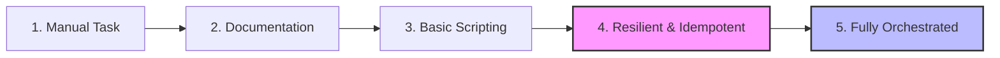

# The Automation Maturity Model

Automation isn't a single step—it's a journey. In a professional DevOps environment, we measure the quality of our automation by its maturity. A script that "just works once" is only the beginning.

## 🏗️ The 5 Levels of Maturity

Moving from manual firefighting to self-healing systems follows a predictable path of increasing reliability.

1.  **Manual Task**: Performing actions via the UI or ad-hoc CLI commands. No repeatability.
2.  **Documentation**: Writing a Runbook (markdown) so another human can repeat the steps.
3.  **Basic Scripting**: Coding the steps into a file (Bash/Python). Saves time but is fragile.
4.  **Resilient & Idempotent**: Scripts that handle errors, check state, and can be safely re-run.
5.  **Fully Orchestrated**: Automation integrated into CI/CD pipelines with automated testing and monitoring.

## 📊 Junior vs. Production-Grade Automation

How do you differentiate a beginner's script from an expert's tool?

| Feature | Junior Level | Production-Grade |
| :--- | :--- | :--- |
| **Error Handling** | Ignores errors ("it just works") | Fail-fast & detailed error recovery |
| **Inputs** | Hardcoded values / strings | Parameterized (Flags/Env Vars/Config) |
| **Logic** | Procedural (Line 1 to End) | Idempotent & Declarative |
| **Observability** | Only prints to screen | Structured logging with timestamps |
| **Secrets** | Cleartext in code | Secrets Manager / Vault integration |

---

## 📖 Stories from the Field: The History-Based "Script"

**Scenario**: A junior engineer was tasked with deploying a new web server. Instead of writing a script, they copied the commands from their `~/.bash_history` into a `.sh` file.
**Problem**: The commands relied on specific temporary files and environment states that only existed on their local machine.
**Outcome**: When another team member tried to run the "script" on a production server, it failed halfway, leaving a half-installed package and an open security hole.
**Resolution**: The script was refactored to use absolute paths, verify prerequisites (Level 3), and check if the package was already installed (Level 4).
**Prevention**: Never build scripts based on local history. Build them from documented, clean-room steps.

---

## ❓ Interview Questions

1. **What is the most important step before writing a script?**
   * *Answer*: Documenting the manual steps. You cannot automate what you don't understand.
2. **Why is Level 5 (Orchestration) the goal for DevOps?**
   * *Answer*: It removes human interaction entirely, ensuring that every deployment follows the exact same tested path, reducing the chance of manual error.
3. **What happens if you jump from Level 1 to Level 3 too fast?**
   * *Answer*: You often automate a broken or misunderstood manual process, scaling the error across the entire infrastructure.
4. **How do you move a script from Level 3 to Level 4?**
   * *Answer*: Adding error handling (`set -e`, `try/except`) and idempotency checks (verifying if a change is needed before applying it).
5. **In the maturity model, what is the role of automated testing?**
   * *Answer*: Testing ensures that Level 4/5 automation continues to work as the underlying infrastructure or libraries evolve.

---

## 🧠 Quiz

1. **Which level involves writing a Markdown guide for humans?** `(Level 2)`
2. **True/False: A script that uses hardcoded passwords is Level 4.** `(False)`
3. **What is the key characteristic of Level 4 automation?** `(Idempotency / Resilience)`
4. **Where should secrets be stored in Production-Grade automation?** `(Secrets Manager / Vault)`
5. **Which maturity level is characterizes by CI/CD integration?** `(Level 5)`