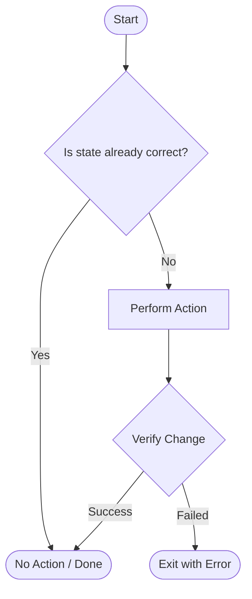

# Idempotency Patterns (Check-Act-Verify)

A script is **idempotent** if running it multiple times has the same outcome as running it once, without causing unintended side effects. This is the single most important best practice for production automation.

## 🛡️ The Check-Act-Verify Pattern

Reliable automation follows a 3-step decision flow for every critical action.



1.  **Check**: Does the file already contain this line? Is this package already installed?
2.  **Act**: Only perform the action if the check fails.
3.  **Verify**: Confirm the state actually changed as intended.

## 💻 Language Examples

### 🐚 Bash (Procedural)
```bash
# Bad (Non-Idempotent: Appends every time)
echo "nameserver 8.8.8.8" >> /etc/resolv.conf

# Good (Check-Act)
grep -q "8.8.8.8" /etc/resolv.conf || echo "nameserver 8.8.8.8" >> /etc/resolv.conf
```

### 🐍 Python (Object-Oriented)
```python
import os

# Good (Check-Act-Verify)
def ensure_directory(path):
    if not os.path.exists(path):  # Check
        os.makedirs(path)         # Act
        if not os.path.exists(path): # Verify
             raise Exception("Failed to create directory!")
```

## 📊 Comparison: Bad vs. Good Patterns

| Task | Non-Idempotent (Bad) | Idempotent (Good) |
| :--- | :--- | :--- |
| **Directory** | `mkdir mydata` | `mkdir -p mydata` |
| **Package** | `apt install nginx` | `apt install -y nginx` |
| **User** | `useradd ganil` | `id -u ganil >/dev/null 2>&1 || useradd ganil` |
| **File Edit** | `echo "line" >> file` | `grep -q "line" file \|\| echo "line" >> file` |

---

## 📖 Stories from the Field: The Double-Billed Deployment

**Scenario**: A deployment script for an e-commerce platform updated the database schema.
**Problem**: The developer forgot to add an idempotency check for a `CREATE TABLE` command.
**Outcome**: The deployment failed at Step 10 due to a network glitch. When the engineer re-ran the script, it failed immediately at Step 1 because the table (created in the previous attempt) already existed.
**Fix**: The engineer refactored the SQL to use `CREATE TABLE IF NOT EXISTS`.
**Lesson**: Without idempotency, an interrupted script becomes impossible to "resume," leading to manual patching in the heat of an incident.

---

## ❓ Interview Questions

1. **Why is idempotency essential for infrastructure retries?**
   * *Answer*: Because transient errors (network drops, API timeouts) are common. Idempotent scripts can be re-run safely until they succeed, without corrupting the system.
2. **Difference between Procedural and Declarative idempotency?**
   * *Answer*: Procedural (Bash/Python) requires you to manually write the "Check." Declarative (Ansible/Terraform) allows you to define the *end state*, and the tool handles the "Check" automatically.
3. **Is `chmod 755 file.sh` idempotent?**
   * *Answer*: Yes. Running it multiple times results in the same permission bitmask, and it doesn't appended or duplicate anything.
4. **How do you handle a non-idempotent tool in a script?**
   * *Answer*: Wrap it in a logical check. For example, check if a service is already running before calling a `start` command that errors if the service is active.
5. **What is the "Verify" step in Check-Act-Verify?**
   * *Answer*: It's a post-flight check to ensure the "Act" actually worked. For example, running `nginx -t` after editing a config file.

---

## 🧠 Quiz

1. **"Idempotency" means a script can be run...** `(Multiple times with the same result)`
2. **Which `mkdir` flag provides idempotency?** `(-p)`
3. **The `grep -q` command is often used in the ___ phase.** `(Check)`
4. **True/False: Appending to a file without a check is idempotent.** `(False)`
5. **Which DevOps tool type (Declarative or Procedural) handles idempotency natively?** `(Declarative)`