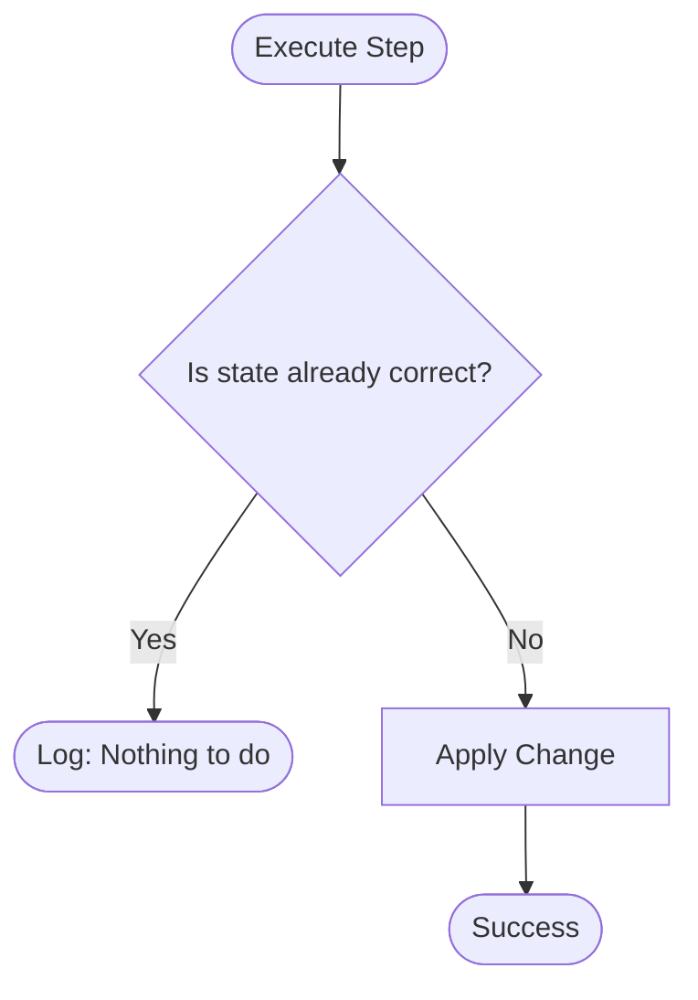

## Building for Reliability
Automation isn't just about "making it work"; it's about making it **reliable**, **safe**, and **reusable**. A poorly written script is more dangerous than manual execution because it scales mistakes at the speed of the CPU.

---

## 🏗️ The Automation Lifecycle
Effective automation is an iterative process. Moving from a manual task to fully orchestrated infrastructure is a journey of increasing maturity.

---

## 🛡️ The Golden Rules

### 1. Idempotency (The "Safety Valve")
A script is idempotent if running it multiple times has the same outcome as running it once. This prevents system corruption on retries.

| Pattern | Non-Idempotent (Bad) | Idempotent (Good) |
| :--- | :--- | :--- |
| **File Edit** | `echo "opt" >> config.txt` | `grep -q "opt" config || echo "opt" >> config` |
| **Package** | `apt-get install nginx` | `apt-get install -y nginx` |
| **Directory** | `mkdir mydata` | `mkdir -p mydata` |

### 2. No Hardcoding (Parameterization)
Never hardcode passwords, IP addresses, or environment-specific values.
- **Environment Variables**: Best for secrets and system paths.
- **CLI Arguments**: Best for runtime decisions (e.g., `--dry-run`).
- **Config Files**: Best for complex settings (YAML/JSON).

### 3. Fail Fast & Early
Don't wait for a 500-line script to fail at step 400.
- Check for **Root Privileges** at line 1.
- Check for **Sufficient Disk Space**.
- Check for **Internet/API Connectivity**.

---

## 📊 Automation Maturity Levels

| Level | Characteristics | Role |
| :--- | :--- | :--- |
| **Ad-hoc** | One-liners, history-based, fragile | Beginner SRE |
| **Reliable** | Error handling, variables, comments | Intermediate DevOps |
| **Cloud-Native** | Idempotent, Secrets Manager, Orchestrated | Advanced Platform Engineer |

---

## ❓ Interview Preparation

### Top 5 Interview Questions
1. **Explain what "Idempotency" means in the context of automation.** (Executing the same script multiple times results in the same final state without side effects).
2. **How do you handle sensitive credentials in an automation script?** (Never hardcode; use environment variables, Vault, or AWS Secrets Manager).
3. **What is a "Dry Run" flag and why is it important?** (A flag that shows what would happen without actually changing anything; essential for safety).
4. **Why is logging with timestamps important for cron jobs?** (Because cron jobs run in the background; timestamps help reconstruct the timeline of a failure).
5. **If a script fails halfway, how does idempotency help?** (It allows you to fix the issue and run the script again without worrying about double-configuring the first half).

---

## 📝 Practice Quiz

1. **Which command is used to make directory creation idempotent?**
   - [ ] `mkdir -v`
   - [x] `mkdir -p`
   - [ ] `mkdir -f`
   - [ ] `mkdir -r`

2. **Where should you check for script dependencies (like `curl`)?**
   - [ ] At the end of the script
   - [ ] In the middle
   - [x] At the very beginning
   - [ ] Only when the command fails

3. **"Fail Fast" means:**
   - [ ] Finishing the script as quickly as possible
   - [x] Exiting immediately if any prerequisite is missing
   - [ ] Ignoring errors to keep running
   - [ ] Writing code as fast as you can

---

## 🏢 Real-Life Scenario: The Rogue Update

**Requirement**: You need to update the configuration of 500 servers simultaneously.

**The Risk**: Without idempotency, if the network drops on 50 servers, you won't know which ones were partially updated. If the script isn't idempotent, running it again might double-apply settings, breaking the app.

**The Best Practice Solution**:
1. Implement a **Check Phase**: Does the server already have the new config?
2. Implement **Atomic Operations**: Write to a temporary file, then `mv` it to overwrite the old one (this is an atomic operation).
3. Implement **Global Error Traps**: Ensure that if the script fails, it logs the exact Hostname and Error Code for later analysis.

