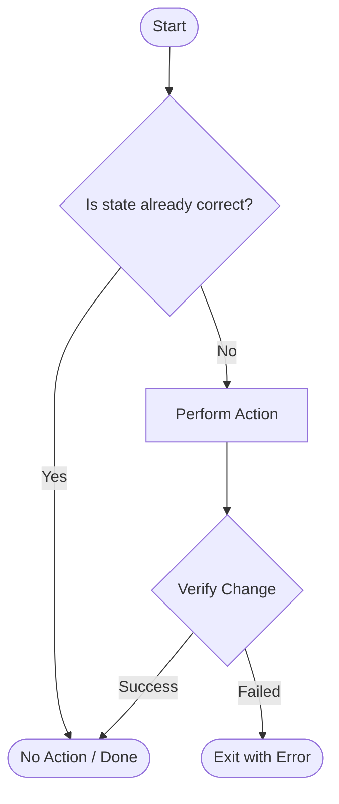

# Automation Best Practices: Production-Grade Reliability

Automation isn't just about making it work; it's about making it **reliable**, **safe**, and **reusable** across a professional engineering environment.

---

## 🏗️ The Automation Maturity Model

Moving from manual tasks to self-healing infrastructure is a journey across distinct levels of maturity.


---

## 🛡️ The Golden Rules of Automation

### 1. Idempotency (The "Check-Act" Pattern)
A script is idempotent if running it multiple times has the same outcome as running it once. This is the cornerstone of reliable automation.



- **Bad**: `echo "nameserver 8.8.8.8" >> /etc/resolv.conf` (appends every time).
- **Good**: `grep -q "8.8.8.8" /etc/resolv.conf || echo "nameserver 8.8.8.8" >> /etc/resolv.conf`.

### 2. No Hardcoding (Parametrization)
Never bake environment-specific values into your code.
- **Environment Variables**: Best for secrets and API keys.
- **CLI Arguments**: Best for dynamic inputs (e.g., `--region us-east-1`).
- **Config Files**: Best for complex, static settings (YAML/JSON).

### 3. Fail Fast & Early
If a script requires `root` privileges or `python3.9+`, check for it on line 1.
```bash
[[ $EUID -ne 0 ]] && { echo "Error: Must be root"; exit 1; }
```

### 4. Atomic Operations
If a script performs three steps and fails on step 2, it shouldn't leave the system in a "half-broken" state. Always aim for "All or Nothing" or include a rollback/cleanup mechanism.

---

## 📊 Junior vs. Production-Grade Automation

| Feature | Junior Level | Production-Grade |
| :--- | :--- | :--- |
| **Error Handling** | Ignores errors (it "just works") | Catches every possible failure point |
| **Inputs** | Hardcoded values | Fully parameterized / Config-driven |
| **Logic** | Procedural (Line 1 to End) | Idempotent & Declarative |
| **Observability** | Prints to screen | Detailed logging with timestamps |

---

## ❓ Interview Preparation

### Top 5 Interview Questions
1. **What does "Idempotency" mean in the context of a deployment script?** (The ability and safety to re-run the script without causing side effects or duplicate data).
2. **How do you ensure a script fails gracefully if a required dependency is missing?** (Using pre-flight checks and `set -e` or `try...except` blocks).
3. **Why is it a bad practice to hardcode API keys even in private repositories?** (Security risk, lacks flexibility, and makes rotating keys impossible).
4. **Explain the difference between Procedural and Declarative automation.** (Procedural defines *how* to do it; Declarative defines *what* the end state should be).
5. **How do you handle a scenario where a script fails halfway through a complex task?** (Implement cleanup functions/traps and aim for atomic operations).

---

## 📝 Practice Quiz

1. **Which pattern is used to achieve idempotency?**
   - [ ] Try-Catch
   - [ ] Do-While
   - [x] Check-Act-Verify
   - [ ] Input-Output

2. **Where is the safest place to store highly sensitive API secrets?**
   - [ ] `config.yaml`
   - [ ] Inside the main script comments
   - [x] A dedicated Secrets Manager (Vault/KMS)
   - [ ] `~/.bash_history`

3. **What is the primary benefit of "Fail Fast" logic?**
   - [ ] It makes the script run faster.
   - [x] It prevents damage by stopping before a critical error occurs.
   - [ ] It reduces the amount of code needed.
   - [ ] It automatically fixes the error.

---

## 🏢 Real-Life Scenario: The Self-Healing Config

**Requirement**: You need to ensure a specific configuration line exists in `/etc/ssh/sshd_config` across 100 servers every day.

**Solution**:
Instead of just appending the line, write a script that:
1. **Checks** if `PermitRootLogin no` is already set.
2. **If not**, it uses `sed` to replace or add the line.
3. **Verifies** the syntax of the config file (`sshd -t`).
4. **Restarts** the service only if a change was made.
This ensures that the service is never restarted unnecessarily and the config is never corrupted.

