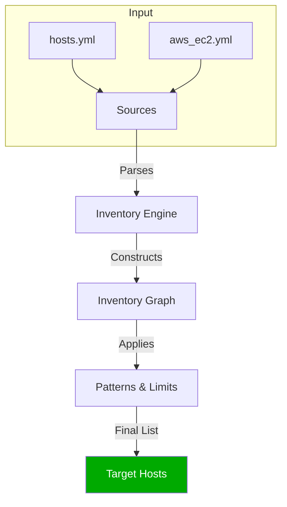

# Inventory Management

The Inventory is Ansible's "Source of Truth". It tells Ansible *what* to connect to and *how* to organize them.

This module breaks down the complexity of managing hosts into 4 key areas.

## 📚 Learning Path

| # | Topic | Description |
| :--- | :--- | :--- |
| **01** | [**Static Inventory**](./01-Static-Inventory/README.md) | The Basics. INI vs YAML, Aliases. |
| **02** | [**Patterns & Targeting**](./02-Patterns-and-Targeting/README.md) | How to select hosts. Limits, Intersections (`:&`), RegEx. |
| **03** | [**Inventory Variables**](./03-Inventory-Variables/README.md) | Where to store data. `group_vars`, `host_vars`, and Precedence. |
| **04** | [**Dynamic Plugins**](./04-Dynamic-Plugins/README.md) | Cloud Scale. Using `aws_ec2` to find Auto-Scaling instances. |

---

## 🏗️ high-Level Inventory Flow



## Quick Start (Static)

To get started quickly, create a file named `hosts.ini`:

```ini
[web]
web1.example.com
web2.example.com
```

Then run:
```bash
ansible -i hosts.ini web -m ping
```

Please proceed to **[01-Static-Inventory](./01-Static-Inventory/README.md)**.