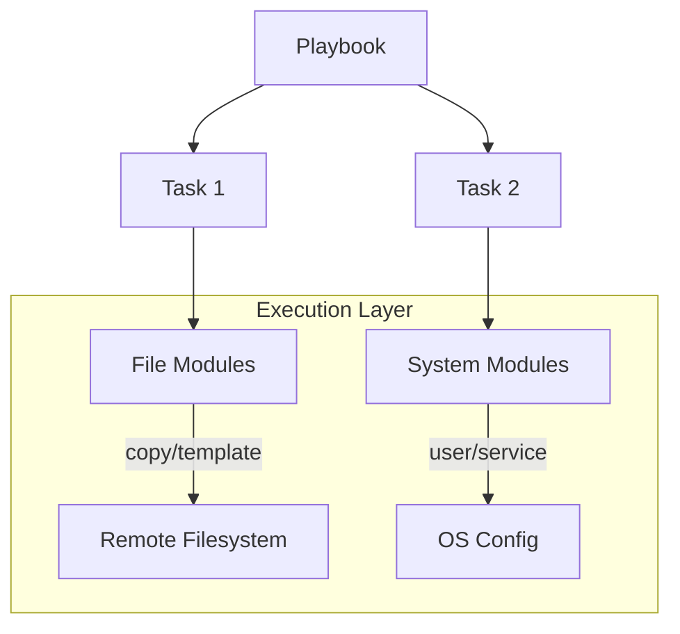

# Core Modules

Ansible ships with thousands of modules, but you will spend 90% of your time using these "Core" modules. This section breaks them down into functional categories.

## 📚 Learning Path

| # | Topic | Description | Modules Covered |
| :--- | :--- | :--- | :--- |
| **01** | [**File Management**](./01-File-Management/README.md) | File & Directory lifecycle | `copy`, `template`, `file`, `lineinfile`, `fetch` |
| **02** | [**Package Management**](./02-Package-Management/README.md) | Software installation | `apt`, `yum`, `package`, `pip` |
| **03** | [**System Modules**](./03-System-Modules/README.md) | OS Configuration | `service`, `user`, `group`, `hostname`, `cron` |
| **04** | [**Utility Modules**](./04-Utility-Modules/README.md) | Debugging and logic | `debug`, `command`, `shell`, `uri`, `wait_for` |

---

## 🏗️ Core Module Ecosystem

## Quick Reference

*   **Idempotency**: All core modules are designed to be idempotent (safe to run multiple times).
*   **Documentation**: Use `ansible-doc <module_name>` on your terminal for a full parameter list.

Please proceed to **[01-File-Management](./01-File-Management/README.md)** to begin.