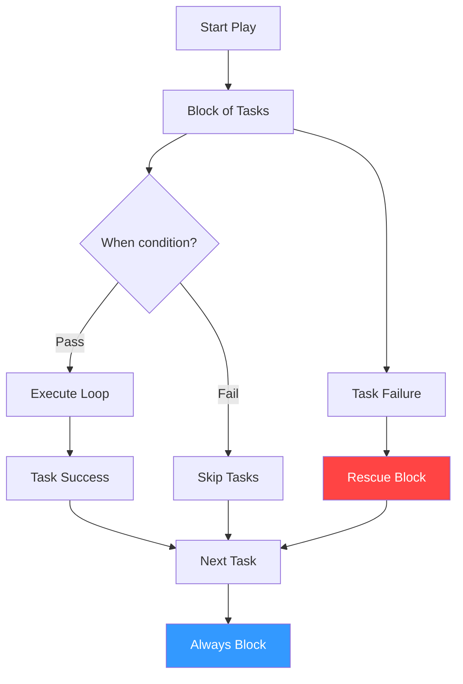

# Conditionals and Loops

Ansible playbooks are simple lists of tasks... until you need logic. This section walks through the core components that turn tasks into intelligent automation.

## 📚 Learning Path

| # | Topic | Description | Key Areas |
| :--- | :--- | :--- | :--- |
| **01** | [**Conditional Execution**](./01-Conditional-Execution/README.md) | Smart Task Skipping | `when`, logical operators |
| **02** | [**Looping Mechanics**](./02-Looping-Mechanics/README.md) | Mass Configuration | `loop`, `until`, `retries` |
| **03** | [**Error Handling Blocks**](./03-Error-Handling-Blocks/README.md) | Flow Control | `block`, `rescue`, `always` |
| **04** | [**Advanced Logic Control**](./04-Advanced-Logic-Control/README.md) | Overriding Status | `failed_when`, `changed_when` |

---

## 🏗️ Execution Flow



## Quick Start

### Simple Conditional
```yaml
- name: Run on Debian ONLY
  apt: name=nginx state=present
  when: ansible_os_family == "Debian"
```

### Simple Loop
```yaml
- name: Install list
  package: name="{{ item }}" state=present
  loop: [git, curl, vim]
```

---

## 🚀 Advanced Logic Patterns

### 1. Complex Conditionals
You can combine multiple conditions using `and`, `or`, and `not`.

```yaml
- name: Install web server based on OS and requirement
  package:
    name: "{{ 'httpd' if ansible_os_family == 'RedHat' else 'apache2' }}"
    state: present
  when: 
    - webserver_required | default(true)
    - ansible_distribution_version | int >= 8
```

### 2. Advanced Loop Control
Use `loop_control` to track indexes or provide descriptive labels in logs.

```yaml
- name: Configure virtual hosts
  template:
    src: vhost.conf.j2
    dest: "/etc/nginx/sites-available/{{ item.name }}"
  loop: "{{ virtual_hosts }}"
  loop_control:
    index_var: vhost_index
    label: "Configuring {{ item.name }} (Node #{{ vhost_index }})"
```

### 3. Loop with Subelements
Great for nested data structures like users and their SSH keys.

```yaml
- name: Create users with SSH keys
  authorized_key:
    user: "{{ item.0.name }}"
    key: "{{ item.1 }}"
  loop: "{{ users | subelements('ssh_keys') }}"
```

Please proceed to **[01-Conditional-Execution](./01-Conditional-Execution/README.md)**.