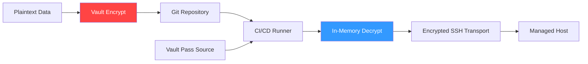

# Ansible Vault

Never commit passwords to Git in plain text. **Ansible Vault** provides 256-bit AES encryption to protect sensitive data like API keys, database passwords, and private certificates within your infrastructure-as-code.

## 📚 Learning Path

| # | Topic | Description | Key Areas |
| :--- | :--- | :--- | :--- |
| **01** | [**CLI Operations**](./01-Vault-CLI-Operations/README.md) | Managing Encrypted Data | create, edit, rekey, encrypt_string |
| **02** | [**Automation Workflow**](./02-Automation-Workflow/README.md) | Hands-Free Running | --vault-password-file, Vault IDs |
| **03** | [**Vault in CI/CD**](./03-Vault-in-CI-CD/README.md) | Integrated Security | Pipeline injection, GitHub Secrets |
| **04** | [**Best Practices**](./04-Security-Best-Practices/README.md) | Professional Standards | Password rotation, string encryption |

---

## 🏗️ Secret Management Lifecycle



## Quick Reference

### Encrypt a single password
```bash
ansible-vault encrypt_string 'my_secret' --name 'my_var'
```

### Run a playbook with a password file
```bash
ansible-playbook site.yml --vault-password-file .vault_pass
```

Please proceed to **[01-CLI-Operations](./01-Vault-CLI-Operations/README.md)**.